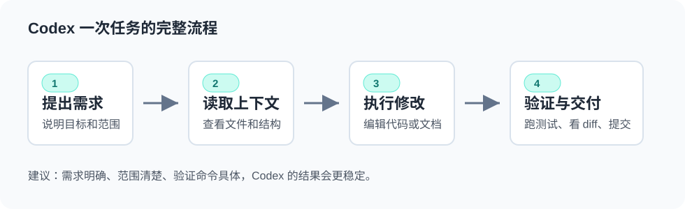

# Codex

这里是 Codex 使用指南的快捷入口。完整内容放在“学习笔记 / 开发工具 / Codex”模块下。



## 进入完整教程

- [Codex 总览](./开发工具/Codex.md)
- [快速开始](./开发工具/Codex/快速开始.md)
- [版本控制](./开发工具/Codex/版本控制.md)
- [工作区与 Worktree](./开发工具/Codex/工作区与Worktree.md)
- [代码修改与审查](./开发工具/Codex/代码修改与审查.md)
- [技能 Skills](./开发工具/Codex/技能Skills.md)
- [插件 Plugins](./开发工具/Codex/插件Plugins.md)
- [MCP](./开发工具/Codex/MCP.md)
- [自动化](./开发工具/Codex/自动化.md)
- [常见问题](./开发工具/Codex/常见问题.md)

## 正确访问地址

如果你想直接打开完整总览页，地址是：

```text
http://localhost:8080/data/开发工具/Codex.html
```

现在也可以通过这个快捷页访问：

```text
http://localhost:8080/data/Codex.html
```
