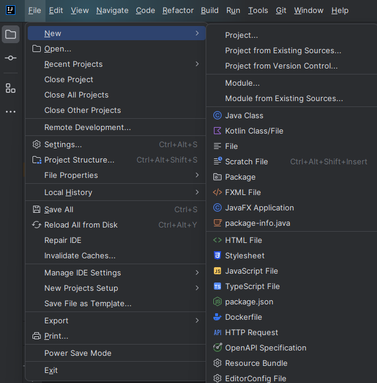
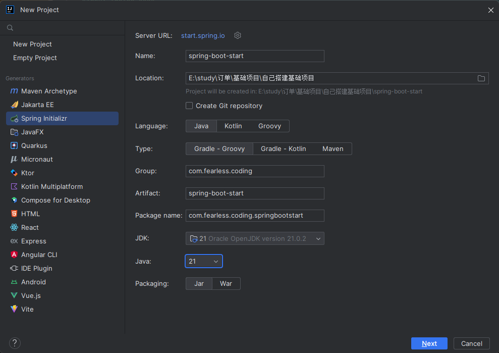
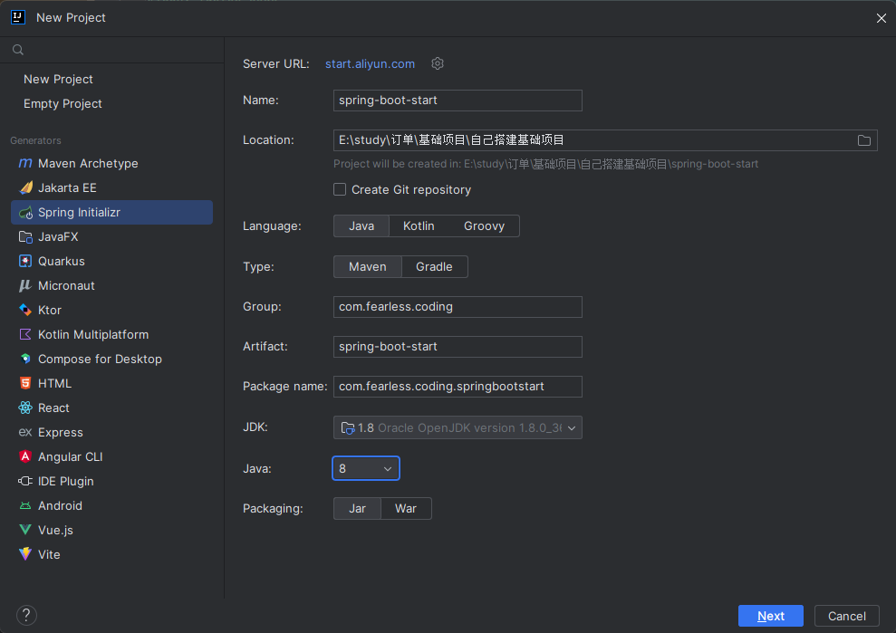
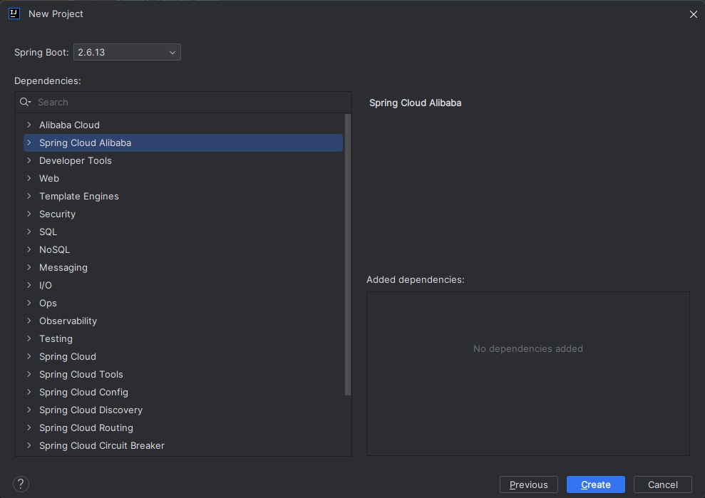
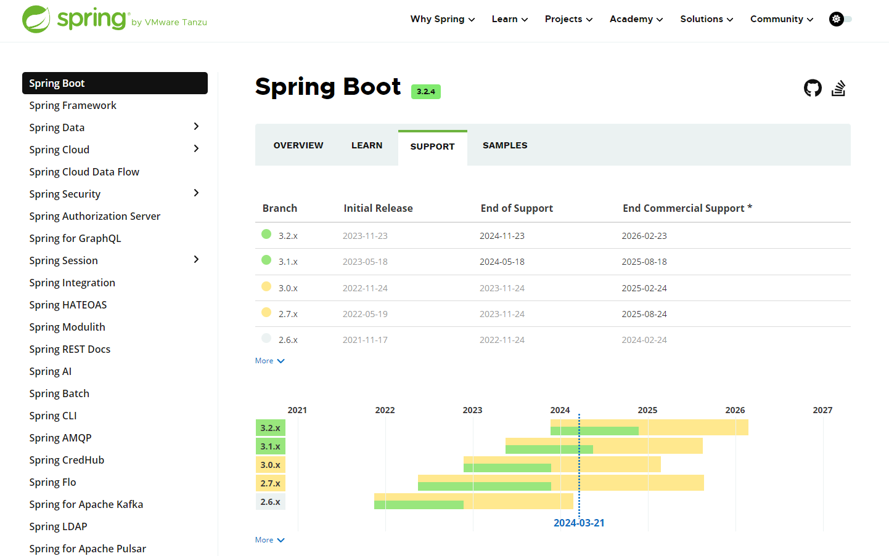
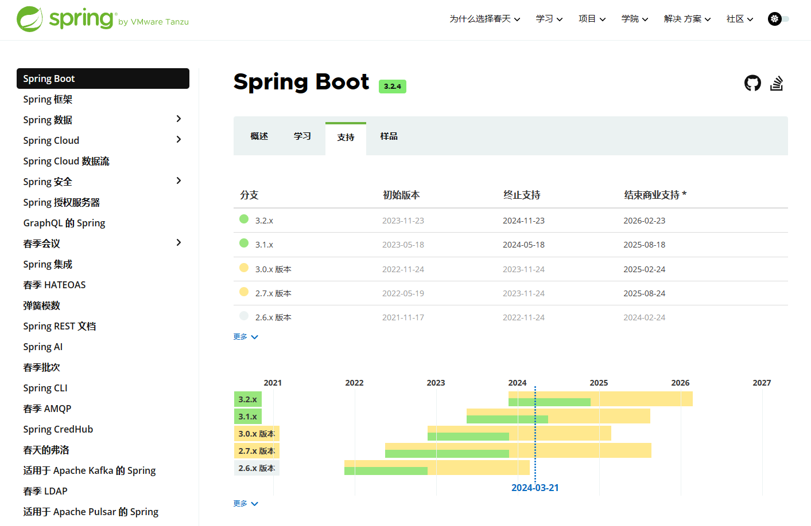
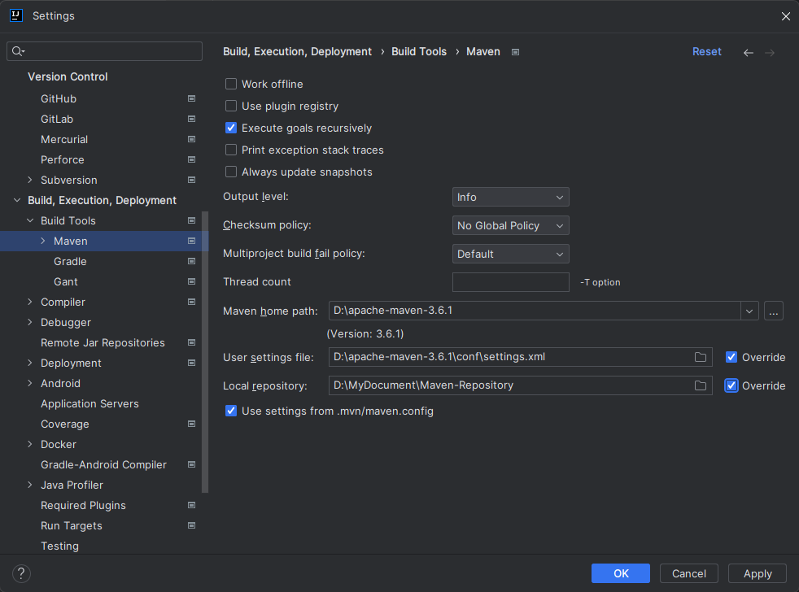
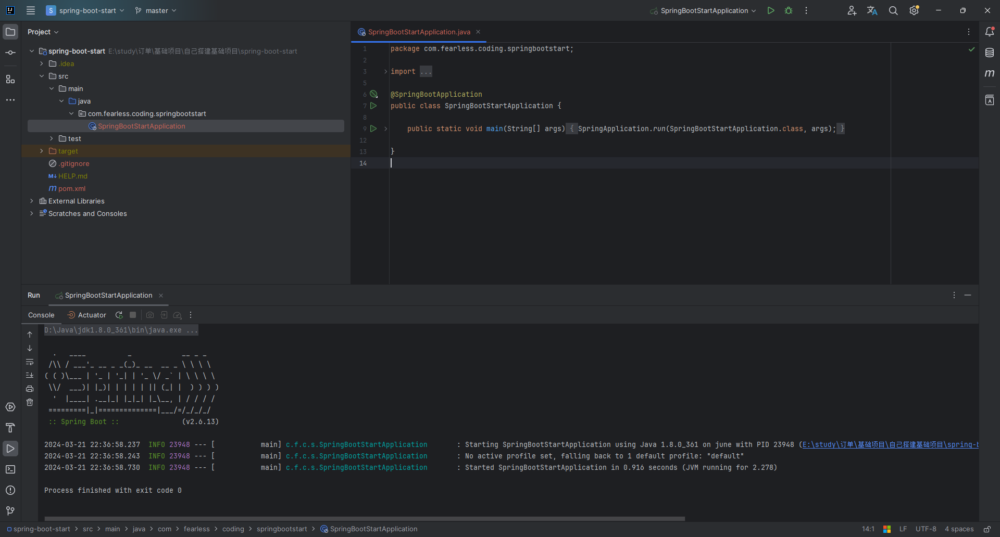

## 新建项目

菜单栏选择 File -> New -> Project...

## 选择Spring Initializr

进入页面选择Spring Initializr

- Name 自定义项目名称
- Location 项目位置
- Language 编程语言，这里我们以Java为例
- Group 项目根路径包名，可以选择默认，也可以自定义（一般项目会以网站域名、公司名为包名，例如 com.fearless.coding）
- Type 构建工具类型，我们这里以maven为例，根据自己需求选择，目前开源框架也会才采用Gradle构建
- JDK 选择我们想要运行的JDK版本，目前比较常用的为JDK 8
- Java 选择Java版本时注意尽量和JDK版本选择一致，否则会提示jdk版本不匹配
- Packaging 打包类型，这里我们采用jar包形式打包

当我们使用IDEA版本比较高时，2023版本以后的版本创建Spring项目的时候发现JDK只能勾选17和21，但是我们一般情况下都是用的JDK1.8的版本，这个时候就会创建失败，提示jdk版本不匹配。（可以选择Java8版本的可以直接跳转下一步）

**解决方案**

将Server URL https://start.spring.io 替换为阿里云版本，只需要将 Server URL 的值换成 https://start.aliyun.com/ （点击小齿轮就可以编辑），这个时候我们就可以选择Java8的版本了

## 选择SpringBoot版本

目前实际项目中使用Spring Boot 2.X的版本比较多，具体版本维护信息查看下面说明

官网对Spring boot版本支持说明，可在官网查看详细说明 https://spring.io/projects/spring-boot#support

翻译版

## 配置Maven

## 运行项目

