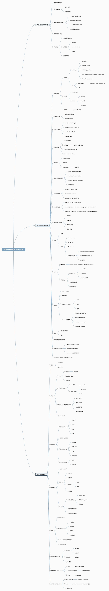
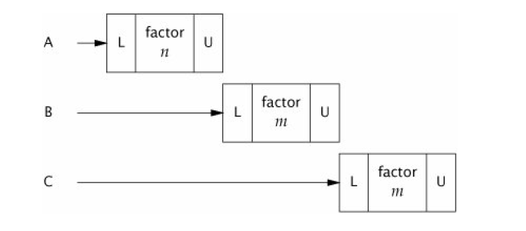
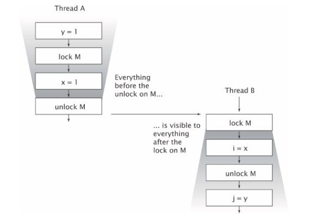
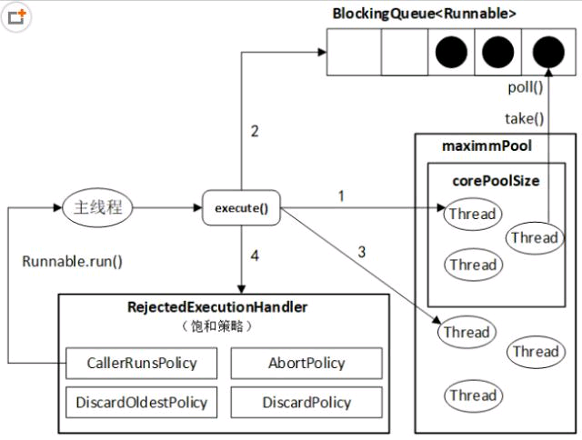
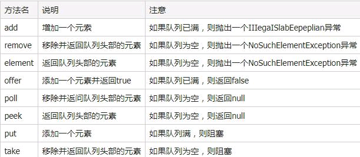
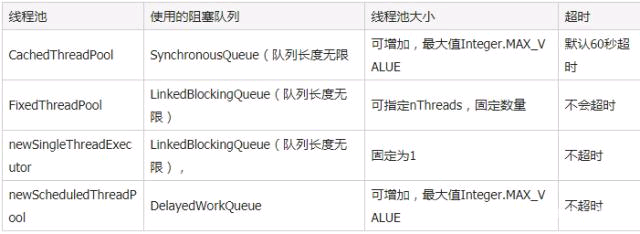

# 学习并发路线




### 2.3.锁

如上一节所示，为一个无状态类添加一个状态域，只要这个状态域使用的是线程安全类，那么这个类仍是线程安全的。如果为一个无状态类添加两个状态域仍然不是线程安全的。线程安全性的定义需要在任何时候，多线程操作的任意重叠状态下都能保持约束条件。

在某些不幸的时间点UnsafeCachingFactorizer类可能会违反这个约束条件。虽然使用了原子引用，我们还是无法同时更新lastNumber和lastFactors两个域的值。

```java
@NotThreadSafe
public class UnsafeCachingFactorizer extends GenericServlet implements Servlet {
    
	private final AtomicReference<BigInteger> lastNumber = new AtomicReference<BigInteger>();
	private final AtomicReference<BigInteger[]> lastFactors = new AtomicReference<BigInteger[]>();
    
    public void service(ServletRequest req, ServletResponse resp){
        BigInteger i = extractFromRequest(req);
        if (i.equals(lastNumber.get())){
        	encodeIntoResponse(resp, lastFactors.get());
        } else {
            BigInteger[] factors = factor(i);
            lastNumber.set(i);
            lastFactors.set(factors);
            encodeIntoResponse(resp, factors);
        }
    }
}
```


#### 2.3.1.内部锁

Java提供了内建的锁机制来实现多个操作的原子性：synchronized 块。内部锁是一种互斥锁，这意味着在任意时刻最多只能有一个线程可以获取这个锁。

每个Java 对象都可以作为锁，这些内建的锁被称为 内部锁 或监视锁。在线程进入 synchronized 块之前自动获取 内部锁 ，在线程离开 synchron ized 块之后自动释放 内部锁 （不管是正常离开 synchronized 块还是抛出异常导致离开synchronized 块）。

有了这种同步机制，我们的 UnsafeCachingFactorizer 就容易实现线程安全了。

```java
@ThreadSafe
public class SynchronizedFactorizer extends GenericServlet implements Servlet{

    @GuardedBy("this")
    private BigInteger lastNumber;
    
    @GuardedBy("this")
    private BigInteger[] lastFactors;
    
    public synchronized void service(ServletRequest req,ServletResponse resp) {
        BigInteger i = extractFromRequest(req);
        if (i.equals(lastNumber)) {
        	encodeIntoResponse(resp, lastFactors);
        } else {
            BigInteger[] factors = factor(i);
            lastNumber = i;
            lastFactors = factors;
            encodeIntoResponse(resp, factors);
        }
    }
}
```


#### 2.3.2.重入

当一个线程请求一个被其他线程获取的锁的时候，这个线程会阻塞。但是由于 Java 中的内部锁是可重入的，因此当一个线程请求一个已经被自己获取的内部锁的时候，这个请求会成功。

```java
public class Xttblog extends SuperXttblog {
    public static void main(String[] args) {
        Xttblog child = new Xttblog();
        child.doSomething();
    }
 
    public synchronized void doSomething() {
        System.out.println("child.doSomething()" + Thread.currentThread().getName());
        doAnotherThing(); // 调用自己类中其他的synchronized方法
    }
 
    private synchronized void doAnotherThing() {
        super.doSomething(); // 调用父类的synchronized方法
        System.out.println("child.doAnotherThing()" + Thread.currentThread().getName());
    }
}
 
class SuperXttblog {
    public synchronized void doSomething() {
        System.out.println("father.doSomething()" + Thread.currentThread().getName());
    }
}

结果：
    child.doSomething()Thread-5492
	father.doSomething()Thread-5492
	child.doAnotherThing()Thread-5492
```

现在可以验证出 synchronized 是可重入锁了吧！因为这些方法输出了相同的线程名称，表明即使递归使用synchronized也没有发生死锁，证明其是可重入的。

这里的对象锁只有一个，就是 child 对象的锁，当执行 child.doSomething 时，该线程获得 child 对象的锁，在 doSomething 方法内执行 doAnotherThing 时再次请求child对象的锁，因为synchronized 是重入锁，所以可以得到该锁，继续在 doAnotherThing 里执行父类的 doSomething 方法时第三次请求 child 对象的锁，同样可得到。如果不是重入锁的话，那这后面这两次请求锁将会被一直阻塞，从而导致死锁。

所以在 java 内部，同一线程在调用自己类中其他 synchronized 方法/块或调用父类的 synchronized 方法/块都不会阻碍该线程的执行。就是说同一线程对同一个对象锁是可重入的，而且同一个线程可以获取同一把锁多次，也就是可以多次重入。因为java线程是基于“每线程（per-thread）”，而不是基于“每调用（per-invocation）”的（java中线程获得对象锁的操作是以线程为粒度的，per-invocation 互斥体获得对象锁的操作是以每调用作为粒度的）。

##### 可重入锁的实现原理？

重入锁实现可重入性原理或机制是：每一个锁关联一个线程持有者和计数器，当计数器为 0 时表示该锁没有被任何线程持有，那么任何线程都可能获得该锁而调用相应的方法；当某一线程请求成功后，JVM会记下锁的持有线程，并且将计数器置为 1；此时其它线程请求该锁，则必须等待；而该持有锁的线程如果再次请求这个锁，就可以再次拿到这个锁，同时计数器会递增；当线程退出同步代码块时，计数器会递减，如果计数器为 0，则释放该锁。


### 2.4.使用锁确保对象状态一致性

我们可以使用锁来确保多线程对保护块中代码的排他性访问，从而确保对象的状态一致性。共享对象上的复合操作，例如 count++ 或者延迟初始化操作都必须是原子操作。使用 synchronized 块就可以做到。然而仅仅将复合操作用synchronized 块包起来还不够。需要在任何访问共享 Mutable 变量的地方都使用 synchronized 块。

**对于任意一个可被多线程访问的Mutable 状态变量，所有对该变量的访问（包括读和写）操作都必须由同一个锁来保护。**

**对于一个牵涉到多个状态域的约束，这些状态域 中所有的 Mutable 状态域，必须被同一个锁保护。**

既然使用同步机制可以防止竞争条件，那么为什么不干脆将所有类中的方法都用 synchronized 关键字修饰呢？事实上，这样做要么会过度同步，要么会同步不足。 例如 Vector 类 中的 contains 方法和 add 方法都是用 synchronized 关键字修饰的，但如下代码并不是线程安全的：

```java
if (!vector.contains(element))
	vector.add(element);
```

当多个原子操作组合在一起形成复合操作的时候，还是需要额外的同步。 此外，鲁莽 地 使用 synchronized 关键字 来修饰方法可能会造成活跃性和性能问题。


### 2.5.活跃性和性能

SynchronizedFactorizer类的做法违反了 Servlet 框架的基本原则：能够并发响应多个用户请求。 这样的做法显然会造成很大的计算资源浪费。 下图演示了当多用户请求到达的时候， SynchronizedFactorizer 是如何处理的：它将多个请求缓存起来，然后逐个处理。 同时处理的请求数不是受计算资源的限制而是受到程序结构的限制。



```java
@ThreadSafe
public class CachedFactorizer extends GenericServlet implements Servlet{
    //上一个需要因数分解的数
    @GuardedBy("this") private BigInteger lastNumber;
    //上一个因数分解结果
    @GuardedBy("this") private BigInteger[] lastFactors;
    //用户访问次数
    @GuardedBy("this") private long hits;
    //命中缓存次数
    @GuardedBy("this") private long cacheHits;
    
    public synchronized long getHits(){
    	return hits;
    }
    
    public synchronized double getCacheHitRatio(){
    	return (double) cacheHits / (double) hits;
    }
    
    public void service(ServletRequest req, ServletResponse resp){
        //获取需要因数分解的数字
        BigInteger i = extractFromRequest(req);
        BigInteger[] factors = null;
        //看是否命中缓存，这里要访问4个状态变量，因此必须作为原子操作
        synchronized (this){
        	++hits;
        	if (i.equals(lastNumber)){
                ++cacheHits;
                factors = lastFactors.clone();
            }
        }
        if (factors == null){
        	factors = factor(i);
        	//更新缓存，这里要访问2个状态变量，因此需要作为原子操作
            synchronized (this){
                lastNumber = i;
                lastFactors = factors.clone();
            }
        }
        encodeIntoResponse(resp, factors);
    }
}
```

**在设计同步策略的时候尽量不要为了性能而牺牲简单性。**

CachedFactorizer类的结构既能够提供线程安全性，又能最大限度地提高响应速度。只有在需要访问 Mutable 状态 域 的时候才使用 synchronized 块，并且需要作为原子操作的代码都被放置在同一个 synchronized 块中。此外每个synchronized 块中的代码都尽量保持短小。像因数分解 factors = factor(i);这样既耗时又不影响状态域的操作就不用放置在 synchronized 块中。

当你使用锁的时候，你应该清楚synchronized 块中的代码是做什么的，有没有可能执 行耗时操作（计算密集型操作和阻塞式操作 是两种最常见的耗时操作 ）。如果 synchronized 块中存在耗时操作，将很有可能引起活跃性问题或者性能问题。
**不要将synchronized 块加在计算密集型操作、网络连接操作和控制台输入输出操作上 ，否则会引起活跃性和性能问题 。**


# 3.共享对象

> 本章主要讨论如何编写可以被多线程安全使用的对象。我们也将讨论 java.u til.concurrent 库中的设施 ，它是编写线程安全类和创建 线程安全并发程序结构的基础。我们已经知道如何使用synchronized 块和 synchronized 方法来实现一组操作的原子性。但是同步的概念不仅包含原子性，也包含内存可见性。我们要确保当一个线程修改了某个共享对象的状态之后，其他线程能够看到该共享对象状态的变化。

## 3.1.内存可见性

下面的代码演示了当多线程共享数据时可能出现的问题。Main 线程和一个reader 线程共享变量 ready 和 number 。 Main 线程先启动 reader 线程，然后为reader 和 number 赋值。 乍一看，打印结果应该是 42 ，但实际上打印结果很有可能是 0 ，也有可能程序一直运行下去无法终止。由于同步不足，无法确保 main线程对 ready 和 number 的赋值能够被 reader 线程看见。

```java
public class NoVisibility {

    private static boolean ready;
    private static int number;

    private static class ReaderThread extends Thread {
        public void run() {
            while (!ready)
                Thread.yield();
            System.out.println(number);
        }
    }

    public static void main(String[] args) {
        new ReaderThread().start();
        number = 42;
        ready = true;
    }
}
```

NoVisibility类可能无限循环下去，因为在 main 线程中为 ready 赋的值可能永远无法被 reader 线程看见。更奇怪的是，也可能打印 0 ，因为 reader 可能先看到 ready 为 true ，但是在打印的时候还没看到 number 变为 42。这是完全可能的，虽然在main 线程中先对 number 赋值，后对ready 赋值，但是在 reader线程中可能先看到 对 ready 的赋值，后看到 对 number 的赋值。

**为什么会出现这样的结果？**

线程的交叉执行，重排序加线程交叉执行，共享变量更新后的值没有在工作内存和主内存中及时更新。

首先要对java内存模型有一个大概的概念，每个线程有自己的工作内存，除此之外还有主内存区域，对变量的读写不一定会及时写入到主存，想要对其它线程可见，需要将工作内存中的写入同步到主存，并且同步到各个线程的工作内存中。


线程对共享变量的读写都必须在自己的工作内存中进行，而不能直接在主内存中读写。不同线程不能直接访问其他线程的工作内存中的变量，线程间变量值的传递需要主内存作为桥梁。

**在没有同步机制的情况下，编译器和运行时可能对操作执行的顺序做稍微的调整。**

但是仍然容易出错，甚至无法终止。有一种解决这个问题的简单方法： **不管变量**
**什么时候被多线程共享，总是使用合适的同步机制 。**


### 3.1.1.陈旧数据

陈旧数据有时候可能变得非常危险，有可能造成严重的安全问题和活跃性问题。 在 NoVisibility 类中，陈旧数据可能导致打印出错误的值 ，或者导致程序无法终止。 一般来说， 陈旧数据可能导致严重的，令人疑惑的程序异常、数据结构破坏、计算精度损失和无限循环。

下面的代码中定义 的 MutableInteger 类不是线程安全的，因为 get 和 set方法没有使用同步机制。如果一个线程在调用 set 方法，另一个线程正在调用get 方法就可能获取 到 陈旧的数据。

```java
@NotThreadSafe
public class MutableInteger{
    private int value;
    
    public int get(){
    	return value;
    }
    
    public void set(int value){
    	this.value = value;
    }
}
```

如果我们将
get 和 set 方法同步就可以将 MutableInteger 类改造成线程安全类，如下面的 代码所示，仅仅同步 set 方法是不够的， get 方法还是可能获取到陈旧的数据 两者都需要同步 。

```java
@ThreadSafe
public class SynchronizedInteger {
    @GuardedBy("this")
    private int value;
    
    public synchronized int get() {
    	return value;
    }

    public synchronized void set(int value) {
    	this.value = value;
    }
}
```


### 3.1.2.非原子性 64 位操作

当一个线程读取一个未被同步的共享变量的时候，它可能获取到一个陈旧的数据，但是它应该至少能获取到一个之前被其他线程写入的数据，而不是获取到一个随机值，这被称为最低安全性保障。
64位非 volatile 类型的变量（包括 double 和 long ）比较特殊。 JVM 可能将 64 位非 volatile 类型的变量分为两个 32 位数进行读写，从而导致当你读取一个 long 类型共享变量值的时候，高 32位是一个线程写入的，低 32 位是另一个线程写入的。因此，即使你不担心陈旧数据的问题，在多线程程序中使用非volatile的long或double类型的共享类型的共享域域都是不安全的。


### 3.1.3.锁和可见性

如下图所示，内部锁 可以被用来确保一个线程能够以我们期望的方式看到另一个线程对共享 域 的操作效果。 当线程 A 进入被锁 M 保护的 synchronized 块之后，线程 B 也要进入被锁 M 保护的 synchronized 块 ，但要等到线程 A 从该synchronized 块中退出之后线程 B 才能进入 。 线程 A 中对变量 x 的修改可以确保对线程 B 可见。



**锁不仅能够提供互斥功能，也可以提供内存可见性。为了确保所有线程都能够看到 Mutable 共享域 的最新值，所有对该 Mutable 共享域的读写操作都必须被同一个锁同步。**


### 3.1.4. volatile域

Java语言也提供了一种较弱的机制来确保 一个线程 对共享 域 的修改能够被其他线程可见。 当一个域被声明为 volatile 的时候，编译器和运行时就知道该域是共享域 ，与其相关的操作不能被改变执行顺序。 V olatile 域 不会被缓存到CPU寄存器中，因此，读取一个 volatile 共享 域 总是能够获取到其他线程对它的最新赋值。

你可以将volatile 域 的 读写操作等价于 SynchronizedInteger类中带synchronized的get和set方法。不过Volatile变量并没有使用锁，因此不会导致执行线程阻塞，因此相比于synchronized块，volatile是一个轻量级的同步机制。

我们并不建议过多地依赖于volatile域 ，使用volatile域 编写的代码更加脆弱，并且比使用锁实现内存可见性的代码更加难以理解。
下面的代码演示了volatile变量的一种典型用法：检查一个状态标志来决定是否退出循环。如果asleep域 不是volatile的，while所在的线程就无法意识到其他线程对asleep标志的修改。我们也可以使用锁来实现内存可见性，但是那样代码就没这么简洁了。


Volatile域 用起来比较方便，但是它也有局限性。Volatile域 最常见的用法是作为完成标志、中断标志和状态标志。比如上例中的asleep。Volatile域也可以被用于存储其他类型的标志信息，但是必须小心使用。例如，volatile语义无法确保count++操作是原子的，除非你可以确定只有一个线程可对域 进行写操作，其他线程都是进行读操作。当然，Volatile修饰的Atomic类型变量还是可以保证原子性的（例如AtomicLong）。
**锁可以保证原子性和内存可见性，而volatile域 只能确保内存可见性。**
只有在满足如下条件的情况下才能使用volatile 域：

- 对 域 的写操作不依赖于它的 当前值，或者你可以确保只有一个线程能够更新该 volatile 域 的值。

- 该 volatile 域 不和其他状态 域 一起组成对象的某个正确性约束。

- 对 域 的访问确实不需要使用锁。

  

## 3.2.发表与逃逸

发表一个对象意味着使它能够被当前范围之外的代码使用，比如存储一个指向该对象的引用，可供其他代码使用；从一个非私有方法中返回 某个 对象或者将某个对象作为参数传入其他类的方法中。如果一个对象被 不恰当地 发表了，就称为逃逸 。

最明显的发表形式是将一个对象的引用存储在public static 域中，这样任何类和线程都能够访问它。如下代 码所示， initialize 方法创建了一个 HashSet对象然后将引用赋值给 public 静态域 kownSecrets 。

```java
public static Set<Secret> knownSecrets;

public void initialize() {
	knownSecrets = new HashSet<Secret>();
}
```

发表一个对象可能间接地发表其他对象，如果在initialize 方法中为knownSecrets 添加一个 Secret 元素，那么你也发表了这个Secret 元素。因为任何代码 都可以通过遍历 knownSecrets 来获取对该 Secret 元素的引用。相似地，从一个非 private 方法中返回一个对象引用也发表了这个对象，如下代码将私有的数组对象通过 return 语句发表出去：

```java
class UnsafeStates{
    private String[] states = new String[] {
    	"AK", "AL" ...
    };
    public String[] getStates() {
    	return states;
    }
}
```

所有在非 private 域和非 private 方法调用链上可达的对象都被一起发表了。

最后一个发表内部状态的方法是发表内部类的实例。如下代码所示，当ThisEscape 发表内部匿名类 实例 的时候，把 this 对象 也发布出去了，因为非静态内部类的实例隐式地包含了对外部类实例的引用。

```java
public class ThisEscape {
    public ThisEscape(EventSource source) {
        source.registerListener(new EventListener() {
            public void onEvent(Event e) {
                doSomething(e);
            }
        });
    }

    void doSomething(Event e) {
    }

    interface EventSource {
        void registerListener(EventListener e);
    }

    interface EventListener {
        void onEvent(Event e);
    }

    interface Event {
    }
}
```


### 3.2.1.安全构造实践

上例中的ThisEscape 类 在其构造函数中发表非静态内部类的实例， 不小心把 this 也发表出去了，但是由于构造函数还没有退出，发表出去的 this是一个没有完全构造好的对象 ，这是非常危险的。

**不允许在对象构造完成之前发表 this 。**

一个常见的导致在对象构造完成之前发表this 的错误是在构造函数中创建一个线程 并将 this 做为参数传入线程对象 ，然后启动该线程 。 这个类 和线程类共享 this 对象。新创建的线程就可以在对象构造完成之前访问 this 对象。

你可以在构造函数中创建线程对象，但不要立即启动它，应该在构造函数之外，创建额外的方法来启动线程。在构造函数中调用一个可被覆盖的实例方法也可能造成 this 对象的 逃逸 。

如果你想在构造函数中注册一个事件监听器或者启动一个线程，你可以先创建一个private 构造函数，然后创建一个 public 工厂方法， 这样就可避免在对象构造完成之前发表 this 如下例所示：

36页


# 自旋锁

**概念：**

何谓自旋锁？它是为实现保护共享资源而提出一种锁机制。其实，自旋锁与互斥锁比较类似，它们都是为了解决对某项资源的互斥使用。

无论是互斥锁，还是自旋锁，在任何时刻，最多只能有一个保持者，也就说，在任何时刻最多只能有一个执行单元获得锁。

但是两者在调度机制上略有不同。对于互斥锁，如果资源已经被占用，资源申请者只能进入睡眠状态。但是自旋锁不会引起调用者睡眠，如果自旋锁已经被别的执行单元保持，调用者就一直循环在那里看是否该自旋锁的保持者已经释放了锁，"自旋"一词就是因此而得名。

**原理：**

跟互斥锁一样，一个执行单元要想访问被自旋锁保护的共享资源，必须先得到锁，在访问完共享资源后，必须释放锁。如果在获取自旋锁时，没有任何执行单元保持该锁，那么将立即得到锁；如果在获取自旋锁时锁已经有保持者，那么获取锁操作将自旋在那里，直到该自旋锁的保持者释放了锁。由此我们可以看出，自旋锁是一种比较低级的保护数据结构或代码片段的原始方式。

这种锁可能存在两个问题：

1. 死锁。试图递归地获得自旋锁必然会引起死锁：递归程序的持有实例在第二个实例循环，以试图获得相同自旋锁时，不会释放此自旋锁。在递归程序中使用自旋锁应遵守下列策略：递归程序决不能在持有自旋锁调用它自己，也决不能在递归调用时试图获得相同的自旋锁。此外如果一个进程已经将资源锁定，那么，即使其它申请这个资源的进程不停地疯狂“自旋”,也无法获得资源，从而进入死循环。
2. 过多占用cpu资源。如果不加限制，由于申请者一直在循环等待，因此自旋锁在锁定的时候,如果不成功,不会睡眠,会持续的尝试,单cpu的时候自旋锁会让其它process动不了. 因此，一般自旋锁实现会有一个参数限定最多持续尝试次数. 超出后, 自旋锁放弃当前time slice. 等下一次机会。

由此可见，自旋锁比较适用于锁使用者保持锁时间比较短的情况。正是由于自旋锁使用者一般保持锁时间非常短，因此选择自旋而不是睡眠是非常必要的，自旋锁的效率远高于互斥锁。信号量和读写信号量适合于保持时间较长的情况，它们会导致调用者睡眠，因此只能在进程上下文使用，而自旋锁适合于保持时间非常短的情况，它可以在任何上下文使用。如果被保护的共享资源只在进程上下文访问，使用信号量保护该共享资源非常合适，如果对共享资源的访问时间非常短，自旋锁也可以。但是如果被保护的共享资源需要在中断上下文访问（包括底半部即中断处理句柄和顶半部即软中断），就必须使用自旋锁。自旋锁保持期间是抢占失效的，而信号量和读写信号量保持期间是可以被抢占的。自旋锁只有在内核可抢占或SMP（多处理器）的情况下才真正需要，在单CPU且不可抢占的内核下，自旋锁的所有操作都是空操作。

**实现：**

* 在单处理机环境中可以使用特定的原子级汇编指令swap和test_and_set实现进程互斥，（Swap指令：交换两个内存单元的内容；test_and_set指令取出内存某一单元(位)的值，然后再给该单元(位)赋一个新值，关于为何这两条指令能实现互斥我们不在赘述，读者可以了解其算法） 这些指令涉及对同一存储单元的两次或两次以上操作，这些操作将在几个指令周期内完成，但由于中断只能发生在两条机器指令之间，而同一指令内的多个指令周期不可中断，从而保证swap指令或test_and_set指令的执行不会交叉进行.
* 但在多处理机环境中情况有所不同，例如test_and_set指令包括“取”、“送”两个指令周期，两个CPU执行test_and_set(lock)可能发生指令周期上的交叉，假如lock初始为0, CPU1和CPU2可能分别执行完前一个指令周期并通过检测(均为0)，然后分别执行后一个指令周期将lock设置为1，结果都取回0作为判断临界区空闲的依据，从而不能实现互斥。
* 为在多CPU环境中利用test_and_set指令实现进程互斥，硬件需要提供进一步的支持，以保证test_and_set指令执行的原子性. 这种支持多以“锁总线”(bus locking)的形式提供的，由于test_and_set指令对内存的两次操作都需要经过总线，在执行test_and_set指令之前锁住总线，在执行test_and_set指令后开放总线，即可保证test_and_set指令执行的原子性，用法如下：

```java
多处理机互斥算法（自旋锁算法）
do{
	b=1;
	while(b){
		lock(bus);
		b = test_and_set(&lock);
		unlock(bus);
	}
	临界区
	lock = 0;
	其余部分
}while(1)
```

总之，自旋锁是一种对多处理器相当有效的机制，而在单处理器非抢占式的系统中基本上没有作用。自旋锁在SMP系统中应用得相当普遍。在许多SMP系统中，允许多个处理机同时执行目态程序，而一次只允许一个处理机执行操作系统代码，利用一个自旋锁可以很容易实现这种控制．一次只允许一个CPU执行核心代码并发性不够高，若期望核心程序在多CPU之间的并行执行，将核心分为若干相对独立的部分，不同的CPU可以同时进入和执行核心中的不同部分，实现时可以为每个相对独立的区域设置一个自旋锁.

**初衷：**

事实上，自旋锁的初衷就是：在短期间内进行轻量级的锁定。一个被争用的自旋锁使得请求它的线程在等待锁重新可用的期间进行自旋(特别浪费处理器时间)，所以自旋锁不应该被持有时间过长。如果需要长时间锁定的话, 最好使用信号量。

1. 自旋锁实际上是忙等锁
   当锁不可用时，CPU一直循环执行“测试并设置”该锁直到可用而取得该锁，CPU在等待自旋锁时不做任何有用的工作，仅仅是等待。因此，只有在占用锁的时间极短的情况下，使用自旋锁才是合理的。当临界区很大或有共享设备的时候，需要较长时间占用锁，使用自旋锁会降低系统的性能。
2. 自旋锁可能导致系统死锁
   引发这个问题最常见的情况是递归使用一个自旋锁，即如果一个已经拥有某个自旋锁的CPU 想第二次获得这个自旋锁，则该CPU 将死锁。此外，如果进程获得自旋锁之后再阻塞，也有可能导致死锁的发生。copy_from_user()、copy_to_user()和kmalloc()等函数都有可能引起阻塞，因此在自旋锁的占用期间不能调用这些函数。代码清单7.2 给出了自旋锁的使用实例，它被用于实现使得设备只能被最多一个进程打开

**基本形式：**

​	自旋锁的基本形式如下：
​	spin_lock(&mr_lock);
​	//临界区
​	spin_unlock(&mr_lock);

* 因为自旋锁在同一时刻只能被最多一个内核任务持有，所以一个时刻只有一个线程允许存在于临界区中。这点很好地满足了对称多处理机器需要的锁定服务。在单处理器上，自旋锁仅仅当作一个设置内核抢占的开关。如果内核抢占也不存在，那么自旋锁会在编译时被完全剔除出内核。
* 简单的说，自旋锁在内核中主要用来防止多处理器中并发访问临界区，防止内核抢占造成的竞争。另外自旋锁不允许任务睡眠(持有自旋锁的任务睡眠会造成自死锁——因为睡眠有可能造成持有锁的内核任务被重新调度，而再次申请自己已持有的锁)，它能够在中断上下文中使用。
* 死锁：假设有一个或多个内核任务和一个或多个资源，每个内核都在等待其中的一个资源，但所有的资源都已经被占用了。这便会发生所有内核任务都在相互等待，但它们永远不会释放已经占有的资源，于是任何内核任务都无法获得所需要的资源，无法继续运行，这便意味着死锁发生了。自死琐是说自己占有了某个资源，然后自己又申请自己已占有的资源，显然不可能再获得该资源，因此就自缚手脚了。 [2] 


# 工作种并发编程

## JDK.Future.get() ：多线程里获取线程执行结果，异步阻塞问题

为了保证系统响应迅速，需要寻找一种方法能够使调取接口能够异步执行，而Java正好提供了类似的方法，在java.util.concurrent中包含了Future相关的类，运用其中的一些类可以进行异步计算，以减少主线程的等待时间。比如启动一个main方法，main中又包含了若干个其它任务，在不使用Java future的情况下，main方法中的任务会同步阻塞执行，一个执行完成后，才能去执行另一个；如果使用java future，则main方法中的任务会异步执行，main方法不用等待一个任务的执行完成，只需往下执行就行。一个任务的执行结果又该怎么获取呢?这里就需要用到Future接口中的isDone()方法来判断任务是否执行完，如果执行完成则可获取结果，如果没有完成则需要等待。 可见虽然主线程中的多个任务是异步执行，但是无法确定任务什么时候执行完成，只能通过不断去监听以获取结果，所以这里是阻塞的。这样，可能某一个任务执行时间很长会拖累整个主任务的执行。

```java
package com.aplus.controller;
 
import lombok.extern.slf4j.Slf4j;
import org.springframework.web.bind.annotation.RequestMapping;
import org.springframework.web.bind.annotation.RestController;
 
import java.util.Random;
import java.util.concurrent.Callable;
import java.util.concurrent.ExecutorService;
import java.util.concurrent.Executors;
import java.util.concurrent.Future;
 
/**
 * @author whb
 */
@Slf4j
@RestController
@RequestMapping(value = "/api/guava")
public class GuavaController {
 
    public static final ExecutorService service = Executors.newCachedThreadPool();
 
    public static void main(String[] args) throws Exception {
        long start = System.currentTimeMillis();
 
        // 任务1
        Future<Boolean> booleanTask = service.submit(new Callable<Boolean>() {
            @Override
            public Boolean call() throws Exception {
                Thread.sleep(10000);
                return true;
            }
        });
 
        // 任务2
        Future<String> stringTask = service.submit(new Callable<String>() {
 
            @Override
            public String call() throws Exception {
                Thread.sleep(3000);
                return "Hello World";
            }
        });
 
        // 任务3
        Future<Integer> integerTask = service.submit(new Callable<Integer>() {
            @Override
            public Integer call() throws Exception {
                Thread.sleep(2000);
                return new Random().nextInt(100);
            }
        });
 
        while (true) {
            if (booleanTask.isDone() && !booleanTask.isCancelled()) {
                Boolean result = booleanTask.get();
                System.err.println("任务1-10s： " + result);
                break;
            }
        }
 
        while (true) {
            if (stringTask.isDone() && !stringTask.isCancelled()) {
                String result = stringTask.get();
                System.err.println("任务2-3s： " + result);
                break;
            }
        }
 
        while (true) {
            if (integerTask.isDone() && !integerTask.isCancelled()) {
                Integer result = integerTask.get();
                System.err.println("任务3-2s：" + result);
                break;
            }
        }
 
        // 执行时间
        System.err.println("time: " + (System.currentTimeMillis() - start));
 
    }
 
}
```

启动一个线程池，有三个线程和三个任务，分别是线程1，线程2，线程3；线程1执行任务1（耗时10s），线程2执行任务2（耗时3s），线程3执行任务3（耗时2s）；

```
Thread1  ——> Task1  10s
Thread2  ——> Task2  2s
Thread3  ——> Task3  3s
运行结果:
    任务1-10s: true
    任务2-3s: Hello Wrold
    任务3-2s: 28
    time: 10002
```

因为我们一开始用 Thread1.get() 获取第一个线程的结果时，是阻塞的，而且我们假定任务1执行了10s钟，导致了线程2（3s就执行完任务）和线程3（2s就执行完任务）都执行完了任务，也不打印出来。那在实际业务中，这种方法要选择场景去使用，但是也可以非阻塞的去获取结果，所以接下来我们引入 Guava Future


## Guava Future 异步非阻塞执行

Guava Future 能够 减少主函数的等待时间，使得多任务能够**异步非阻塞执行**

ListenableFuture是可以监听的Future，它是对java原生Future的扩展增强。Future表示一个异步计算任务，当任务完成时可以得到计算结果。如果希望计算完成时马上就拿到结果展示给用户或者做另外的计算，就必须使用另一个线程不断的查询计算状态。这样做会使得代码复杂，且效率低下。如果使用ListenableFuture，Guava会帮助检测Future是否完成了，如果完成就自动调用回调函数，这样可以减少并发程序的复杂度。

Guava是Google的一款工具，需要导入pom

```xml
<dependency>
	<groupId>com.google.guava</groupId>
	<artifactId>guava</artifactId>
</dependency>	
```


```java
package com.aplus.controller;
 
import com.google.common.util.concurrent.*;
import lombok.extern.slf4j.Slf4j;
import org.springframework.web.bind.annotation.RequestMapping;
import org.springframework.web.bind.annotation.RestController;
 
import java.util.Random;
import java.util.concurrent.Callable;
import java.util.concurrent.Executors;
 
/**
 * @author whb
 */
@Slf4j
@RestController
@RequestMapping(value = "/api/guava")
public class GuavaController {
    
    public static final ListeningExecutorService service = MoreExecutors.listeningDecorator(Executors.newCachedThreadPool());
 
    public static void main(String[] args) {
        long start = System.currentTimeMillis();
 
        // 任务1
        ListenableFuture<Boolean> booleanTask = service.submit(new Callable<Boolean>() {
            @Override
            public Boolean call() throws Exception {
                Thread.sleep(10000);
                return true;
            }
        });
 
        Futures.addCallback(booleanTask, new FutureCallback<Boolean>() {
            @Override
            public void onSuccess(Boolean result) {
                System.out.println("BooleanTask.任务1-10s: " + result);
            }
 
            @Override
            public void onFailure(Throwable throwable) {
                System.out.println("BooleanTask.throwable: " + throwable);
            }
        });
 
        // 任务2
        ListenableFuture<String> stringTask = service.submit(new Callable<String>() {
            @Override
            public String call() throws Exception {
                Thread.sleep(3000);
                return "Hello World";
            }
        });
 
        Futures.addCallback(stringTask, new FutureCallback<String>() {
            @Override
            public void onSuccess(String result) {
                System.out.println("StringTask.任务2-3s: " + result);
            }
 
            @Override
            public void onFailure(Throwable t) {
            }
        });
 
        // 任务3
        ListenableFuture<Integer> integerTask = service.submit(new Callable<Integer>() {
            @Override
            public Integer call() throws Exception {
                Thread.sleep(2000);
                return new Random().nextInt(100);
            }
        });
 
        Futures.addCallback(integerTask, new FutureCallback<Integer>() {
            @Override
            public void onSuccess(Integer result) {
                System.err.println("IntegerTask.任务3-2s：: " + result);
            }
 
            @Override
            public void onFailure(Throwable t) {
            }
        });
 
        // 执行时间
        System.err.println("time: " + (System.currentTimeMillis() - start));
    }
 
}
```

解释一波：

启动一个线程池，有三个线程和三个任务，分别是线程1，线程2，线程3；线程1执行任务1（耗时10s），线程2执行任务2（耗时3s），线程3执行任务3（耗时2s）；

```java
Thread1  ——> Task1  10s
Thread2  ——> Task2  2s
Thread3  ——> Task3  3s
运行结果:
	time: 57
    IntegerTask.任务3-2s: 28
    IntegerTask.任务2-3s: Hello Wrold
    BooleanTask.任务1-10s: true
```

这里我们可以看到，每一个任务下面，都去获取任务的结果，从代码来看，任务1执行时间是10s，任务2是3s，任务3是2s，虽然代码里是任务1先执行的，但是从打印结果来看，是执行时间最少的先打印，执行时间最长的是最后打印，说明它获取结果时，只要结果有反馈，就能获取到，因为它是非阻塞的。


## ThreadPoolExecutor

```java
// 初始化
private static final ThreadPoolExecutor EXECUTOR;

static {
    // ThreadFactoryBuilder是Google Guava 中的一个类
    final ThreadFactory threadFactory = new ThreadFactoryBuilder().setNameFormat("mailService").build();
    final RejectedExecutionHandler handler = new ThreadPoolExecutor.AbortPolicy();
    final int corePoolSize = 4;
    final int maximumPoolSize = 4;
    final long keepAliveTime = 0L;
    final TimeUnit unit = TimeUnit.SECONDS;
    final BlockingQueue<Runnable> workQueue = new LinkedBlockingQueue<>(50);

    EXECUTOR = new ThreadPoolExecutor(corePoolSize, maximumPoolSize,
            keepAliveTime, unit, workQueue, threadFactory, handler);
    log.info("初始化邮件发送线程池：corePoolSize={},maximumPoolSize={},keepAliveTime={},unit={}",
            corePoolSize, maximumPoolSize, keepAliveTime, unit);
}


// 方法调用多线程
public void send() {

	EXECUTOR.execute(() -> {
		...
	});
	
}
```

这些参数的意义如下：

corePoolSize：该线程池中核心线程数最大值

maximumPoolSize： 该线程池中线程总数最大值

keepAliveTime：该线程池中非核心线程闲置超时时长

unit：keepAliveTime的单位

workQueue：阻塞队列BlockingQueue，维护着等待执行的Runnable对象

threadFactory：创建线程的接口，需要实现他的Thread newThread(Runnable r)方法。

RejectedExecutionHandler：饱和策略，最大线程和工作队列容量且已经饱和时execute方法都将调用RejectedExecutionHandler 

**ThreadPoolExecutor工作流程**

 

 

大致过程陈述为：

1. 向线程池中添加任务，当任务数量少于corePoolSize时，会自动创建thead来处理这些任务；

2. 当添加任务数大于corePoolSize且少于maximmPoolSize时，不在创建线程，而是将这些任务放到阻塞队列中，等待被执行；

3. 接上面2的条件，且当阻塞队列满了之后，继续创建thread,从而加速处理阻塞队列；

4. 当添加任务大于maximmPoolSize时，根据饱和策略决定是否容许继续向线程池中添加任务，默认的饱和策略是AbortPolicy（直接丢弃）。

线程池中使用的阻塞队列

ArrayBlockingQueue：基于数组结构的有界阻塞队列，构造函数一定要传大小，FIFO（先进先出）；

LinkedBlockingQueue：无界，默认大小65536（Integer.MAX_VALUE），当大量请求任务时，容易造成内存耗尽。

SynchronousQueue：同步队列，是一个特殊的BlockingQueue，它没有容量（这是因为在SynchronousQueue中，插入将等待另一个线程的删除操作，反之亦然）。具体可以参考：《Java SynchronousQueue Examples（译）》

PriorityBlockingQueue: 优先队列，无界。DelayedWorkQueue：这个队列接收到任务时，首先先入队，只有达到了指定的延时时间，才会执行任务

阻塞队列常见的方法如下表所示：



常见四种线程池

newCachedThreadPool

newFixedThreadPool

newSingleThreadExecutor

newScheduledThreadPool



它们通过Executors以静态方法的方式直接调用，实质上是它们最终调用的是ThreadPoolExecutor的构造方法，也就是本文最前面那段代码。

注：KeepAliveTime=0的话，表示不等待


摘自阿里巴巴开发手册：

**【强制】**线程池不允许使用 Executors 去创建，而是通过 ThreadPoolExecutor 的方式，这样 的处理方式让写的同学更加明确线程池的运行规则，规避资源耗尽的风险。

说明：Executors 返回的线程池对象的弊端如下：

1）FixedThreadPool 和 SingleThreadPool: 允许的请求队列长度为 Integer.MAX_VALUE，可能会堆积大量的请求，从而导致 OOM。

2）CachedThreadPool 和 ScheduledThreadPool: 允许的创建线程数量为 Integer.MAX_VALUE，可能会创建大量的线程，从而导致 OOM。
