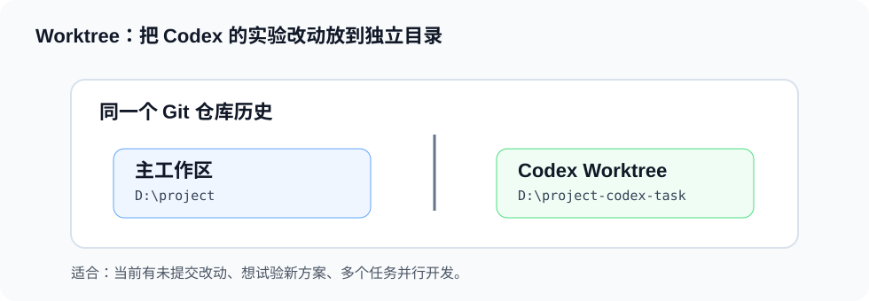

# 工作区与 Worktree

Worktree 可以让同一个 Git 仓库同时拥有多个独立工作目录。Codex 做较大任务时，可以在隔离目录中修改代码，避免影响你当前正在编辑的内容。



## 什么时候使用 Worktree

- 当前分支上已经有未提交改动。
- 要尝试一个不确定的方案。
- 要并行处理多个功能或 bug。
- 不希望 Codex 的实验性修改影响主工作区。

## 基本理解

普通工作区：

```text
一个目录，对应一个当前分支。
```

Worktree：

```text
多个目录，共享同一个 Git 仓库历史，但可以 checkout 不同分支。
```

## 可以这样要求 Codex

```text
请在独立 worktree 中实现这个功能，避免影响当前工作区。
```

```text
这个需求先做实验，不要直接改我当前目录。
```

## 操作步骤

### 第 1 步：确认当前目录状态

```bash
git status
```

如果当前目录已经有很多改动，优先考虑使用 worktree。

### 第 2 步：让 Codex 创建隔离环境

```text
请在独立 worktree 中实现这个功能，分支名使用 codex/add-codex-guide。
```

### 第 3 步：在 worktree 中开发和验证

Codex 会在隔离目录中修改文件，并运行对应的验证命令。

### 第 4 步：检查结果

```bash
git diff
npm run docs:build
```

确认通过后，再决定是否合并回主工作区。

## 注意事项

- Worktree 不是备份，仍然要靠 Git 提交保存历史。
- 每个 worktree 都要单独看 `git status`。
- 合并回主分支前，需要检查 diff、测试和冲突。
