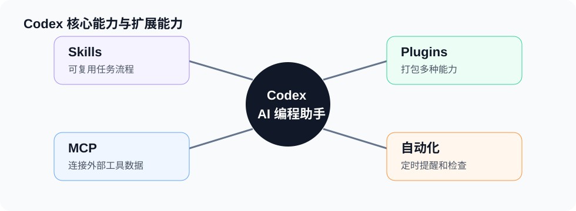

# 插件 Plugins

Plugins 是 Codex 的扩展包。一个插件可以包含 Skills、工具、MCP 配置、脚本、资源文件和应用能力。



## 插件适合解决什么问题

- 把一组相关能力打包复用。
- 给 Codex 增加项目或团队专用工具。
- 分发统一的工作流、模板和检查规则。
- 集成外部系统能力。

## Plugin 和 Skill 的区别

Skill 更像一套任务流程。

Plugin 更像一个能力包，可以包含多个 Skill，也可以包含工具、配置和资源。

## 使用建议

- 只有一个简单流程时，先做 Skill。
- 有多套流程、脚本和工具时，再做 Plugin。
- 团队共享能力时，Plugin 更适合管理。

## 示例场景

```text
为我的博客项目创建一个插件，包含 VuePress 文档写作规范、构建检查和链接检查流程。
```

## 创建思路

1. 先确定插件要解决哪一类问题。
2. 把重复流程拆成一个或多个 Skill。
3. 如果需要外部能力，再加入工具或 MCP 配置。
4. 写清楚安装、启用和验证方式。
5. 在真实项目里跑一次完整流程。
