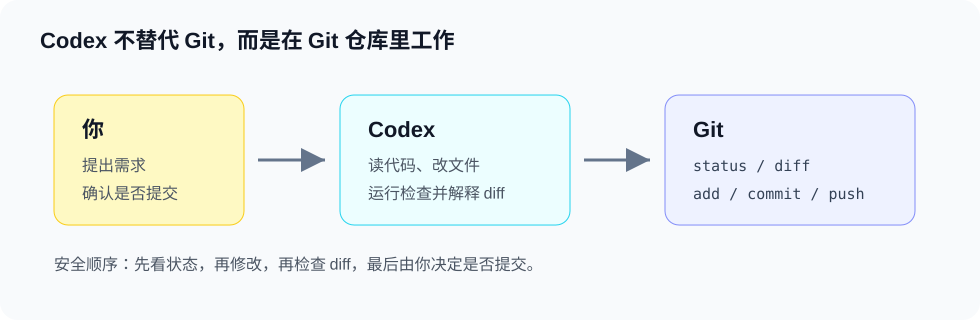

# 版本控制

Codex 本身不替代 Git。它是在你的 Git 仓库里工作，帮你修改文件、查看差异、提交代码或创建 PR。



## Codex 和 Git 的关系

- Git 负责版本控制。
- Codex 负责理解需求、修改文件、运行命令和解释结果。
- 你仍然可以用 `git status`、`git diff`、`git add`、`git commit` 管理版本。

## 常用流程

### 第 1 步：查看当前状态

```bash
git status
```

查看当前是否有未提交改动。

### 第 2 步：让 Codex 修改

```text
请只修改 Codex 文档相关文件，完成后告诉我改了哪些文件。
```

### 第 3 步：查看修改差异

```bash
git diff
```

查看 Codex 修改了什么。

### 第 4 步：确认后提交

```bash
git add .
git commit -m "docs: add codex guide"
```

确认无误后提交。

## 使用建议

- 让 Codex 修改前，先确认当前工作区是否干净。
- 如果工作区已有你的改动，告诉 Codex 不要覆盖。
- 大改动建议新建分支或使用 worktree。
- 提交前让 Codex 做一次代码审查。

## 可以这样要求 Codex

```text
先运行 git status，确认当前工作区状态，再帮我修改。
```

```text
只修改 Codex 文档相关文件，不要碰 Git 模块。
```

```text
帮我总结当前 diff，看看是否可以提交。
```
