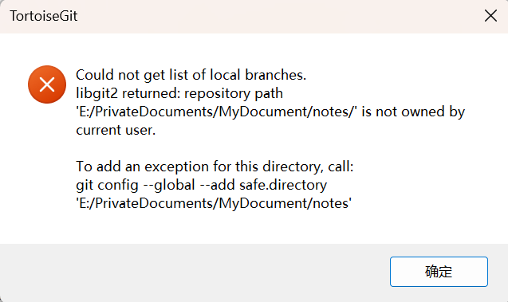

## 初始化

初始化一个 Git 本地仓库，使用 `git init` 命令

添加文件到仓库：

 	1. 使用 `git add <fileName>` 命令添加待提交文件，可反复提交提交多个文件
 	2. 使用 `git commit -m <message>` 命令提交到暂存区

例：

```
$ git add file1.txt
$ git add file2.txt file3.txt
$ git commit -m "add 3 files."
```


## Git创建本地分支并关联远程分支

**1、创建本地分支**

```
git branch 分支名
```

例如：git branch dev，这条命令是基于当前分支创建的本地分支，假设本地分支是main，则是基于main分支创建的本地分支dev。

**2、切换到本地分支**

```
git checkout 分支名
```

例如：git checkout dev，这条命令表示从当前main分支切换到dev分支。

**3、创建本地分支并切换**

```
git checkout -b 分支名
```

例如：git checkout -b dev，这条命令把创建本地分支和切换到该分支的功能结合起来了，即基于当前分支master创建本地分支dev并切换到该分支下。

**4、提交本地分支到远程仓库**

```
git push origin 本地分支名
```

例如：git push origin dev，这条命令表示把本地dev分支提交到远程仓库，即创建了远程分支dev。
注：要想和其他人分享某个本地分支，你需要把它推送到一个你拥有写权限的远程仓库。你创建的本地分支不会因为你的写入操作而被自动同步到你引入的远程服务器上，你需要明确地执行推送分支的操作。换句话说，对于无意分享的分支，你尽管保留为私人分支好了，而只推送那些协同工作要用到的特性分支。

**5.新建本地分支与远程分支关**

```
git branch –set-upstream 本地新建分支名 origin/远程分支名
或者 git branch –set-upstream-to=origin/远程分支名
例：git branch --set-upstream-to=origin/dev  dev
```

原文链接：https://blog.csdn.net/renfeideboke/article/details/130930418


## git怎么删除某个分支

> 原文链接：https://www.php.cn/faq/493215.html

**1、删除本地分支**

在删除分支的时候,我们会使用

```
git branch ``--delete dev
```

登录后复制

来执行.有时还会通过缩写

```
git branch -d dev
```

来代替,使用中我们发现还有git branch -D dev的写法,他们有什么区别呢?

- -d是--delete的缩写,在使用--delete删除分支时,该分支必须完全和它的上游分支merge完成(了解上游分支,可以点击查看链接),如果没有上游分支,必须要和HEAD完全merge
- -D是--delete --force的缩写,这样写可以在不检查merge状态的情况下删除分支
- --force简写-f,作用是将当前branch重置到初始点(startpoint),如果不使用--force的话,git分支无法修改一个已经存在的分支.

**2、删除远程分支**

指令git push origin --delete branch,该指令也会删除追踪分支

**3、删除追踪分支**

通过指令git branch --delete --remotes remote/branch,可以删除追踪分支,该操作并没有真正删除远程分支,而是删除的本地分支和远程分支的关联关系,即追踪分支

如上,通过命令行git push origin --delete branch会删除远程分支和追踪分支,不需要单独删除追踪分支,但是如果通过网页对远程分支进行删除,追踪分支是不会被删除的.

在git版本1.6.6之后,可以通过git fetch origin --prune或它的简写git fetch origin -p来单独删除追踪分支


## git查看本地分支

**1、基本操作**

在使用Git时，查看本地分支是一项基本操作。我们可以通过以下命令来查看本地分支：

```
git branch
```

如果我们想查看详细的本地分支信息，可以使用以下命令：

```
git branch -v
```

命令运行后会输出本地所有分支，包括当前所在分支。输出结果格式如下：

```
* master      2ab2384  Add new feature
  dev         abcd123  Fix bug
  feature-1   efgh456  Implement new function
```

其中，星号标记的为当前所在的分支，第一列为分支名，第二列为最后一次提交的SHA1哈希值，第三列为最后一次提交的注释。

**2、查看指定分支**

有时候我们只需要查看指定的分支，可以使用以下命令：

```
git branch branch-name
```

该命令会输出指定分支的信息，包括该分支最后一次提交的SHA1哈希值和注释。

**3、查看所有分支**

如果我们想要查看所有本地和远程分支，可以使用以下命令：

```
git branch -a
```

该命令会输出所有分支信息，包括本地分支和远程分支。输出结果中，本地分支前没有任何标记，而远程分支前会标记所属的远程仓库，例如：

```
* master          2ab2384  Add new feature
  dev             abcd123  Fix bug
  feature-1       efgh456  Implement new function
  remotes/origin/master   2ab2384  Add new feature
  remotes/origin/dev      abcd123  Fix bug
```

**4、查看远程分支**

如果我们只需要查看远程分支，可以使用以下命令：

```
git branch -r
```

该命令会输出所有远程分支信息，不包括本地分支信息。输出结果格式与上例相同。

**5、查看本地和远程分支的差异**

如果我们想要查看本地分支与远程分支的差异，可以使用以下命令：

```
git branch -v -vv
```

在输出结果中，本地分支后会标记远程分支的跟踪关系，例如：

```
* master      2ab2384  Add new feature [origin/master] [ahead 1, behind 1]
  dev         abcd123  Fix bug [origin/dev] [ahead 3]
  feature-1   efgh456  Implement new function
```

其中，标记“[origin/master] [ahead 1, behind 1]”表示当前本地分支跟踪的远程分支为origin/master，并且本地分支比远程分支领先1个提交、落后1个提交。

**6、列出所有跟踪关系**

如果我们想查看本地所有分支跟踪的远程分支，可以使用以下命令：

```
git branch -vv
```

该命令会输出所有本地分支的跟踪关系信息，不包括远程分支信息。输出结果格式同上例。


## git怎样转换分支

> https://www.php.cn/faq/487574.html

checkout最常用的用法莫过于对于工作分支的切换了：

```
git checkout branchName
```

该命令会将当前工作分支切换到branchName。另外，可以通过下面的命令在新分支创建的同时切换分支：

```
git checkout -b newBranch
```

该命令相当于下面这两条命令的执行结果：

```
1. git branch newBranch ``2. git checkout newBranch
```

该命令的完全体为：

```
git checkout -b|-B <new_branch> [<start point>]
```

首先通过

```
$ git branch -a
```

来查看所在目录的分支

```
$ git branch -a`` ``master``* trunk`` ``remotes/origin/HEAD -> origin/master`` ``remotes/origin/master`` ``remotes/origin/zhanghanlun
```

然后输入命令切换分支

适用于第一次创建并切换分支

```
$ git checkout -b zhanghanlun origin/zhanghanlun
```

其中远程分支为origin/zhanghanlun

本地分支为zhanghanlun

如果已经有本地分支

直接输入命令

```
git checkout zhanghanlun
```

切换到本地为zhanghanlun的分支


## 状态查看

```
$ git status
On branch master	当前分支为 master
Changes not staged for commit:	更改没有上传到提交
  (use "git add <file>..." to update what will be committed)	更新要提交的内容
  (use "git checkout -- <file>..." to discard changes in working directory)	放弃工作目录中的更改

	modified:   readme.txt	修改 readme.txt

no changes added to commit (use "git add" and/or "git commit -a")	没有添加到提交的更改(使用“git add”和/或“git commit -a”)
```

`git status` 命令可以让我们时刻掌握仓库当前的状态，上面的命令输出告诉我们，`readme.txt` 被修改过了，但还没有准备提交的修改。

虽然Git告诉我们`readme.txt`被修改了，但如果能看看具体修改了什么内容，自然是很好的。比如你休假两周从国外回来，第一天上班时，已经记不清上次怎么修改的`readme.txt`，所以，需要用`git diff`这个命令看看：

```
$ git diff readme.txt 
diff --git a/readme.txt b/readme.txt
index 46d49bf..9247db6 100644
--- a/readme.txt
+++ b/readme.txt
@@ -1,2 +1,2 @@
-Git is a version control system.
+Git is a distributed version control system.
 Git is free software.
```

`git diff`顾名思义就是查看difference（差异），显示的格式正是Unix通用的diff格式，可以从上面的命令输出看到，我们在第一行添加了一个`distributed`单词。


## TortoiseGit 拉取项目失败，错误：Could not get HEAD hash. libgit2 returned: repository path '***' is not owned bu current user.

> 参考：https://www.hxstrive.com/article/1202.htm

**1、问题描述**

系统从win10更新到win11时，发现用TortoiseGit 对项目进行 pull （拉取）时，抛出异常！！！

**2、问题现象**

根据错误提示 **To add an exception for this directory, call: git config --global --add safe.directory **可知，Git 提示当前项目的目录被 Git 认为是不安全的，需要使用 **git config --global --add safe.directory** 命令将项目目录添加到 Git 的安全目录。如下图的错误：




其中，safe.directory 配置项指定了被 Git 追踪的目录，即使它们被当前用户以外的用户拥有，也会被认为是安全的。默认情况下，Git 会拒绝解析 git。

**3、解决方案**

打开 DOS 窗口，然后执行如下命令：

```
C:\Users\Administrator> git config --global --add safe.directory "E:\PrivateDocuments\MyDocument\notes"
```

也可以

```
C:\Users\Administrator> git config --global --add safe.directory "*"
```

执行完命令后，重新拉去就可以啦！！！


## Unstaged changes after reset

> 参考：https://blog.csdn.net/a1030260075/article/details/129761382


## 学习地址

https://www.liaoxuefeng.com/wiki/896043488029600/896954074659008


```
git reflog

git reset

git log


git checkout -f

git remote -v

get fetch origin

git rebase origin/分支名称

git add *

git checkout -f


git fetch origin 拉远程的到本地
git rebase origin/xxx 变基到远程分支
git add * 加 git checkout -f，清空未commit的东西

发现
和错，可以rebase -i 把合错的commit干掉
```

## 场景：多个commit合为一个


参考：
https://blog.csdn.net/u013276277/article/details/82470177?utm_medium=distribute.pc_aggpage_search_result.none-task-blog-2~all~first_rank_v2~rank_v25-1-82470177.nonecase&utm_term=%E5%90%88%E5%B9%B6commit&spm=1000.2123.3001.4430


## rebase 后无法 push

**Git在push推送时，报错提示信息如下：**

```shell
18:28:22.125: [ins-barley-margin] git -c credential.helper= -c core.quotepath=false -c log.showSignature=false push --progress --porcelain origin refs/heads/test:test
error: failed to push some refs to 'coding.jd.com:ins-barley-group/ins-barley-margin.git'
hint: Updates were rejected because the tip of your current branch is behind
To coding.jd.com:ins-barley-group/ins-barley-margin.git
!	refs/heads/test:refs/heads/test	[rejected] (non-fast-forward)
hint: its remote counterpart. Integrate the remote changes (e.g.
Done
hint: 'git pull ...') before pushing again.
hint: See the 'Note about fast-forwards' in 'git push --help' for details.
```


**原因分析：**

是由于本地和远程仓库两者代码文件不同步，因此需要先pull，进行合并然后再进行push


**解决方法：**
1、先使用pull命令：

```
git pull --rebase origin master
```

2、再使用push命令：

```
git push -u origin master
```

原文链接：https://blog.csdn.net/qq15577969/article/details/107618389
