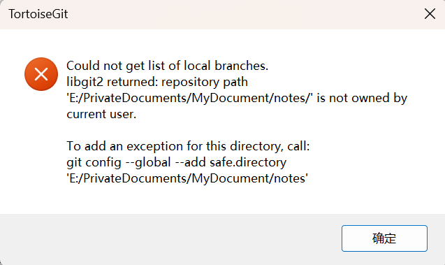

# Git 问题排查

## TortoiseGit 拉取项目失败：Could not get HEAD hash

### 问题描述

系统从 Windows 10 更新到 Windows 11 后，使用 TortoiseGit 拉取项目时出现异常：

```text
Could not get HEAD hash.
libgit2 returned: repository path '***' is not owned by current user.
```

错误提示通常会建议执行：

```bash
git config --global --add safe.directory <项目目录>
```

### 原因

Git 认为当前项目目录的所有者和当前用户不一致，因此拒绝解析该仓库。`safe.directory` 配置项可以将指定目录加入信任列表。

### 解决方案

打开命令行，执行：

```bash
git config --global --add safe.directory "E:\PrivateDocuments\MyDocument\notes"
```

如果想信任所有目录，也可以执行：

```bash
git config --global --add safe.directory "*"
```

执行完成后，重新拉取项目即可。



## Unstaged changes after reset

执行 `git reset` 后，如果出现未暂存修改，可以先确认当前状态：

```bash
git status
```

如果这些修改不需要保留，可以丢弃工作区变更：

```bash
git checkout -f
```

如果修改需要保留，先添加并提交：

```bash
git add .
git commit -m "save changes"
```
