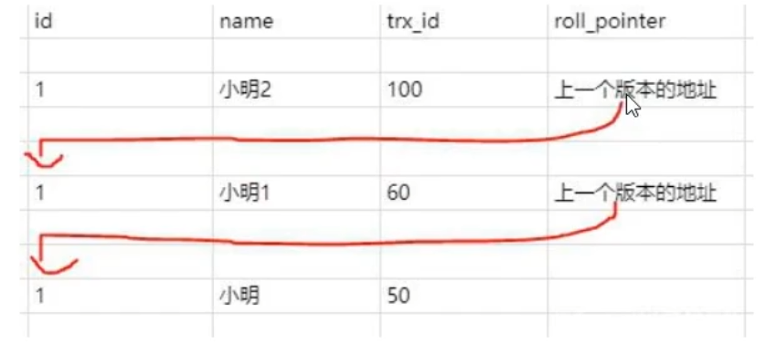
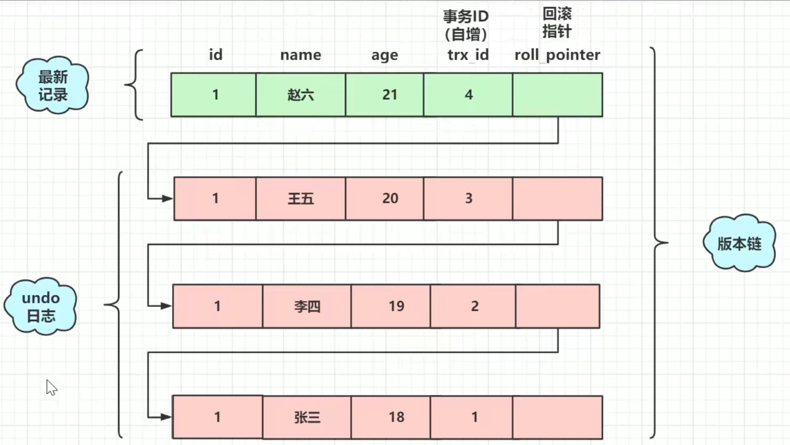
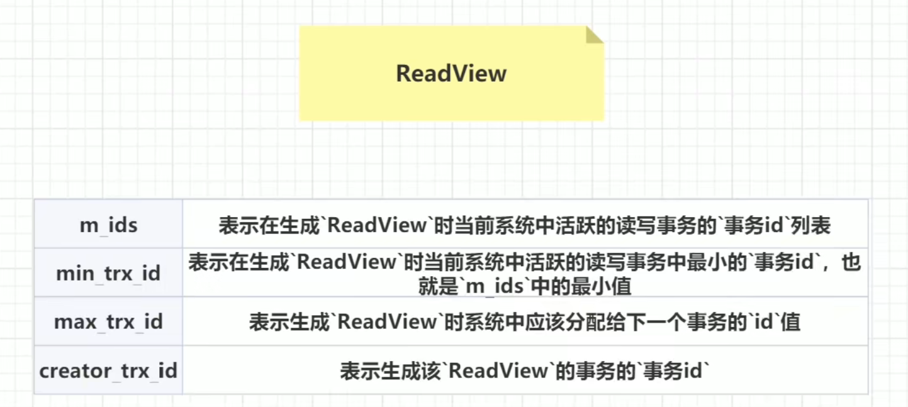
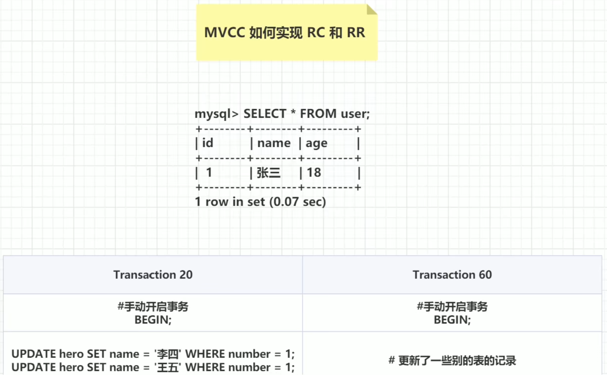
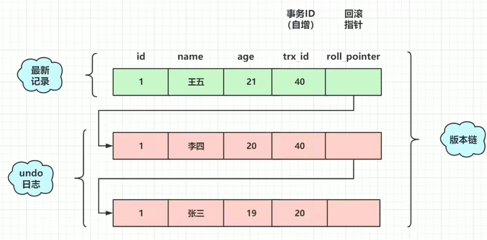
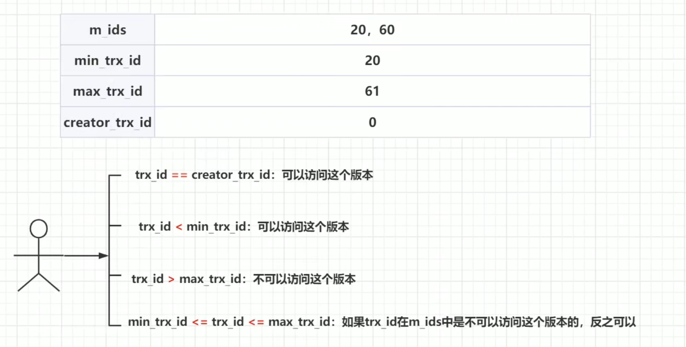

# Mysql基础


## 数据库连接池到底应该设多大？

计算公式：**连接数 = ((核心数 \* 2) + 有效磁盘数)**

> 核心数不应包含超线程(hyper thread)，即使打开了hyperthreading也是。如果活跃数据全部被缓存了，那么有效磁盘数是0，随着缓存命中率的下降，有效磁盘数逐渐趋近于实际的磁盘数。这一公式作用于SSD时的效果如何尚未有分析。

按这个公式，你的4核i7数据库服务器的连接池大小应该为((4 * 2) + 1) = 9。取个整就算是是10吧。是不是觉得太小了？跑个性能测试试一下，我们保证它能轻松搞定3000用户以6000TPS的速率并发执行简单查询的场景。如果连接池大小超过10，你会看到响应时长开始增加，TPS开始下降。

> 笔者注：这一公式其实不仅适用于数据库连接池的计算，大部分涉及计算和I/O的程序，线程数的设置都可以参考这一公式。我之前在对一个使用Netty编写的消息收发服务进行压力测试时，最终测出的最佳线程数就刚好是CPU核心数的一倍。

参考地址：https://zhuanlan.zhihu.com/p/133996025

https://www.jianshu.com/p/a8f653fc0c54

https://github.com/brettwooldridge/HikariCP/wiki/About-Pool-Sizing


## 添加索引

1. 添加主键索引：

   ```sql
   ALTER TABLE `table_name` ADD PRIMARY KEY `IndexName` (`column`);
   ```

2. 添加唯一索引：

   ```sql
   ALTER TABLE `table_name` ADD UNIQUE KEY `IndexName` (`column`);
   ```

3. 添加普通索引：

   ```sql
   ALTER TABLE `table_name` ADD INDEX `index_name` (`column`);
   ```

4. 添加全文索引：

   ```sql
   ALTER TABLE `talbe_name` ADD FULLTEXT `index_name` (`column`);
   ```

5. 添加组合索引：

   ```sql
   ALTER TABLE `table_name` ADD INDEX `index_name`（`column1`,`column2`,`column3`);
   ```

   

## mysql 清空表且自增的id从0开始

```sql
truncate table TableName;
```


## Update字符串拼接

update 字段=字段+字符串 拼接

```sql
update comic set concat(user_name,'呵呵呵');
```


## MVCC

参考：https://mp.weixin.qq.com/s/oOL4yradD5w73VsrfoyneA

全称Multi-Version Concurrency Control，即`多版本并发控制`，主要是为了提高数据库的`并发性能`。以下文章都是围绕InnoDB引擎来讲，因为myIsam不支持事务。同一行数据平时发生读写请求时，会`上锁阻塞`住。但mvcc用更好的方式去处理读—写请求，做到在发生读—写请求冲突时`不用加锁`。这个读是指的`快照读`，而不是`当前读`，当前读是一种加锁操作，是`悲观锁`。


多版本并发控制:读取数据时通过一种类似快照的方式将数据保存下来,这样读锁就和写锁不冲突了，不同的事务session会看到自己特定版本的数据,版本链

MVCC只在READ COMMITTED和REPEATABLE READ两个隔离级别下工作。其他两个隔离级别够和MVCC不兼容,因为READ UNCOMMITTED总是读取最新的数据行,而不是符合当前事务版本的数据行。而SERIALIZABLE则会对所有读取的行都加锁。

聚簇索引记录中有两个必要的隐藏列:
**trx_ id:**用来存储每次对某条聚簇索弓|记录进行修改的时候的事务id。
**roll pointer:**每次对哪条聚簇索引记录有修改的时候，都会把老版本写入undo日志中。这个roll. pointer就是存
了一个指针，它指向这条聚簇索引记录的上一个版本的位置,通过它来获得上一个版本的记录信息。(注意插入操
作的undo日志没有这个属性，因为它没有老版本)



**已提交读和可重复读的区别就在于它们生成ReadView的策略不同。**

开始事务时创建readview, readView维护当前活动的事务id,即未提交的事务id,排序生成一-个数组
访问数据，获取数据中的事务id (获取的是事务id最大的记录)，对比readview:
如果在readview的左边(此readview都小)，可以访问(在左边意味着该事务已经提交)
如果在readview的右边(比readview都大) 或者就在readview中,不可以访问，获取roll_ pointer,取上一版本
重新对比(在右边意味着，该事务在readview生成之 后出现，在readview中意味着该事务还未提交)
已提交读隔离级别下的事务在每次查询的开始都会生成一个独立 的ReadView,而可重复读隔离级别则在第一次读的时候生成一个ReadView, 之后的读都复用之前的ReadView。
这就是Mysql的MVCC,通过版本链，实现多版本，可并发读写，写读。通过ReadView生 成策略的不同实现不同的
隔离级别。







活跃的读写事务的"事务ID"：就是指还未commit的数据




RC：读已提交

RR：可重复读






