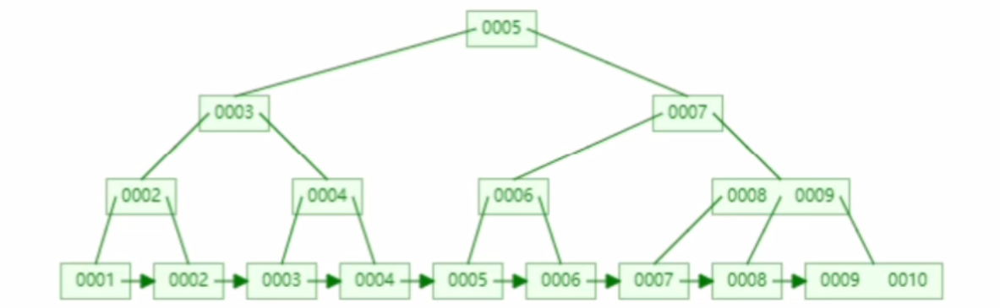
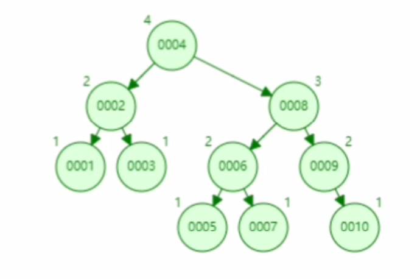
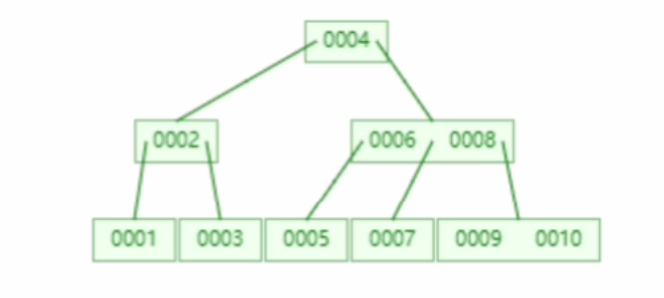

# Mysql面试题


## 索引的基本原理

快速的找到想要的值，索引就是把无序变成有序的查询

1. 把索引列排序
2. 对排序结果生成倒排表
3. 在倒排表上拼接数据的地址
4. 在排序时，先拿到倒排表的内容，再去去地址，拿到对应的数据

## 聚簇索引和非聚簇索引的区别

数据结构都是B+Tree
● 聚簇索引:将数据存储与索引放到了一块、并且是按照一定的顺序组织的,找到索引也就找到了数据，数据的物理存放顺序与索引顺序是一致的, 即:只要索引是相邻的，那么对应的数据一定也是相邻地存放在磁盘上的
● 非聚簇索引:叶子节点不存储数据、存储的是数据行地址，也就是说根据索引查找到数据行的位置再取磁盘查（普通索引也叫二级索引就是非聚簇索引）

**优势:**

1. 查询通过聚簇索引可以直接获取数据，相比非聚簇索引需要第二次查询(非覆盖索引的情况下)效率要高

2. 聚簇索引对于范围查询的效率很高，因为其数据是按照大小排列的

3. 聚簇索引适合用在排序的场合，非聚簇索引不适合

**劣势:**

1. 维护索引很昂贵，特别是插入新行或者主键被更新导至要分页(page split)的时候。 建议在大量插入新行后，选在负载较低的时间段，通过OPTIMIZE TABLE优化表，因为必须被移动的行数据可能造成碎片。使用独享表空间可以弱化碎片

2. 表因为使用UUId (随机ID)作为主键，使数据存储稀疏，这就会出现聚簇索引有可能有比全表扫面更慢，所以建议使用int的auto_ increment作为主键

3. 如果主键比较大的话，那辅助索引将会变的更大，因为辅助索引的叶子存储的是主键值;过长的主键值，会导致非叶子节点占用占用更多的物理空间


InnoDB中一定有主键，主键一定是聚簇索引，不手动设置、则会使用unique索引, 没有unique索引, 则会使用数据库内部的一个行的隐藏id来当作主键索引。在聚簇索引之上创建的索引称之为辅助索引，辅助索引访问数据总是需要二次查找，**非聚簇索引都是辅助索引**,像复合索引、前缀索引、唯一索引, 辅助索引叶子节点存储的不再是行的物理位置，而是主键值

MyISM使用的是非聚簇索引，没有聚簇索引,非聚簇索引的两棵B+树看上去没什么不同,节点的结构完全一致只是存储的内容不同而已，主键索引B+树的节点存储了主键,辅助键索引B+树存储了辅助键。表数据存储在独立的地方，这两颗B+树的叶子节点都使用一个地址指向真正的表数据，对于表数据来说，这两个键没有任何差别。由于索引树是独立的，通过辅助键检索无需访问主键的索引树。

如果涉及到大数据量的排序、全表扫描、count之类的操作的话，还是MyISAM占优势些，因为索引所占空间小,这些操作是需要在内存中完成的。


## 回表

当查询提供主键是，可以直接走聚集索引，得到数据。而如果查询提供的是非聚集索引，则需要先在非聚集索引中查询到主键，然后用主键去距离索引中查询真实数据，这称为 **回表**。


## 覆盖索引

覆盖索引就是从索引中直接获取查询结果，要使用覆盖索引需要注意select查询列中包含在索引列中；where条件包含索引列或者复合索引的前导列；

参考：https://www.cnblogs.com/zhuifeng-mayi/p/9296415.html


## 索引的数据结构，各自优势，MySQL索引数据结构为什么使用B+树

索引的数据结构和具体存储引擎的实现有关,在MySQL中使用较多的索引有Hash索引，B+树索引等, InnoDB存
储引擎的默认索引实现为: B+树索引。对于哈希索引来说，底层的数据结构就是哈希表，因此在绝大多数需求为
单条记录查询的时候，可以选择哈希索引,查询性能最快;其余大部分场景，建议选择BTree索引。
**B+树:** 
B+树是一个平衡的多叉树，从根节点到每个叶子节点的高度差值不超过1，而且同层级的节点间有指针相互链接。
在B+树上的常规检索，从根节点到叶子节点的搜索效率基本相当，不会出现大幅波动，而且基于索弓|的顺序扫描
时，也可以利用双向指针快速左右移动，效率非常高。因此，B+树索引被广泛应用于数据库、文件系统等场景。

B+树：解决一个问题就是，回表查询，他的存储结构是将索引和数据都存储在叶子节点，叶子节点之间是有序排列的单项链表，所以根据索引查询的效率也会更高



**哈希索引:**
哈希索弓|就是采用一定的哈希算法，把键值换算成新的哈希值,检索时不需要类似B+树那样从根节点到叶子节点
逐级查找，只需一次哈希算法即可立刻定位到相应的位置，速度非常快

如果是等值查询，那么哈希索引明显有绝对优势，因为只需要经过一-次算法即可找到相应的键值;前提是键值都是
唯一的。如果键值不是唯一的，就需要先找到该键所在位置，然后再根据链表往后扫描，直到找到相应的数据;
如果是范围查询检索,这时候哈希索引|就毫无用武之地了，因为原先是有序的键值，经过哈希算法后，有可能变成
不连续的了,就没办法再利用索弓|完成范围查询检索;

哈希索引也没办法利用索弓|完成排序，以及like 'xxx%'这样的部分模糊查询(这种部分模糊查询,其实本质上也是
范围查询) ;
哈希索引也不支持多列联合索引的最左匹配规则;
B+树索引的关键字检索效率比较平均,不像B树那样波动幅度大,在有大量重复键值情况下，哈希索引的效率也是
极低的，因为存在哈希碰撞问题。

Hash：因为hash是无序的不能进行范围查找，而且会出现hash冲突的问题，冲突了就得去比对值，查询效率也会受影响

平衡二叉树：左右节点高度相差不会大于1，当数据量过大时，就会发现查找的深度越深，查找速度也会越慢，当查询数据大于5的数据时，还会出现回表查找



**B树：**

虽然说B树的高度相对于平衡二叉树来说高度减小了，但是也会出现回表查询的问题




## 索引设计原则

查询更快、占用空间更小

1. 适合索引的列是出现在where子句中的列，或者连接子句中指定的列
2. 基数较小的表,索引效果较差,没有必要在此列建立索引（数据量不是很大）
3. 使用短索引，如果对长字符串列进行索引,应该指定一个前缀长度, 这样能够节省大量索引空间,如果搜索词超过索引前缀长度，则使用索引排除不匹配的行，然后检查其余行是否可能匹配。
4. 不要过度索引。索引需要额外的磁盘空间，并降低写操作的性能。在修改表内容的时候,索引会进行更新甚至重构，索引列越多，这个时间就会越长。所以只保持需要的索引有利于查询即可。
5. 定义有外键的数据列一定要建立索引。
6. 更新频繁字段不适合创建索引
7. 若是不能有效区分数据的列不适合做索引列(如性别，男女未知，最多也就三种,区分度实在太低)
8. 尽量的扩展索引，不要新建索引。比如表中已经有a的索引,现在要加(a,b)的索引，那么只需要修改原来的索引即可。
9. 对于那些查询中很少涉及的列，重复值比较多的列不要建立索引。
10. 对于定义为text、image和bit的数据类型的列不要建 立索引。


## 锁的类型有哪些

基于锁的属性分类:共享锁、排他锁。
基于锁的粒度分类:行级锁(INNODB)、表级锁(INNODB、MYISAM)、 页级锁(BDB引擎)、记录锁、间隙锁、临键
锁。
基于锁的状态分类:意向共享锁、意向排它锁。
●共享锁(Share Lock)

```
共享锁又称读锁，简称S锁;当一个事务为数据加上读锁之后，其他事务只能对该数据加读锁，而不能对数据加写锁，
直到所有的读锁释放之后其他事务才能对其进行加持写锁。共享锁的特性主要是为了支持并发的读取数据，读取数据
的时候不支持修改，避免出现重复读的问题。
```

●排他锁(eXclusive Lock)

```
排他锁又称写锁，简称X锁;当-一个事务为数据加上写锁时，其他请求将不能再为数据加任何锁，直到该锁释放之后，
其他事务才能对数据进行加锁。排他锁的目的是在数据修改时候，不允许其他人同时修改，也不允许其他人读取。 避
免了出现脏数据和脏读的问题。
```

●表锁

```
表锁是指上锁的时候锁住的是整个表，当下一 一个事 务访问该表的时候，必须等前一一个事务释放了锁才能进行对表进行访问;
特点:粒度大， 加锁简单，容易冲突;
```

●行锁

```
行锁是指上锁的时候锁住的是表的某一行或多 行记录，其他事务访问同一-张表时， 只有被锁住的记录不能访问，其他
的记录可正常访问;
特点:粒度小，加锁比表锁麻烦，不容易冲突，相比表锁支持的并发要高;
```

●记录锁(Record Lock)

```
记录锁也属于行锁中的一-种，只不过记录锁的范围只是表中的某一条记录， 记录锁是说事务在加锁后锁住的只是表的
某一条记录。
精准条件命中，并且命中的条件字段是唯一索引
加了记录锁之后数据可以避免数据在查询的时候被修改的重复读问题，也避免了在修改的事务未提交前被其他事务读
取的脏读问题。
```

选择语言
●页锁

```
页级锁是MySQL中锁定粒度介于行级锁和表级锁中间的一种锁。 表级锁速度快，但冲突多，行级冲突少，但速度慢。
所以取了折衷的页级，一次锁定相邻的一-组记录。
特点:开销和加锁时间界于表锁和行锁之间;会出现死锁; 锁定粒度界于表锁和行锁之间，并发度- -般
```

●间隙锁(Gap Lock)

```
属于行锁中的一一种，间隙锁是在事务加锁后其锁住的是表记录的某- - 个区间，当表的相邻ID之间出现空隙则会形成一
个区间，遵循左开右闭原则。
范围查询并且查询未命中记录，查询条件必须命中索引、间隙锁只会出现在REPEATABLE_ READ (重复读)的事务级别
中。
触发条件:防止幻读问题，事务并发的时候，如果没有间隙锁，就会发生如下图的问题，在同一 一个事务里，A事务的两
次查询出的结果会不一一样。
比如表里面的数据ID为1,4,5,7,10 ,那么会形成以下几个间隙区间，-n-1区间， 1-4区间，7-10区间，10-n区
间(-n代表负无穷大，n代表正无穷大)
```

●临建锁(Next-Key Lock)

```
也属于行锁的一-种， 并且它是INNODB的行锁默认算法，总结来说它就是记录锁和间隙锁的组合，临键锁会把查询出来
的记录锁住，同时也会把该范围查询内的所有间隙空间也会锁住，再之它会把相邻的下-一个区间也会锁住
触发条件:范围查询并命中，查询命中了索引。
结合记录锁和间隙锁的特性，临键锁避免了在范围查询时出现脏读、重复读、幻读问题。加了临键锁之后，在范围区
间内数据不允许被修改和插入。
```

如果当事务A加锁成功之后就设置一个状态告诉后面的人， 已经有人对表里的行加了一个排他锁了，你们不能
对整个表加共享锁或排它锁了，那么后面需要对整个表加锁的人只需要获取这个状态就知道自己是不是可以对
表加锁，避免了对整个索弓|树的每个节点扫描是否加锁，而这个状态就是意向锁。
●意向共享锁

```
当一个事务试图对整个表进行加共享锁之前，首先需要获得这个表的意向共享锁。
```

●意向排他锁

```
当一个事务试图对整个表进行加排它锁之前，首先需要获得这个表的意向排它锁。
```


## ACID靠什么保证的?

A原子性由undo log日志保证，它记录了需要回滚的日志信息，事务回滚时撤销已经执行成功的sq|
C-致性由其他三大特性保证、程序代码要保证业务上的一致性
隔离性由MVCC来保证
D持久性由内存+redo log来保证, mysq|修改 数据同时在内存和redo log记录这次操作,宕机的时候可以从redolog恢复

```
InnoDB redo log写盘，InnoDB 事务进入prepare 状态。
如果前面prepare成功，bin1og写盘，再继续将事务日志持久化到binlog, 如果持久化成功，那么InnoDB 事务
则进入commit状态(在redo 1og里面写一个commit 记录)
```

redolog的刷盘会在系统空闲时进行

基于InnoDB引擎的日志：redo log、undo log

基于Mysql的日志：binlog


## mysql主从同步原理

mysql主从同步的过程:
Mysql的主从复制中主要有三个线程: master (binlog dump thread) 、slave (I/O thread 、 SQL thread)，Master一条线程和Slave中的两条线程。
● 主节点binlog, 主从复制的基础是主库记录数据库的所有变更记录到binlog。 binlog是数据库服务器启动的
那一刻起，保存所有修改数据库结构或内容的一个文件。
● 主节点log dump线程，当binlog 有变动时，log dump线程读取其内容并发送给从节点。
● 从节点l/O线程接收binlog内容,并将其写入到relay log文件中。
从节点的SQL线程读取relay log文件内容对数据更新进行重放，最终保证主从数据库的一致性。

**注:**主从节点使用binglog文件+ position偏移量来定位主从同步的位置,从节点会保存其已接收到的偏移量,如果从节点发生宕机重启，则会自动从position的位置发起同步。

由于mysq|默认的复制方式是异步的，主库把日志发送给从库后不关心从库是否已经处理，这样会产生一个问题就是假设主库挂了，从库处理失败了，这时候从库升为主库后，日志就丢失了。由此产生两个概念。

**全同步复制**
主库写入binlog后强制同步日志到从库，所有的从库都执行完成后才返回给客户端，但是很显然这个方式的话性能
会受到严重影响。

**半同步复制**
和全同步不同的是，半同步复制的逻辑是这样,从库写入日志成功后返回ACK确认给主库，主库收到至少一个从库
的确认就认为写操作完成。


## MyISAM和InnoDB的区别

**MyISAM:**
不支持事务，但是每次查询都是原子的;
支持表级锁，即每次操作是对整个表加锁;
存储表的总行数;
一个MYISAM表有三个文件:索引文件、表结构文件、数据文件;
采用非聚集索引，索引文件的数据域存储指向数据文件的指针。辅索引与主索引基本一致, 但是辅索引不用保证唯一性。
**InnoDb:** 
支持ACID的事务，支持事务的四种隔离级别;
支持行级锁及外键约束:因此可以支持写并发;
不存储总行数;
一个InnoDb引擎存储在一个文件空间(共享表空间，表大小不受操作系统控制，一个表可能分布在多个文件里)，也有可能为多个(设置为独立表空,大小受操作系统文件大小限制，一般为2G) , 受操作系统文件大小的限制;


## 索引类型及对数据库的性能的影响

**普通索引:**允许被索引的数据列包含重复的值。
**唯一索引:**可以保证数据记录的唯一性。
**主键:**是一种特殊的唯一索引， 在-张表中只能定义一个主键索引，主键用于唯一标识一 记录,使用关键字PRIMARY KEY来创建。
**联合索引:**索引可以覆盖多个数据列，如像INDEX(columnA, columnB)索引。
**全文索引:**通过建立倒排索引,可以极大的提升检索效率,解决判断字段是否包含的问题，是目前搜索弓|擎使用的一
种关键技术。可以通过ALTER TABLE table_ name ADD FULLTEXT (column);创建全文索引

索引可以极大的提高数据的查询速度。

通过使用索引，可以在查询的过程中，使用优化隐藏器，提高系统的性能。

但是会降低插入、删除、更新表的速度,因为在执行这些写操作时，还要操作索引文件

索引需要占物理空间，除了数据表占数据空间之外,每一个索引还要占-定的物理空间，如果要建立聚簇索引,那么需要的空间就会更大，如果非聚集索引很多，一旦聚集索引改变，那么所有非聚集索引都会跟着变。


## select * 和 select 字段的区别

1. select * 和 select 字段在性能上没有什么差别

2. 网络IO问题
   select * 会查出所有的字段，有些是不需要的，当应用程序和服务器不在同一个局域网时，字段过多会影响网络传输的性能

3. 索引问题

```sql
select col from table;
select * from table;
```

在col字段有索引的情况下，mysql是可以不用读data，直接使用index里面的值就返回结果的。
但是一旦用了select *，就会有其他列需要读取，这时在读完index以后还需要去读data才会返回结果。这样就造成了额外的性能开销


## count(*)、count(常数)、count(主键)的区别

对于`count(*)`、`count(常数)`、`count(主键)`形式的count函数来说，优化器可以选择扫描成本最小的索引执行查询，从而提升效率，它们的执行过程是一样的，只不过在判断表达式是否为NULL时选择不同的判断方式，这个判断为NULL的过程的代价可以忽略不计，所以我们可以认为`count(*)`、`count(常数)`、`count(主键)`所需要的代价是相同的。

而对于`count(非索引列)`来说，优化器选择全表扫描，说明只能在聚集索引的叶子结点顺序扫描。

`count(二级索引列)`只能选择包含我们指定的列的索引去执行查询，可能导致优化器选择的索引执行的代价并不是最小。

其实上述这些区别就是因为非聚集索引记录比聚集索引记录占用更少的存储空间，减少更多I/O成本，所以优化器才有了不同索引的选择，仅此而已。


参考：https://mp.weixin.qq.com/s?__biz=MzU2MTI4MjI0MQ==&mid=2247511868&idx=1&sn=c7afc775a6fc63ae60d432b591168d0d&chksm=fc79c292cb0e4b84f92f03d9c7169a0980bde75061240a03b257ee1b169cd777d69861e35fd9&mpshare=1&scene=2&srcid=0207JaRzCCjCCieF93LigI2E&sharer_sharetime=1644227446591&sharer_shareid=49eb7a1d7876087866c7b5165ff791ae#rd


