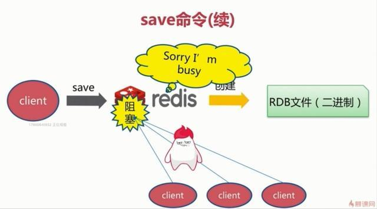
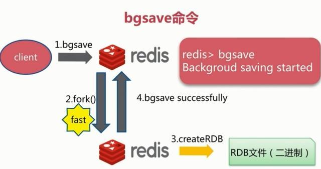
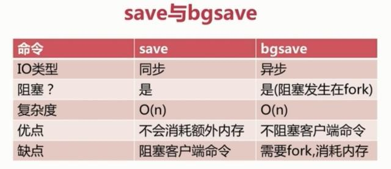
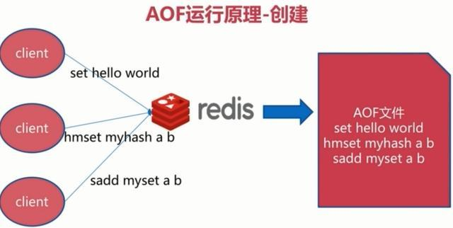
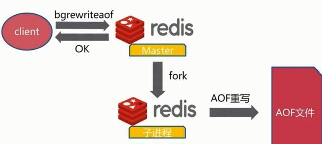
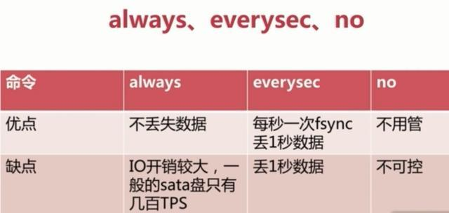
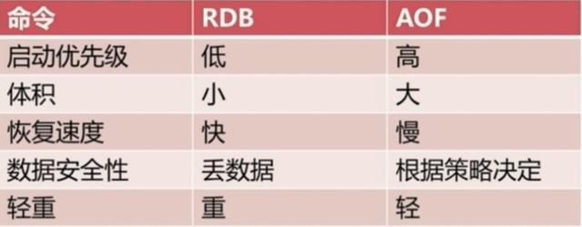

# Redis持久化


redis是一个内存数据库，数据保存在内存中，但是我们都知道内存的数据变化是很快的，也容易发生丢失。幸好Redis还为我们提供了持久化的机制，分别是RDB(Redis DataBase)和AOF(Append Only File)。

> 在这里假设你已经了解了redis的基础语法，某字母网站都有很好的教程，可以去看。基本使用的文章就不写了，都是一些常用的命令。

下面针对这两种方式来介绍一下。由浅入深。

Redis 持久化要解决的是“内存数据如何落盘”和“宕机后能恢复到什么程度”。它不能替代主从复制、备份和高可用，只是数据恢复链路中的一环。

## 持久化方式总览

| 方式 | 写入内容 | 触发方式 | 恢复速度 | 数据完整性 | 适合场景 |
|------|----------|----------|----------|------------|----------|
| RDB | 某一时刻的数据快照 | 手动、配置自动触发 | 快 | 可能丢失快照后的数据 | 备份、灾难恢复、冷启动 |
| AOF | 每条写命令日志 | 每次写入后追加 | 慢于 RDB | 通常最多丢失 1 秒 | 对数据完整性要求更高 |
| 混合持久化 | RDB 快照 + AOF 增量日志 | AOF 重写时生成 | 较快 | 较好 | Redis 4.0+ 推荐方案 |

简单理解：RDB 像定期拍照片，AOF 像持续记流水账，混合持久化是先用照片打底，再追加流水账。

## **一、持久化流程**

既然redis的数据可以保存在磁盘上，那么这个流程是什么样的呢？

要有下面五个过程：

（1）客户端向服务端发送写操作(数据在客户端的内存中)。

（2）数据库服务端接收到写请求的数据(数据在服务端的内存中)。

（3）服务端调用write这个系统调用，将数据往磁盘上写(数据在系统内存的缓冲区中)。

（4）操作系统将缓冲区中的数据转移到磁盘控制器上(数据在磁盘缓存中)。

（5）磁盘控制器将数据写到磁盘的物理介质中(数据真正落到磁盘上)。

这5个过程是在理想条件下一个正常的保存流程，但是在大多数情况下，我们的机器等等都会有各种各样的故障，这里划分了两种情况：

（1）Redis数据库发生故障，只要在上面的第三步执行完毕，那么就可以持久化保存，剩下的两步由操作系统替我们完成。

（2）操作系统发生故障，必须上面5步都完成才可以。

在这里只考虑了保存的过程可能发生的故障，其实保存的数据也有可能发生损坏，需要一定的恢复机制，不过在这里就不再延伸了。现在主要考虑的是redis如何来实现上面5个保存磁盘的步骤。它提供了两种策略机制，也就是RDB和AOF。

## **二、RDB机制**

RDB其实就是把数据以快照的形式保存在磁盘上。什么是快照呢，你可以理解成把当前时刻的数据拍成一张照片保存下来。

RDB持久化是指在指定的时间间隔内将内存中的数据集快照写入磁盘。也是默认的持久化方式，这种方式是就是将内存中数据以快照的方式写入到二进制文件中,默认的文件名为dump.rdb。

> 在我们安装了redis之后，所有的配置都是在redis.conf文件中，里面保存了RDB和AOF两种持久化机制的各种配置。

既然RDB机制是通过把某个时刻的所有数据生成一个快照来保存，那么就应该有一种触发机制，是实现这个过程。对于RDB来说，提供了三种机制：save、bgsave、自动化。我们分别来看一下

**1、save触发方式**

该命令会阻塞当前Redis服务器，执行save命令期间，Redis不能处理其他命令，直到RDB过程完成为止。具体流程如下：



执行完成时候如果存在老的RDB文件，就把新的替代掉旧的。我们的客户端可能都是几万或者是几十万，这种方式显然不可取。

**2、bgsave触发方式**

执行该命令时，Redis会在后台异步进行快照操作，快照同时还可以响应客户端请求。具体流程如下：



具体操作是Redis进程执行fork操作创建子进程，RDB持久化过程由子进程负责，完成后自动结束。阻塞只发生在fork阶段，一般时间很短。基本上 Redis 内部所有的RDB操作都是采用 bgsave 命令。

**3、自动触发**

```bash
127.0.0.1:6379> FLUSHALL	# 清除库中数据，也会生成一个dump.rdb文件
OK
```

自动触发是由我们的配置文件来完成的。在redis.conf配置文件中，里面有如下配置，我们可以去设置：

**①save：**这里是用来配置触发 Redis的 RDB 持久化条件，也就是什么时候将内存中的数据保存到硬盘。比如“save m n”。表示m秒内数据集存在n次修改时，自动触发bgsave。

默认如下配置：

```conf
# 表示 900 秒内如果至少有 1 个 key 的值变化，则保存
save 900 1

# 表示 300 秒内如果至少有 10 个 key 的值变化，则保存
save 300 10

# 表示 60 秒内如果至少有 10000 个 key 的值变化，则保存
save 60 10000
```

不需要持久化，那么你可以注释掉所有的 save 行来停用保存功能。

**②stop-writes-on-bgsave-error ：**默认值为yes。当启用了RDB且最后一次后台保存数据失败，Redis是否停止接收数据。这会让用户意识到数据没有正确持久化到磁盘上，否则没有人会注意到灾难（disaster）发生了。如果Redis重启了，那么又可以重新开始接收数据了

**③rdbcompression ；**默认值是yes。对于存储到磁盘中的快照，可以设置是否进行压缩存储。

**④rdbchecksum ：**默认值是yes。在存储快照后，我们还可以让redis使用CRC64算法来进行数据校验，但是这样做会增加大约10%的性能消耗，如果希望获取到最大的性能提升，可以关闭此功能。

**⑤dbfilename ：**设置快照的文件名，默认是 dump.rdb

**⑥dir：**设置快照文件的存放路径，这个配置项一定是个目录，而不能是文件名。

我们可以修改这些配置来实现我们想要的效果。因为第三种方式是配置的，所以我们对前两种进行一个对比：



**4、RDB 的优势和劣势**

①、优势

（1）RDB文件紧凑，全量备份，非常适合用于进行备份和灾难恢复。

（2）生成RDB文件的时候，redis主进程会fork()一个子进程来处理所有保存工作，主进程不需要进行任何磁盘IO操作。

（3）RDB 在恢复大数据集时的速度比 AOF 的恢复速度要快。

②、劣势

RDB快照是一次全量备份，存储的是内存数据的二进制序列化形式，存储上非常紧凑。当进行快照持久化时，会开启一个子进程专门负责快照持久化，子进程会拥有父进程的内存数据，父进程修改内存子进程不会反应出来，所以在快照持久化期间修改的数据不会被保存，可能丢失数据。

**5、适合使用 RDB 的场景**

- 需要定期生成全量备份文件，方便复制到远程存储。
- 可以接受分钟级数据丢失。
- 更关注重启恢复速度。
- Redis 主要作为缓存使用，数据可以从数据库重新构建。

**6、RDB 配置建议**

```conf
# RDB 文件名
dbfilename dump.rdb

# RDB 文件目录
dir /var/lib/redis

# 后台保存失败时是否停止写入
stop-writes-on-bgsave-error yes

# 是否压缩 RDB 文件
rdbcompression yes

# 是否进行校验
rdbchecksum yes
```


## 三、AOF机制（append only file）

全量备份总是耗时的，有时候我们提供一种更加高效的方式AOF，工作机制很简单，redis会将每一个收到的写命令都通过write函数追加到文件中。通俗的理解就是日志记录。每次都采取的是追加模式。

**1、持久化原理**

他的原理看下面这张图：



每当有一个写命令过来时，就直接保存在我们的AOF文件中。

**2、文件重写原理**

AOF的方式也同时带来了另一个问题。持久化文件会变的越来越大。为了压缩aof的持久化文件。redis提供了bgrewriteaof命令。将内存中的数据以命令的方式保存到临时文件中，同时会fork出一条新进程来将文件重写。可以根据配置文件进行配置文件到达多大时重写aof文件。



重写aof文件的操作，并没有读取旧的aof文件，而是将整个内存中的数据库内容用命令的方式重写了一个新的aof文件，这点和快照有点类似。

**3、AOF也有三种触发机制**

（1）每修改同步always：同步持久化 每次发生数据变更会被立即记录到磁盘 性能较差但数据完整性比较好

（2）每秒同步everysec：异步操作，每秒记录 如果一秒内宕机，有数据丢失

（3）不同no：从不同步



对应配置如下：

```conf
# 开启 AOF
appendonly yes

# AOF 文件名
appendfilename "appendonly.aof"

# 同步策略：always / everysec / no
appendfsync everysec

# AOF 重写期间是否不执行 fsync，通常保持 no
no-appendfsync-on-rewrite no

# AOF 文件比上次重写后增长 100% 时触发重写
auto-aof-rewrite-percentage 100

# AOF 文件达到 64MB 后才允许自动重写
auto-aof-rewrite-min-size 64mb
```

**4、优点**

（1）AOF可以更好的保护数据不丢失，一般AOF会每隔1秒，通过一个后台线程执行一次fsync操作，最多丢失1秒钟的数据。

（2）AOF日志文件没有任何磁盘寻址的开销，写入性能非常高，文件不容易破损。

（3）AOF日志文件即使过大的时候，出现后台重写操作，也不会影响客户端的读写。

（4）AOF日志文件的命令通过非常可读的方式进行记录，这个特性非常适合做灾难性的误删除的紧急恢复。比如某人不小心用flushall命令清空了所有数据，只要这个时候后台rewrite还没有发生，那么就可以立即拷贝AOF文件，将最后一条flushall命令给删了，然后再将该AOF文件放回去，就可以通过恢复机制，自动恢复所有数据

**5、缺点**

（1）对于同一份数据来说，AOF日志文件通常比RDB数据快照文件更大

（2）AOF开启后，支持的写QPS会比RDB支持的写QPS低，因为AOF一般会配置成每秒fsync一次日志文件，当然，每秒一次fsync，性能也还是很高的

（3）以前AOF发生过bug，就是通过AOF记录的日志，进行数据恢复的时候，没有恢复一模一样的数据出来。

**6、AOF 文件修复**

如果 Redis 启动时发现 AOF 文件损坏，可以使用 `redis-check-aof` 修复。修复的本质通常是截断损坏命令之后的内容，因此可能丢失尾部数据。

```bash
redis-check-aof --fix appendonly.aof
```

修复前建议先备份原 AOF 文件，避免误操作导致无法回退。

## 四、RDB和AOF到底该如何选择

选择的话，两者加一起才更好。因为两个持久化机制你明白了，剩下的就是看自己的需求了，需求不同选择的也不一定，但是通常都是结合使用。有一张图可供总结：



## 五、混合持久化

Redis 4.0 引入 AOF + RDB 混合持久化。开启后，AOF 重写生成的新文件前半部分是 RDB 格式的全量快照，后半部分是 AOF 格式的增量命令。

```conf
appendonly yes
aof-use-rdb-preamble yes
```

混合持久化的优点是恢复速度接近 RDB，同时又能保留 AOF 的增量数据。缺点是文件可读性下降，不再像纯 AOF 那样可以直接打开看全部命令。

## 六、生产配置建议

| 业务特点 | 建议配置 |
|----------|----------|
| 纯缓存，可从数据库重建 | 可以只开 RDB，甚至关闭持久化 |
| 允许少量数据丢失 | RDB + `appendfsync everysec` |
| 尽量少丢数据 | 开启 AOF，使用 `appendfsync everysec` |
| 极端要求不丢数据 | `appendfsync always`，但要接受明显性能损耗 |
| 重启恢复要快 | 开启混合持久化 |
| 需要异地备份 | 定期复制 RDB/AOF 到远程存储 |

多数线上业务会选择：开启 AOF，`appendfsync everysec`，同时保留 RDB 或混合持久化。这样能在性能、恢复速度和数据完整性之间取得比较稳妥的平衡。

## 七、恢复流程

Redis 启动时会根据配置和文件情况加载持久化文件。通常情况下，如果同时开启 RDB 和 AOF，Redis 会优先加载 AOF，因为 AOF 通常包含更新的数据。

恢复前建议检查：

- 确认 `dir` 目录下的 RDB/AOF 文件是否存在。
- 确认文件权限 Redis 进程可读。
- 如果 AOF 损坏，先备份，再执行 `redis-check-aof --fix`。
- 恢复完成后检查核心 Key 数量、业务抽样数据和应用日志。
- 对重要数据，不能只依赖 Redis 本地持久化，还要有定期备份和恢复演练。

## 八、常见误区

| 误区 | 说明 |
|------|------|
| 开了 RDB 就不会丢数据 | RDB 是快照，快照之后的数据可能丢失 |
| AOF 一定不丢数据 | `everysec` 最多仍可能丢 1 秒数据 |
| 持久化等于高可用 | 持久化解决恢复，高可用还需要主从、哨兵或 Cluster |
| AOF 文件越完整越好 | AOF 会膨胀，需要重写控制体积 |
| 删除命令可以靠 AOF 恢复 | 如果 AOF 已重写，误删命令可能已经固化进新文件 |

