# Redis进阶


## 事务

Redis中没有隔离级别的概念

Redis中单条命令是保证原子性的，但是事务不保证原子性。（有运行时异常不会回滚）

正常执行事务：

```bash
127.0.0.1:6379> MULTI			# 开启事务
OK
127.0.0.1:6379> set k1 v1		
QUEUED
127.0.0.1:6379> set k2 v2
QUEUED
127.0.0.1:6379> get k1
QUEUED
127.0.0.1:6379> exec			# 执行事务
1) OK
2) OK
3) "v1"
```

放弃事务：

```bash
127.0.0.1:6379> MULTI
OK
127.0.0.1:6379> set k1 v1
QUEUED
127.0.0.1:6379> discard			# 放弃事务
OK
```

编译型异常（命令有误！）事务中的所以命令都不会执行：

```bash
127.0.0.1:6379> MULTI
OK
127.0.0.1:6379> set k1 v1
QUEUED
127.0.0.1:6379> getset k2		# 命令有误
(error) ERR wrong number of arguments for 'getset' command
127.0.0.1:6379> exec			# 执行事务报错
(error) EXECABORT Transaction discarded because of previous errors.
```

运行时异常（1/0）如果事务队列中存在语法性错误，那么执行命令的时候，其他命令可以正常执行，错误命令抛出异常：

```bash
127.0.0.1:6379> get k1
"v1"
127.0.0.1:6379> MULTI
OK
127.0.0.1:6379> get k1
QUEUED
127.0.0.1:6379> incr k1			# 错误语法，在字符串上加1
QUEUED
127.0.0.1:6379> set k3 v3
QUEUED
127.0.0.1:6379> exec
1) "v1"
2) (error) ERR value is not an integer or out of range
3) OK
```


## 乐观锁watch监控

Redis中watch可以当做乐观锁去操作

正常执行：事务正常执行

```bash
127.0.0.1:6379> set money 100
OK
127.0.0.1:6379> set out 20
OK
127.0.0.1:6379> watch money			# 监视 money对象
OK
127.0.0.1:6379> MULTI
OK
127.0.0.1:6379> decrby money 20
QUEUED
127.0.0.1:6379> incrby out 20
QUEUED
127.0.0.1:6379> exec
1) (integer) 80
2) (integer) 20
127.0.0.1:6379>

```

 多线程修改测试：事务提交失败

```bash
127.0.0.1:6379> watch money			# 监视 money对象
OK
127.0.0.1:6379> MULTI -
OK
127.0.0.1:6379> decrby money 20
QUEUED
127.0.0.1:6379> incrby out 20
QUEUED
127.0.0.1:6379> exec				# 执行之前，另外一个线程修改了money的值，这个时候就会导致事务提交失败
(nil)
```

失败解决方案：

```bash
127.0.0.1:6379> UNWATCH				# 先解锁
OK
127.0.0.1:6379> watch money			# 获取money的最新值在进行监视
OK
127.0.0.1:6379> MULTI -
OK
127.0.0.1:6379> decrby money 10
QUEUED
127.0.0.1:6379> incrby out 10
QUEUED
127.0.0.1:6379> exec
1) (integer) 190
2) (integer) 30
```

## Redis 发布订阅

订阅端：

```bash
127.0.0.1:6379> PSUBSCRIBE pzy	# 订阅频道-pzy
Reading messages... (press Ctrl-C to quit)
1) "psubscribe"
2) "pzy"
3) (integer) 1
# 等待读取推送消息
1) "pmessage"	# 消息
2) "pzy"		# 订阅频道的名称
3) "pzy"
4) "helloworld"	# 消息的具体内容
1) "pmessage"
2) "pzy"
3) "pzy"
4) "zhangsanshuo"
```

客户端：

```bash
127.0.0.1:6379> PUBLISH pzy helloworld		# 发送消息
(integer) 1
127.0.0.1:6379> PUBLISH pzy zhangsanshuo
(integer) 1
127.0.0.1:6379>
```


## 主从复制

```bash
127.0.0.1:6379> info replication	# 查看当前库的信息
# Replication
role:master							# 角色为master
connected_slaves:0					# 当前从机个数
master_repl_offset:0
repl_backlog_active:0
repl_backlog_size:1048576
repl_backlog_first_byte_offset:0
repl_backlog_histlen:0
```


复制3个配置文件，修改对应的信息（默认情况下，每台Redis服务器都是主节点，只需要配置从机）

1. 端口
2. pid名称
3. log文件名称
4. dump.rdb名称

```
可以通过slaveof ip port 进行配置，通过这种方式进行配置的话是暂时的，要永久配置的话需要在配置文件中进行配置
slaveof no one  可以将从节点变为主节点
```


主机可以写，从机只能读不能写，从机写入时会报错


**复制原理需要补充**


**层层链路**也只能是从节点，只有一个主节点


## 哨兵模式

参考：https://www.cnblogs.com/ysocean/tag/Redis%E8%AF%A6%E8%A7%A3/

### 1、架构图

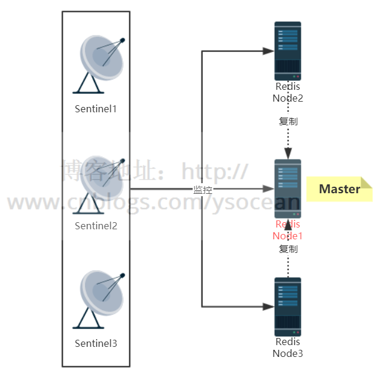

### 2、服务器列表

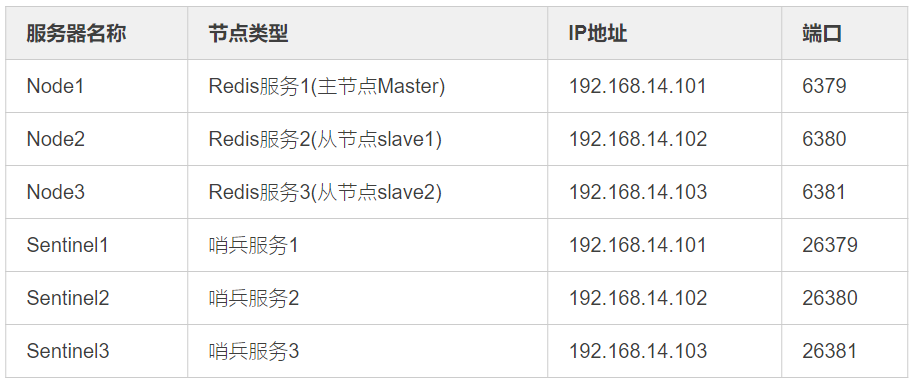


### 3、搭建哨兵模式

**①、主要配置项** 

配置文件名称为：sentinel.conf

```bash
#配置端口
port 26379
#以守护进程模式启动
daemonize yes
#日志文件名
logfile "sentinel_26379.log"
#存放备份文件以及日志等文件的目录
dir "/opt/redis/data"
#监控的IP 端口号 名称 sentinel通过投票后认为mater宕机的数量，此处为至少``2``个
sentinel monitor mymaster 192.168.14.101 6379 2
#``30``秒ping不通主节点的信息，主观认为master宕机
sentinel down-after-milliseconds mymaster 30000
#故障转移后重新主从复制，``1``表示串行，>``1``并行
sentinel parallel-syncs mymaster 1
#故障转移开始，三分钟内没有完成，则认为转移失败
sentinel failover-timeout mymaster 180000
```

注意三台服务器的端口配置.如果redis服务器配置了密码连接,则要增加如下配置:

```bash
sentinel auth-pass mymaster 123
```

后面的123表示密码mymaster表示主机.注意这行配置要配置到 sentinel monitor mymaster ip port 后面,因为名称 mymaster要先定义.

②**、启动哨兵**

```bash
redis-sentinel sentinel.conf
```

③**、验证主从自动切换**

　　首先kill掉Redis 主节点.然后查看sentinel 日志:

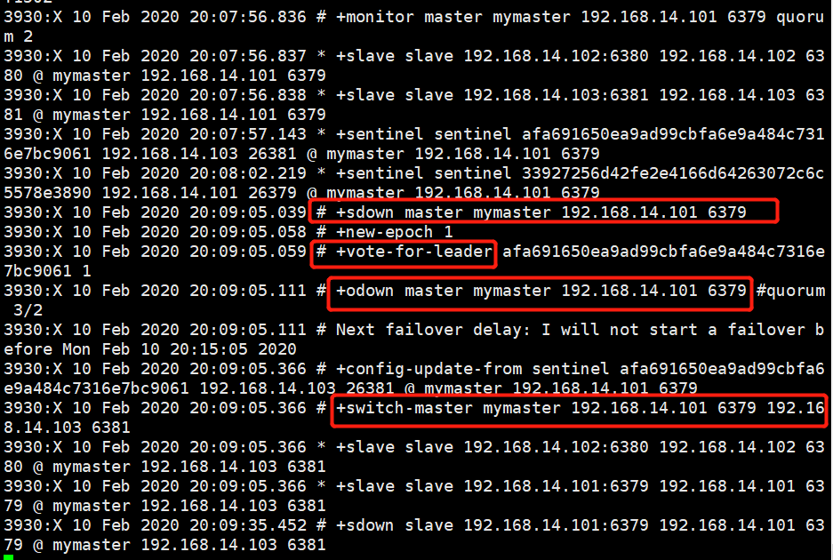

　　上面截图红框框住的几个重要信息,这里先介绍最后一行,switch-master mymaster 192.168.14.101 6379 192.168.14.103 6381 表示master服务器将由6379的redis服务切换为6381端口的redis服务器.

　　PS:**+switch-master** 表示切换主节点.

　　然后我们通过 info replication 命令查看 6381的redis服务器:

　　									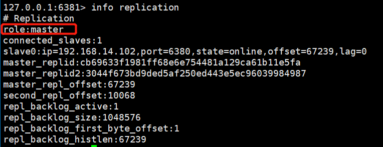

　　我们发现,6381的Redis服务已经切换成master节点了. 

　　另外,也可以查看sentinel.conf 配置文件,里面的 sentinel monitor mymaster 192.168.14.101 6379 2 也自动更改为 sentinel monitor mymaster 192.168.14.103 6381 2 配置了.

### 4、Java客户端连接原理

　　**①**、**结构图**

　　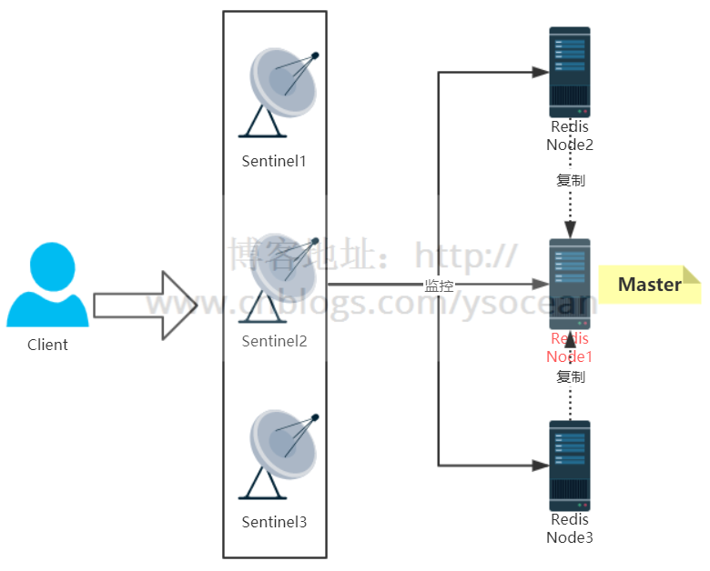

　　**②、连接步骤** 

　　一.客户端遍历所有的 Sentinel 节点集合,获取一个可用的 Sentinel 节点.

　　二.客户端向可用的 Sentinel 节点发送 get-master-addr-by-name 命令,获取Redis Master 节点.

　　三.客户端向Redis Master节点发送role或role replication 命令,来确定其是否是Master节点,并且能够获取其 slave节点信息.

　　四.客户端获取到确定的节点信息后,便可以向Redis发送命令来进行后续操作了

　　需要注意的是:客户端是和Sentinel来进行交互的,通过Sentinel来获取真正的Redis节点信息,然后来操作.实际工作时,Sentinel 内部维护了一个主题队列,用来保存Redis的节点信息,并实时更新,客户端订阅了这个主题,然后实时的去获取这个队列的Redis节点信息.


### 5、哨兵模式工作原理

　　**①、三个定时任务**

　　一.每10秒每个 sentinel 对master 和 slave 执行info 命令:该命令第一个是用来发现slave节点,第二个是确定主从关系.

　　二.每2秒每个 sentinel 通过 master 节点的 channel(名称为_sentinel_:hello) 交换信息(pub/sub):用来交互对节点的看法(后面会介绍的节点主观下线和客观下线)以及自身信息.

　　三.每1秒每个 sentinel 对其他 sentinel 和 redis 执行 ping 命令,用于心跳检测,作为节点存活的判断依据.

　　**②、主观下线和客观下线**

　　一.主观下线

　　SDOWN:subjectively down,直接翻译的为”主观”失效,即当前sentinel实例认为某个redis服务为”不可用”状态.

　　二.客观下线

　　ODOWN:objectively down,直接翻译为”客观”失效,即多个sentinel实例都认为master处于”SDOWN”状态,那么此时master将处于ODOWN,ODOWN可以简单理解为master已经被集群确定为”不可用”,将会开启故障转移机制.

　　结合我们第4点搭建主从模式,验证主从切换时,kill掉Redis主节点,然后查看 sentinel 日志,如下:

　　

　　发现有类似 sdown 和 odown 的日志.在结合我们配置 sentinel 时的配置文件来看:

```bash
#监控的IP 端口号 名称 sentinel通过投票后认为mater宕机的数量，此处为至少``2``个``
sentinel monitor mymaster 192.168.14.101 6379 2
```

　　最后的 2 表示投票数,也就是说当一台 sentinel 发现一个 Redis 服务无法 ping 通时,就标记为 主观下线 sdown;同时另外的 sentinel 服务也发现该 Redis 服务宕机,也标记为 主观下线,当多台 sentinel (大于等于2,上面配置的最后一个)时,都标记该Redis服务宕机,这时候就变为客观下线了,然后进行故障转移.

　　**③、故障转移**

　　故障转移是由 sentinel 领导者节点来完成的(只需要一个sentinel节点),关于 sentinel 领导者节点的选取也是每个 sentinel 向其他 sentinel 节点发送我要成为领导者的命令,超过半数sentinel 节点同意,并且也大于quorum ,那么他将成为领导者,如果有多个sentinel都成为了领导者,则会过段时间在进行选举.

　　sentinel 领导者节点选举出来后,会通过如下几步进行故障转移:

　　一.从 slave 节点中选出一个合适的 节点作为新的master节点.这里的合适包括如下几点:

　　　　1.选择 slave-priority(slave节点优先级)最高的slave节点,如果存在则返回,不存在则继续下一步判断.

　　　　2.选择复制偏移量最大的 slave 节点(复制的最完整),如果存在则返回,不存在则继续.

　　　　3.选择runId最小的slave节点(启动最早的节点)

　　二.对上面选出来的 slave 节点执行 slaveof no one 命令让其成为新的 master 节点.

　　三.向剩余的 slave 节点发送命令,让他们成为新master 节点的 slave 节点,复制规则和前面设置的 parallel-syncs 参数有关.

　　四.更新原来master 节点配置为 slave 节点,并保持对其进行关注,一旦这个节点重新恢复正常后,会命令它去复制新的master节点信息.(注意:原来的master节点恢复后是作为slave的角色)

　　可以从 sentinel 日志中出现的几个消息来进行查看故障转移:

　　1.**+switch-master**:表示切换主节点(从节点晋升为主节点)

　　2.**+sdown**:主观下线

　　3.**+odown**:客观下线

　　4.**+convert-to-slave**:切换从节点(原主节点降为从节点)


## 缓存穿透、击穿和雪崩


### 1、缓存穿透


#### 一、概念

　　缓存穿透：缓存和数据库中都没有的数据，可用户还是源源不断的发起请求，导致每次请求都会到数据库，从而压垮数据库。

　　如下图红色的流程：

　　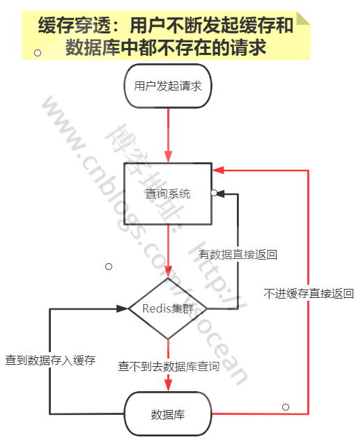

 　比如客户查询一个根本不存在的东西，首先从Redis中查不到，然后会去数据库中查询，数据库中也查询不到，那么就不会将数据放入到缓存中，后面如果还有类似源源不断的请求，最后都会压到数据库来处理，从而给数据库造成巨大的压力。


#### 二、解决办法

　　**①、业务层校验**

　　用户发过来的请求，根据请求参数进行校验，对于明显错误的参数，直接拦截返回。

　　比如，请求参数为主键自增id，那么对于请求小于0的id参数，明显不符合，可以直接返回错误请求。

　　**②、不存在数据设置短过期时间**

　　对于某个查询为空的数据，可以将这个空结果进行Redis缓存，但是设置很短的过期时间，比如30s，可以根据实际业务设定。注意一定不要影响正常业务。

　　**③、布隆过滤器**

　　关于布隆过滤器，后面会详细介绍。布隆过滤器是一种数据结构，利用极小的内存，可以判断大量的数据“一定不存在或者可能存在”。

　　对于缓存穿透，我们可以将查询的数据条件都哈希到一个足够大的布隆过滤器中，用户发送的请求会先被布隆过滤器拦截，一定不存在的数据就直接拦截返回了，从而避免下一步对数据库的压力。

### 2、缓存击穿


#### 一、概念

　　缓存击穿：Redis中一个热点key在失效的同时，大量的请求过来，从而会全部到达数据库，压垮数据库。

　　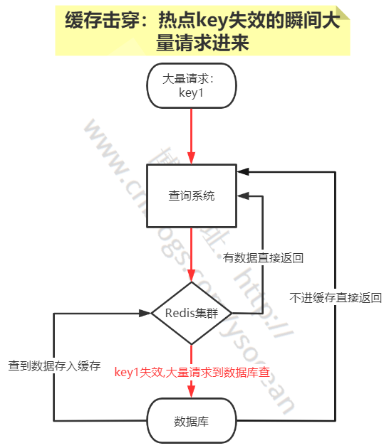

 　这里要注意的是这是某一个热点key过期失效，和后面介绍缓存雪崩是有区别的。比如淘宝双十一，对于某个特价热门的商品信息，缓存在Redis中，刚好0点，这个商品信息在Redis中过期查不到了，这时候大量的用户又同时正好访问这个商品，就会造成大量的请求同时到达数据库。


#### 二、解决办法

　　**①、设置热点数据永不过期**

　　对于某个需要频繁获取的信息，缓存在Redis中，并设置其永不过期。当然这种方式比较粗暴，对于某些业务场景是不适合的。

　　**②、定时更新**

　　比如这个热点数据的过期时间是1h，那么每到59minutes时，通过定时任务去更新这个热点key，并重新设置其过期时间。

　　③**、互斥锁**

　　这是解决缓存击穿比较常用的方法。

　　互斥锁简单来说就是在Redis中根据key获得的value值为空时，先锁上，然后从数据库加载，加载完毕，释放锁。若其他线程也在请求该key时，发现获取锁失败，则睡眠一段时间（比如100ms）后重试。也可以使用双重检测同步锁：https://blog.csdn.net/weixin_42857269/article/details/120181414

### **3、缓存雪崩**


#### 一、概念

　　缓存雪崩：Redis中缓存的数据大面积同时失效，或者Redis宕机，从而会导致大量请求直接到数据库，压垮数据库。

　　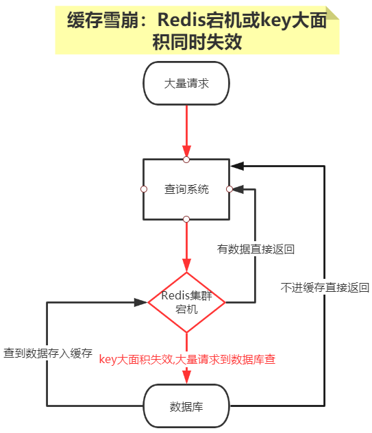

 　对于一个业务系统，如果Redis宕机或大面积的key同时过期，会导致大量请求同时打到数据库，这是灾难性的问题。


#### 二、解决办法

　　**①、设置有效期均匀分布**

　　避免缓存设置相近的有效期，我们可以在设置有效期时增加随机值；

　　或者统一规划有效期，使得过期时间均匀分布。

　　**②、数据预热**

　　对于即将来临的大量请求，我们可以提前走一遍系统，将数据提前缓存在Redis中，并设置不同的过期时间。

　　**③、保证Redis服务高可用**

　　前面我们介绍过Redis的哨兵模式和集群模式，为防止Redis集群单节点故障，可以通过这两种模式实现高可用。


## 布隆过滤器


### 1、布隆过滤器使用场景

　　比如有如下几个需求：

　　①、原本有10亿个号码，现在又来了10万个号码，要快速准确判断这10万个号码是否在10亿个号码库中？

　　解决办法一：将10亿个号码存入数据库中，进行数据库查询，准确性有了，但是速度会比较慢。

　　解决办法二：将10亿号码放入内存中，比如Redis缓存中，这里我们算一下占用内存大小：10亿*8字节=8GB，通过内存查询，准确性和速度都有了，但是大约8gb的内存空间，挺浪费内存空间的。

　　②、接触过爬虫的，应该有这么一个需求，需要爬虫的网站千千万万，对于一个新的网站url，我们如何判断这个url我们是否已经爬过了？

　　解决办法还是上面的两种，很显然，都不太好。

　　③、同理还有垃圾邮箱的过滤。

　　那么对于类似这种，大数据量集合，如何准确快速的判断某个数据是否在大数据量集合中，并且不占用内存，**布隆过滤器**应运而生了。

### 2、布隆过滤器简介

　　带着上面的几个疑问，我们来看看到底什么是布隆过滤器。

　　布隆过滤器：一种数据结构，是由一串很长的二进制向量组成，可以将其看成一个二进制数组。既然是二进制，那么里面存放的不是0，就是1，但是初始默认值都是0。

　　如下所示：

　　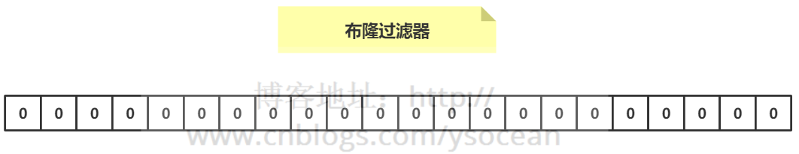

　　**①、添加数据**

　　介绍概念的时候，我们说可以将布隆过滤器看成一个容器，那么如何向布隆过滤器中添加一个数据呢？

　　如下图所示：当要向布隆过滤器中添加一个元素key时，我们通过多个hash函数，算出一个值，然后将这个值所在的方格置为1。

　　比如，下图hash1(key)=1，那么在第2个格子将0变为1（数组是从0开始计数的），hash2(key)=7，那么将第8个格子置位1，依次类推。

　　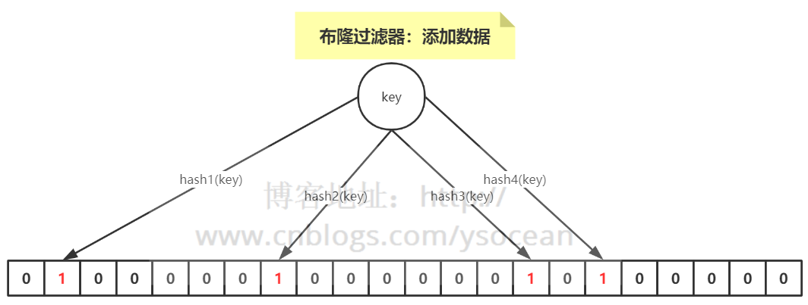

 

　　**②、判断数据是否存在？**

　　知道了如何向布隆过滤器中添加一个数据，那么新来一个数据，我们如何判断其是否存在于这个布隆过滤器中呢？

　　很简单，我们只需要将这个新的数据通过上面自定义的几个哈希函数，分别算出各个值，然后看其对应的地方是否都是1，如果存在一个不是1的情况，那么我们可以说，该新数据一定不存在于这个布隆过滤器中。

　　反过来说，如果通过哈希函数算出来的值，对应的地方都是1，那么我们能够肯定的得出：这个数据一定存在于这个布隆过滤器中吗？

　　答案是否定的，因为多个不同的数据通过hash函数算出来的结果是会有重复的，所以会存在某个位置是别的数据通过hash函数置为的1。

　　我们可以得到一个结论：**布隆过滤器可以判断某个数据一定不存在，但是无法判断一定存在**。

　　**③、布隆过滤器优缺点**

　　优点：优点很明显，二进制组成的数组，占用内存极少，并且插入和查询速度都足够快。

　　缺点：随着数据的增加，误判率会增加；还有无法判断数据一定存在；另外还有一个重要缺点，无法删除数据。


### 3、Redis实现布隆过滤器


#### ①、bitmaps

　　我们知道计算机是以二进制位作为底层存储的基础单位，一个字节等于8位。

　　比如“big”字符串是由三个字符组成的，这三个字符对应的ASCII码分为是98、105、103，对应的二进制存储如下：

　　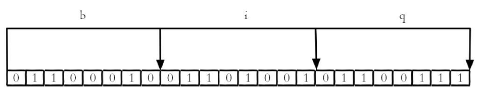

 

 

　　在Redis中，Bitmaps 提供了一套命令用来操作类似上面字符串中的每一个位。

　　**一、设置值**

```
setbit key offset value
```

　　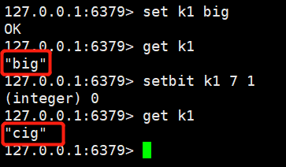

 

 　我们知道"b"的二进制表示为0110 0010，我们将第7位（从0开始）设置为1，那0110 0011 表示的就是字符“c”，所以最后的字符 “big”变成了“cig”。

　　**二、获取值**

```
gitbit key offset
```

　　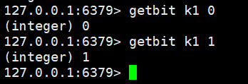

 　**三、获取位图指定范围值为1的个数**

```
bitcount key [start end]
```

　　如果不指定，那就是获取全部值为1的个数。

　　注意：start和end指定的是**字节的个数**，而不是位数组下标。

　　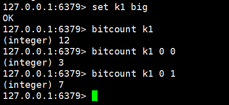


#### ②、Redisson

　　Redis 实现布隆过滤器的底层就是通过 bitmap 这种数据结构，至于如何实现，这里就不重复造轮子了，介绍业界比较好用的一个客户端工具——Redisson。

　　Redisson 是用于在 Java 程序中操作 Redis 的库，利用Redisson 我们可以在程序中轻松地使用 Redis。

　　下面我们就通过 Redisson 来构造布隆过滤器。

```java
package com.ys.rediscluster.bloomfilter.redisson;

import org.redisson.Redisson;
import org.redisson.api.RBloomFilter;
import org.redisson.api.RedissonClient;
import org.redisson.config.Config;

public class RedissonBloomFilter {

    public static void main(String[] args) {
        Config config = new Config();
        config.useSingleServer().setAddress("redis://192.168.14.104:6379");
        config.useSingleServer().setPassword("123");
        //构造Redisson
        RedissonClient redisson = Redisson.create(config);

        RBloomFilter<String> bloomFilter = redisson.getBloomFilter("phoneList");
        //初始化布隆过滤器：预计元素为100000000L,误差率为3%
        bloomFilter.tryInit(100000000L,0.03);
        //将号码10086插入到布隆过滤器中
        bloomFilter.add("10086");

        //判断下面号码是否在布隆过滤器中
        System.out.println(bloomFilter.contains("123456"));//false
        System.out.println(bloomFilter.contains("10086"));//true
    }
}
```

　这是单节点的Redis实现方式，如果数据量比较大，期望的误差率又很低，那单节点所提供的内存是无法满足的，这时候可以使用分布式布隆过滤器，同样也可以用 Redisson 来实现，这里我就不做代码演示了，大家有兴趣可以试试。


### 4、guava 工具

　　最后提一下不用Redis如何来实现布隆过滤器。

　　guava 工具包相信大家都用过，这是谷歌公司提供的，里面也提供了布隆过滤器的实现。

```java
package com.ys.rediscluster.bloomfilter;

import com.google.common.base.Charsets;
import com.google.common.hash.BloomFilter;
import com.google.common.hash.Funnel;
import com.google.common.hash.Funnels;

public class GuavaBloomFilter {
    public static void main(String[] args) {
        BloomFilter<String> bloomFilter = BloomFilter.create(Funnels.stringFunnel(Charsets.UTF_8),100000,0.01);

        bloomFilter.put("10086");

        System.out.println(bloomFilter.mightContain("123456"));
        System.out.println(bloomFilter.mightContain("10086"));
    }
}
```


## 底层原理


## LUA脚本


## 为什么说Redis是单线程的以及Redis为什么这么快！

https://blog.csdn.net/chenyao1994/article/details/79491337
