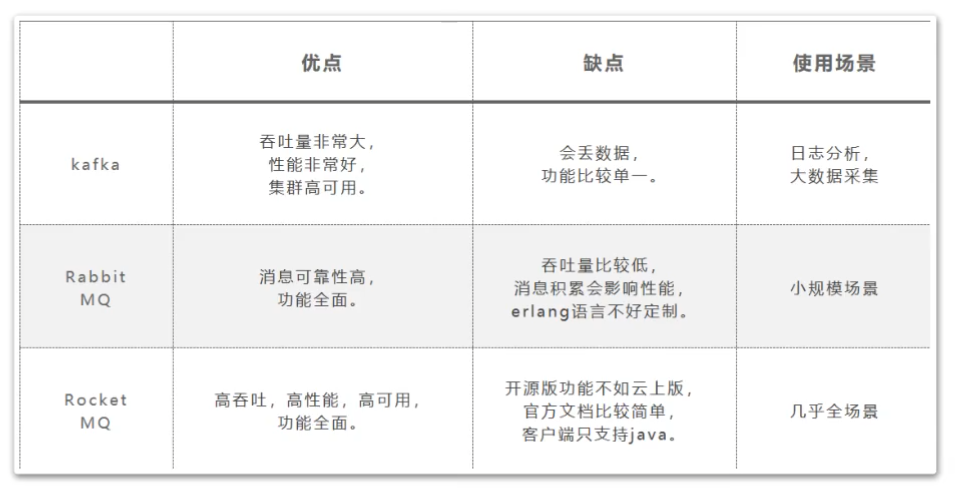

https://www.jianshu.com/p/79fa047d06cb?utm_campaign=haruki&utm_content=note&utm_medium=reader_share&utm_source=weixin


https://blog.csdn.net/suman35/article/details/103011360?utm_source=app


https://juejin.im/post/6844903652939792392#heading-6


# 介绍

## 1、什么是MQ?为什么要用MQ?

MQ: MessageQueue, 消息队列。队列，是一种FIFO先进先出的数据结构。消息由生产者发送到MQ进行排队，然后按原来的顺序交由消息的消费者进行处理。
MQ的作用主要有以下三个方面:

- 异步
  例子:快递员发快递，直接到客户家效率会很低。引入菜鸟驿站后，快递员只需要把快递放到菜鸟驿站，就可以继续发其他快递去了。客户再按自己的时间安排去菜鸟驿站取快递。
  
  作用:异步能提高系统的响应速度、吞吐量。

- 解耦
    例子:《Thinking in JAVA》很经典,但是都是英文,我们看不懂，所以需要编辑社，将文章翻译成其他语言，这样就可以完成英语与其他语言的交流。
    作用:
    
    1、服务之间进行解耦,才可以减少服务之间的影响。提高系统整体的稳定性以及可扩展性。
    2、另外,解耦后可以实现数据分发。生产者发送一个消息后， 可以由一个或者多个消费者进行消费，并且消费者的增加或者减少对生产者没有影响。
    
- 削峰
    例子:长江每年都会涨水，但是下游出水口的速度是基本稳定的，所以会涨水。引入三峡大坝后，可以把水储存起来，下游慢慢排水。
    作用:以稳定的系统资源应对突发的流量冲击。

## 2、MQ的优缺点

上面MQ的所用也就是使用MQ的优点。但是引入MQ也是有他的缺点的:

- 系统可用性降低
  系统引入的外部依赖增多，系统的稳定性就会变差。一旦MQ宕机，对业务会产生影响。这就需要考虑如何保证MQ的高可用。
- 系统复杂度提高
    引入MQ后系统的复杂度会大大提高。以前服务之间可以进行同步的服务调用，引入MQ后，会变为异步调用，数据的链路就会变得更复杂。并且还会带来其他一些问题。比如:如何保证消费不会丢失?不会被重复调用?怎么保证消息的顺序性等问题。
- 消息一致性问题
    A系统处理完业务，通过MQ发送消息给B、C系统进行后续的业务处理。如果B系统处理成功，C系统处理失败怎么办?这就需要考虑如何保证消息数据处理的一致性。

## 3、几大MQ产品特点比较

常用的MQ产品包括Kafka、RabbitMQ和RocketMQ。 我们对这三个产品做下简单的比较，重点需要理解他们的适用场景。




# RocketMQ架构


# 集群搭建

基于CentOS 7搭建


参考：

https://blog.csdn.net/mrathena/article/details/110847212

https://blog.csdn.net/boomlee/article/details/118068672


## 1.安装java

首先需要安装 Java，因为rocketMq是基于Java编写的。

安装Java省略，可查看之前安装Java步骤

https://blog.csdn.net/qq_43644923/article/details/117442308


## 2.下载

```shell
# 下载
wget https://archive.apache.org/dist/rocketmq/4.7.1/rocketmq-all-4.7.1-bin-release.zip --no-check-certificate

# 解压
unzip rocketmq-all-4.7.1-bin-release.zip
```


## 3.安装

准备三台虚拟机，这里特意不把每个机器的机器名定义得太过规范，比如master slave这样的，有助于更理解各项配置。这里需要配置为host，每个服务都需要配置

```
192.168.241.100 worker1
192.168.241.101 worker2
192.168.241.102 worker3
```

我们为了便于观察，这次搭建一个2主2从异步刷盘的集群，所以我们会使用conf/2m-2s-async下的配置文件，实际项目中，为了达到高可用，一般会使用dleger。预备设计的集群情况如下：

| 机器名  | nemaeServer节点部署 | broker节点部署       |
| ------- | ------------------- | -------------------- |
| worker1 | nameserver          |                      |
| worker2 | nameserver          | broker-a, broker-b-s |
| worker3 | nameserver          | broker-b,broker-a-s  |

在rocketmq的config目录下可以看到rocketmq建议的各种配置方式：

2m-2s-async: 2主2从异步刷盘(吞吐量较大，但是消息可能丢失),
2m-2s-sync: 2主2从同步刷盘(吞吐量会下降，但是消息更安全)，
2m-noslave:2主无从(单点故障)，然后还可以直接配置broker.conf，进行单点环境配置。
而dleger就是用来实现主从切换的。集群中的节点会基于Raft协议随机选举出一个leader，其他的就都是follower（从机）。通常正式环境都会采用这种方式来搭建集群。

| ip              | broker名称 | 说明    |
| --------------- | ---------- | ------- |
| 192.168.241.101 | broker-a   | a主节点 |
| 192.168.241.101 | broker-b-s | b从节点 |
| 192.168.241.102 | broker-b   | b主节点 |
| 192.168.241.102 | borker-a-s | a从节点 |

我们这次采用2m-2s-async的方式搭建集群。具体配置查看[5.配置broker](#5.配置broker)


## 4.配置环境变量

1、rocketmq安装后一定要配置环境变量

2、所有涉及到的路径名里不能有中文或空格

3、涉及到的日志路径也不能有空格，不然rocketmq会报错找不到。

```shell
# 先通过 pwd 查看当前rocketMq安装路径
[root@localhost rocketmq-all-4.7.1-bin-release]# pwd
/usr/local/rocketMq/rocketmq-all-4.7.1-bin-release

# 配置环境变量位置
[root@localhost rocketmq-all-4.7.1-bin-release]# vim /etc/profile

# 在/etc/profile中配置该命令
export ROCKETMQ_HOME=/usr/local/rocketMq/rocketmq-all-4.7.1-bin-release

```


## 5.配置broker

**1、配置第一组broker-a**

在**worker2**上先配置borker-a的master节点。先配置2m-2s-async/broker-a.properties

```properties
#所属集群名字，名字一样的节点就在同一个集群内
brokerClusterName=rocketmq-cluster
#broker名字，名字一样的节点就是一组主从节点。
brokerName=broker-a
#brokerid,0就表示是Master，>0的都是表示 Slave
brokerId=0
#nameServer地址，分号分割
namesrvAddr=worker1:9876;worker2:9876;worker3:9876
#在发送消息时，自动创建服务器不存在的topic，默认创建的队列数
defaultTopicQueueNums=4
#是否允许 Broker 自动创建Topic，建议线下开启，线上关闭
autoCreateTopicEnable=true
#是否允许 Broker 自动创建订阅组，建议线下开启，线上关闭
autoCreateSubscriptionGroup=true
#Broker 对外服务的监听端口
listenPort=10911
#删除文件时间点，默认凌晨 4点
deleteWhen=04
#文件保留时间，默认 48 小时
fileReservedTime=120
#commitLog每个文件的大小默认1G
mapedFileSizeCommitLog=1073741824
#ConsumeQueue每个文件默认存30W条，根据业务情况调整
mapedFileSizeConsumeQueue=300000
#destroyMapedFileIntervalForcibly=120000
#redeleteHangedFileInterval=120000
#检测物理文件磁盘空间
diskMaxUsedSpaceRatio=88
#存储路径
storePathRootDir=/usr/local/rocketmq/store
#commitLog 存储路径
storePathCommitLog=/usr/local/rocketmq/store/commitlog
#消费队列存储路径存储路径
storePathConsumeQueue=/usr/local/rocketmq/store/consumequeue
#消息索引存储路径
storePathIndex=/usr/local/rocketmq/store/index
#checkpoint 文件存储路径
storeCheckpoint=/usr/local/rocketmq/store/checkpoint
#abort 文件存储路径
abortFile=/usr/local/rocketmq/store/abort
#限制的消息大小
maxMessageSize=65536
#flushCommitLogLeastPages=4
#flushConsumeQueueLeastPages=2
#flushCommitLogThoroughInterval=10000
#flushConsumeQueueThoroughInterval=60000
#Broker 的角色
#- ASYNC_MASTER 异步复制Master
#- SYNC_MASTER 同步双写Master
#- SLAVE
brokerRole=ASYNC_MASTER
#刷盘方式
#- ASYNC_FLUSH 异步刷盘
#- SYNC_FLUSH 同步刷盘
flushDiskType=ASYNC_FLUSH
#checkTransactionMessageEnable=false
#发消息线程池数量
#sendMessageThreadPoolNums=128
#拉消息线程池数量
#pullMessageThreadPoolNums=128
```


该节点对应的从节点在**worker3**上。修改2m-2s-async/broker-a-s.properties `只需要修改brokerId和brokerRole`

```properties
#所属集群名字，名字一样的节点就在同一个集群内
brokerClusterName=rocketmq-cluster
#broker名字，名字一样的节点就是一组主从节点。
brokerName=broker-a
#brokerid,0就表示是Master，>0的都是表示 Slave
brokerId=1
#nameServer地址，分号分割
namesrvAddr=worker1:9876;worker2:9876;worker3:9876
#在发送消息时，自动创建服务器不存在的topic，默认创建的队列数
defaultTopicQueueNums=4
#是否允许 Broker 自动创建Topic，建议线下开启，线上关闭
autoCreateTopicEnable=true
#是否允许 Broker 自动创建订阅组，建议线下开启，线上关闭
autoCreateSubscriptionGroup=true
#Broker 对外服务的监听端口
listenPort=11011
#删除文件时间点，默认凌晨 4点
deleteWhen=04
#文件保留时间，默认 48 小时
fileReservedTime=120
#commitLog每个文件的大小默认1G
mapedFileSizeCommitLog=1073741824
#ConsumeQueue每个文件默认存30W条，根据业务情况调整
mapedFileSizeConsumeQueue=300000
#destroyMapedFileIntervalForcibly=120000
#redeleteHangedFileInterval=120000
#检测物理文件磁盘空间
diskMaxUsedSpaceRatio=88
#存储路径
storePathRootDir=/usr/local/rocketmq/storeSlave
#commitLog 存储路径
storePathCommitLog=/usr/local/rocketmq/storeSlave/commitlog
#消费队列存储路径存储路径
storePathConsumeQueue=/usr/local/rocketmq/storeSlave/consumequeue
#消息索引存储路径
storePathIndex=/usr/local/rocketmq/storeSlave/index
#checkpoint 文件存储路径
storeCheckpoint=/usr/local/rocketmq/storeSlave/checkpoint
#abort 文件存储路径
abortFile=/usr/local/rocketmq/storeSlave/abort
#限制的消息大小
maxMessageSize=65536
#flushCommitLogLeastPages=4
#flushConsumeQueueLeastPages=2
#flushCommitLogThoroughInterval=10000
#flushConsumeQueueThoroughInterval=60000
#Broker 的角色
#- ASYNC_MASTER 异步复制Master
#- SYNC_MASTER 同步双写Master
#- SLAVE
brokerRole=SLAVE
#刷盘方式
#- ASYNC_FLUSH 异步刷盘
#- SYNC_FLUSH 同步刷盘
flushDiskType=ASYNC_FLUSH
#checkTransactionMessageEnable=false
#发消息线程池数量
#sendMessageThreadPoolNums=128
#拉消息线程池数量
#pullMessageThreadPoolNums=128
```


**2、配置第二组Broker-b**

这一组broker的主节点在**worker3**上，所以需要配置worker3上的config/2m-2s-async/broker-b.properties

```properties
#所属集群名字，名字一样的节点就在同一个集群内
brokerClusterName=rocketmq-cluster
#broker名字，名字一样的节点就是一组主从节点。
brokerName=broker-b
#brokerid,0就表示是Master，>0的都是表示 Slave
brokerId=0
#nameServer地址，分号分割
namesrvAddr=worker1:9876;worker2:9876;worker3:9876
#在发送消息时，自动创建服务器不存在的topic，默认创建的队列数
defaultTopicQueueNums=4
#是否允许 Broker 自动创建Topic，建议线下开启，线上关闭
autoCreateTopicEnable=true
#是否允许 Broker 自动创建订阅组，建议线下开启，线上关闭
autoCreateSubscriptionGroup=true
#Broker 对外服务的监听端口
listenPort=10911
#删除文件时间点，默认凌晨 4点
deleteWhen=04
#文件保留时间，默认 48 小时
fileReservedTime=120
#commitLog每个文件的大小默认1G
mapedFileSizeCommitLog=1073741824
#ConsumeQueue每个文件默认存30W条，根据业务情况调整
mapedFileSizeConsumeQueue=300000
#destroyMapedFileIntervalForcibly=120000
#redeleteHangedFileInterval=120000
#检测物理文件磁盘空间
diskMaxUsedSpaceRatio=88
#存储路径
storePathRootDir=/usr/local/rocketmq/store
#commitLog 存储路径
storePathCommitLog=/usr/local/rocketmq/store/commitlog
#消费队列存储路径存储路径
storePathConsumeQueue=/usr/local/rocketmq/store/consumequeue
#消息索引存储路径
storePathIndex=/usr/local/rocketmq/store/index
#checkpoint 文件存储路径
storeCheckpoint=/usr/local/rocketmq/store/checkpoint
#abort 文件存储路径
abortFile=/usr/local/rocketmq/store/abort
#限制的消息大小
maxMessageSize=65536
#flushCommitLogLeastPages=4
#flushConsumeQueueLeastPages=2
#flushCommitLogThoroughInterval=10000
#flushConsumeQueueThoroughInterval=60000
#Broker 的角色
#- ASYNC_MASTER 异步复制Master
#- SYNC_MASTER 同步双写Master
#- SLAVE
brokerRole=ASYNC_MASTER
#刷盘方式
#- ASYNC_FLUSH 异步刷盘
#- SYNC_FLUSH 同步刷盘
flushDiskType=ASYNC_FLUSH
#checkTransactionMessageEnable=false
#发消息线程池数量
#sendMessageThreadPoolNums=128
#拉消息线程池数量
#pullMessageThreadPoolNums=128
```


然后他对应的slave在worker2上，修改work2上的 conf/2m-2s-async/broker-b-s.properties

```properties
#所属集群名字，名字一样的节点就在同一个集群内
brokerClusterName=rocketmq-cluster
#broker名字，名字一样的节点就是一组主从节点。
brokerName=broker-b
#brokerid,0就表示是Master，>0的都是表示 Slave
brokerId=1
#nameServer地址，分号分割
namesrvAddr=worker1:9876;worker2:9876;worker3:9876
#在发送消息时，自动创建服务器不存在的topic，默认创建的队列数
defaultTopicQueueNums=4
#是否允许 Broker 自动创建Topic，建议线下开启，线上关闭
autoCreateTopicEnable=true
#是否允许 Broker 自动创建订阅组，建议线下开启，线上关闭
autoCreateSubscriptionGroup=true
#Broker 对外服务的监听端口
listenPort=11011
#删除文件时间点，默认凌晨 4点
deleteWhen=04
#文件保留时间，默认 48 小时
fileReservedTime=120
#commitLog每个文件的大小默认1G
mapedFileSizeCommitLog=1073741824
#ConsumeQueue每个文件默认存30W条，根据业务情况调整
mapedFileSizeConsumeQueue=300000
#destroyMapedFileIntervalForcibly=120000
#redeleteHangedFileInterval=120000
#检测物理文件磁盘空间
diskMaxUsedSpaceRatio=88
#存储路径
storePathRootDir=/usr/local/rocketmq/storeSlave
#commitLog 存储路径
storePathCommitLog=/usr/local/rocketmq/storeSlave/commitlog
#消费队列存储路径存储路径
storePathConsumeQueue=/usr/local/rocketmq/storeSlave/consumequeue
#消息索引存储路径
storePathIndex=/usr/local/rocketmq/storeSlave/index
#checkpoint 文件存储路径
storeCheckpoint=/usr/local/rocketmq/storeSlave/checkpoint
#abort 文件存储路径
abortFile=/usr/local/rocketmq/storeSlave/abort
#限制的消息大小
maxMessageSize=65536
#flushCommitLogLeastPages=4
#flushConsumeQueueLeastPages=2
#flushCommitLogThoroughInterval=10000
#flushConsumeQueueThoroughInterval=60000
#Broker 的角色
#- ASYNC_MASTER 异步复制Master
#- SYNC_MASTER 同步双写Master
#- SLAVE
brokerRole=SLAVE
#刷盘方式
#- ASYNC_FLUSH 异步刷盘
#- SYNC_FLUSH 同步刷盘
flushDiskType=ASYNC_FLUSH
#checkTransactionMessageEnable=false
#发消息线程池数量
#sendMessageThreadPoolNums=128
#拉消息线程池数量
#pullMessageThreadPoolNums=128
```

这样broker就配置完成了。

需要注意的配置项：

1、同一机器上两个实例的store目录不能相同，否则会报错 Lock failed,MQ already started

2、同一机器上两个实例的listenPort也不能相同。否则会报端口占用的错

nameserver不需要进行配置，直接启动就行。这也看出nameserver是无状态的。

3、其他的配置项参见《RcoketMQ全部配置表.pdf》

## 6.启动

**先启动nameServer**


修改三个节点上的bin/runserver.sh，调整里面的jvm内存配置。找到下面这一行调整下内存

```sh
JAVA_OPT="${JAVA_OPT} -server -Xms512m -Xmx512m -Xmn256m -XX:MetaspaceSize=128m -XX:MaxMetaspaceSize=320m"
```

直接在三个节点上启动nameServer。

```
nohup sh mqnamesrv &
```

启动时需要注意，要在rocketmq文件夹下的bin文件下执行这个命令，否则要通过路径../到bin路径下


**启动状态检查**

启动完成后，在nohup.out里看到这一条关键日志就是启动成功了。

```shell
Java HotSpot™ 64-Bit Server VM warning: Using the DefNew young collector with the CMS collector is deprecated and will likely be removed in a future release
Java HotSpot™ 64-Bit Server VM warning: UseCMSCompactAtFullCollection is deprecated and will likely be removed in a future release.
The Name Server boot success. serializeType=JSON
```

使用jps指令可以看到一个NamesrvStartup进程。

这里也看到，RocketMQ在runserver.sh中是使用的CMS垃圾回收期，而在runbroker.sh中使用的是G1垃圾回收期。


**再启动broker**


修改worker2、worker3节点上的bin/runbroker.sh，调整里面的jvm内存配置。找到下面这一行调整下内存。

```sh
JAVA_OPT="${JAVA_OPT} -server -Xms512m -Xmx512m -Xmn256m"
```

不修改此配置默认为8G，启动会因为内存不够而出现下面的异常

```shell
Java HotSpot(TM) 64-Bit Server VM warning: INFO: os::commit_memory(0x00000005c0000000, 8589934592, 0) failed; error='Cannot allocate memory' (errno=12)
# Java运行时环境的内存不足，无法继续运行。本地内存分配(mmap)映射8589934592字节(8G)提交预留内存失败
# There is insufficient memory for the Java Runtime Environment to continue.
# Native memory allocation (mmap) failed to map 8589934592 bytes for committing reserved memory.
# An error report file with more information is saved as:
# /usr/local/software/rocketmq/hs_err_pid1669.log
```

启动broker是使用的mqbroker指令，只是注意启动broker时需要通过-c 指定对应的配置文件。

在**worker2**上启动broker-a的master节点和broker-b的slave节点

```
nohup ./mqbroker -c ../conf/2m-2s-async/broker-a.properties &
nohup ./mqbroker -c ../conf/2m-2s-async/broker-b-s.properties &
```

在work3上启动broker-b的master节点和broker-a的slave节点

```
nohup ./mqbroker -c ../conf/2m-2s-async/broker-b.properties &
nohup ./mqbroker -c ../conf/2m-2s-async/broker-a-s.properties &
```

启动slave时，如果遇到报错 Lock failed,MQ already started ，那是因为有多个实例共用了同一个storePath造成的，这时就需要调整store的路径。


**启动状态检查**

使用jps指令，能看到一个NameSrvStartup进程和两个BrokerStartup进程。

nohup.out中也有启动成功的日志。

```shell
The broker[broker-a, 192.168.241.102:11011] boot success. serializeType=JSON and name server is worker1:9876;worker2:9876;worker3:9876
The broker[broker-b, 192.168.241.102:10911] boot success. serializeType=JSON and name server is worker1:9876;worker2:9876;worker3:9876
```


## 7.访问

很多人在配置完毕之后两台RocketMQ的broker和nameserver都运行起来了，但是通过broker的日志发现一直报如下错误：

```java
com.alibaba.rocketmq.remoting.exception.RemotingConnectException: connect to <192.168.140.128:9876> failed
	at com.alibaba.rocketmq.remoting.netty.NettyRemotingClient.invokeSync(NettyRemotingClient.java:641) ~[rocketmq-remoting-3.2.6.jar:na]
	at com.alibaba.rocketmq.broker.out.BrokerOuterAPI.registerBroker(BrokerOuterAPI.java:153) ~[rocketmq-broker-3.2.6.jar:na]
	at com.alibaba.rocketmq.broker.out.BrokerOuterAPI.registerBrokerAll(BrokerOuterAPI.java:193) ~[rocketmq-broker-3.2.6.jar:na]
	at com.alibaba.rocketmq.broker.BrokerController.registerBrokerAll(BrokerController.java:591) [rocketmq-broker-3.2.6.jar:na]
	at com.alibaba.rocketmq.broker.BrokerController$7.run(BrokerController.java:561) [rocketmq-broker-3.2.6.jar:na]
	at java.util.concurrent.Executors$RunnableAdapter.call(Executors.java:471) [na:1.7.0_79]
	at java.util.concurrent.FutureTask.runAndReset(FutureTask.java:304) [na:1.7.0_79]
	at java.util.concurrent.ScheduledThreadPoolExecutor$ScheduledFutureTask.access$301(ScheduledThreadPoolExecutor.java:178) [na:1.7.0_79]
	at java.util.concurrent.ScheduledThreadPoolExecutor$ScheduledFutureTask.run(ScheduledThreadPoolExecutor.java:293) [na:1.7.0_79]
	at java.util.concurrent.ThreadPoolExecutor.runWorker(ThreadPoolExecutor.java:1145) [na:1.7.0_79]
	at java.util.concurrent.ThreadPoolExecutor$Worker.run(ThreadPoolExecutor.java:615) [na:1.7.0_79]
	at java.lang.Thread.run(Thread.java:745) [na:1.7.0_79]
2018-06-10 21:22:25 INFO BrokerControllerScheduledThread1 - slave fall behind master, how much, 0 bytes
2018-06-10 21:22:26 INFO BrokerControllerScheduledThread1 - register broker to name server 192.168.140.129:9876 OK
2018-06-10 21:22:26 WARN BrokerControllerScheduledThread1 - registerBroker Exception, 192.168.140.128:9876
com.alibaba.rocketmq.remoting.exception.RemotingConnectException: connect to <192.168.140.128:9876> failed
	at com.alibaba.rocketmq.remoting.netty.NettyRemotingClient.invokeSync(NettyRemotingClient.java:641) ~[rocketmq-remoting-3.2.6.jar:na]
	at com.alibaba.rocketmq.broker.out.BrokerOuterAPI.registerBroker(BrokerOuterAPI.java:153) ~[rocketmq-broker-3.2.6.jar:na]
	at com.alibaba.rocketmq.broker.out.BrokerOuterAPI.registerBrokerAll(BrokerOuterAPI.java:193) ~[rocketmq-broker-3.2.6.jar:na]
	at com.alibaba.rocketmq.broker.BrokerController.registerBrokerAll(BrokerController.java:591) [rocketmq-broker-3.2.6.jar:na]
	at com.alibaba.rocketmq.broker.BrokerController$7.run(BrokerController.java:561) [rocketmq-broker-3.2.6.jar:na]
	at java.util.concurrent.Executors$RunnableAdapter.call(Executors.java:471) [na:1.7.0_79]
	at java.util.concurrent.FutureTask.runAndReset(FutureTask.java:304) [na:1.7.0_79]
	at java.util.concurrent.ScheduledThreadPoolExecutor$ScheduledFutureTask.access$301(ScheduledThreadPoolExecutor.java:178) [na:1.7.0_79]
	at java.util.concurrent.ScheduledThreadPoolExecutor$ScheduledFutureTask.run(ScheduledThreadPoolExecutor.java:293) [na:1.7.0_79]
	at java.util.concurrent.ThreadPoolExecutor.runWorker(ThreadPoolExecutor.java:1145) [na:1.7.0_79]
	at java.util.concurrent.ThreadPoolExecutor$Worker.run(ThreadPoolExecutor.java:615) [na:1.7.0_79]
	at java.lang.Thread.run(Thread.java:745) [na:1.7.0_79]
```

出现上述问题不用太慌，首先要做几件事
1、相互之间ping一下看看能不能通;
2、ping一下外网看看能不能通(一般使用桥接模式);如果上述两个都通，那说明网络上应该是没什么问题的.
3、看看后台进程中是否有开启相应的服务，如果有9876端口，那就说明是正常的

```
netstat -ntlp
```

4、相互之间telnet一下

```
telnet 192.168.140.128 9876
```

如果未安装telnet，可以通过如下命令进行安装：

```
yum list telnet*    查看telnet相关的安装包
yum install telnet-server  安装telnet服务
yum install telnet.*  安装telnet客户端
```

一般情况出现上述错误这边telnet应该是不通的，原因是防火墙开着，我们需要将防火墙关闭.

1、firewall防火墙


（1）首先查看防火墙的状态

```
systemctl status firewalld
```

（2）如果防火墙开着，那么将其关闭

```
systemctl stop firewalld
systemctl disable firewalld    #禁止firewall开机启动
```

2、iptables防火墙

这个很容易被忽视，或者是一不小心被打开，步骤依然如上
（1）先查看其状态

```
service iptables status
```

（2）如果开着将其关闭

```
service iptables stop                --临时关闭防火墙
chkconfig iptables off               --永久关闭防火墙
```


## 8.运行

出现发送超时

```
Exception in thread "main" org.apache.rocketmq.remoting.exception.RemotingTooMuchRequestException: sendDefaultImpl call timeout
```

解决方法

```java
producer.setSendMsgTimeout(10000);
```


## n.控制台安装


# 什么是ACK？


# 源码分析

源码分析基于rocketmq-client-4.3.0

## 事务MQ源码解析

### Producer端

1. org.apache.rocketmq.client.producer.TransactionMQProducer#sendMessageInTransaction

   判断有没有实现事务监听

   发送事务MQ

2. org.apache.rocketmq.client.impl.producer.DefaultMQProducerImpl#sendMessageInTransaction

   ```java
   public TransactionSendResult sendMessageInTransaction(final Message msg,
                                                         final TransactionListener tranExecuter, 
                                                         final Object arg)
       throws MQClientException {
       // 参数校验
       if (null == tranExecuter) {
           throw new MQClientException("tranExecutor is null", null);
       }
       Validators.checkMessage(msg, this.defaultMQProducer);
   
       SendResult sendResult = null;
       // 设置事务消息标识
       MessageAccessor.putProperty(msg, MessageConst.PROPERTY_TRANSACTION_PREPARED, "true");
       MessageAccessor.putProperty(msg, MessageConst.PROPERTY_PRODUCER_GROUP, this.defaultMQProducer.getProducerGroup());
       try {
           // 发送半（half）消息
           sendResult = this.send(msg);
       } catch (Exception e) {
           throw new MQClientException("send message Exception", e);
       }
   
       LocalTransactionState localTransactionState = LocalTransactionState.UNKNOW;
       Throwable localException = null;
       switch (sendResult.getSendStatus()) {
           case SEND_OK: {	// 发送成功
               try {
                   if (sendResult.getTransactionId() != null) {
                       msg.putUserProperty("__transactionId__", sendResult.getTransactionId());
                   }
                   String transactionId = msg.getProperty(MessageConst.PROPERTY_UNIQ_CLIENT_MESSAGE_ID_KEYIDX);
                   if (null != transactionId && !"".equals(transactionId)) {
                       msg.setTransactionId(transactionId);
                   }
                   // 发送成功，执行本地事务
                   localTransactionState = tranExecuter.executeLocalTransaction(msg, arg);
                   if (null == localTransactionState) {
                       localTransactionState = LocalTransactionState.UNKNOW;
                   }
   
                   if (localTransactionState != LocalTransactionState.COMMIT_MESSAGE) {
                       log.info("executeLocalTransactionBranch return {}", localTransactionState);
                       log.info(msg.toString());
                   }
               } catch (Throwable e) {
                   log.info("executeLocalTransactionBranch exception", e);
                   log.info(msg.toString());
                   localException = e;
               }
           }
           break;
           case FLUSH_DISK_TIMEOUT:
           case FLUSH_SLAVE_TIMEOUT:
           case SLAVE_NOT_AVAILABLE:
               localTransactionState = LocalTransactionState.ROLLBACK_MESSAGE;
               break;
           default:
               break;
       }
   
       try {
           // 给broker反馈本地事务执行状态
           this.endTransaction(sendResult, localTransactionState, localException);
       } catch (Exception e) {
           log.warn("local transaction execute " + localTransactionState + ", but end broker transaction failed", e);
       }
   
       TransactionSendResult transactionSendResult = new TransactionSendResult();
       transactionSendResult.setSendStatus(sendResult.getSendStatus());
       transactionSendResult.setMessageQueue(sendResult.getMessageQueue());
       transactionSendResult.setMsgId(sendResult.getMsgId());
       transactionSendResult.setQueueOffset(sendResult.getQueueOffset());
       transactionSendResult.setTransactionId(sendResult.getTransactionId());
       transactionSendResult.setLocalTransactionState(localTransactionState);
       return transactionSendResult;
   }
   ```

   发送消息成功之后,如何知道消息是否发送成功呢？在RabbitMq中会有消息发送确认机制，mq会返回给消息一个ack标识。

   RocketMq提供了四种发送返回信息状态,分别对应着在不同的场景下消息发送的状态

   - FLUSH_DISK_TIMEOUT：表示没有在规定时间内完成刷盘（需要Broker的刷盘策略被设置成SYNC_FLUSH才会报这个错误）。


   - FLUSH_SLAVE_TIMEOUT：表示在主备方式下，并且Broker被设置成SYNC_MASTER方式，没有在设定时间内完成主从同步。


   - SLAVE_NOT_AVAILABLE：这个状态产生的场景和FLUSH_SLAVE_TIMEOUT类似，表示在主备方式下，并且Broker被设置成SYNC_MASTER，但是没有找到被配置成Slave的Broker。


   - SEND_OK：表示发送成功，发送成功的具体含义，比如消息是否已经被存储到磁盘？消息是否被同步到了Slave上？消息在Slave上是否被写入磁盘？需要结合所配置的刷盘策略、主从策略来定。这个状态还可以简单理解为，没有发生上面列出的三个问题状态就是SEND_OK。

     

   

   

   


# 项目中的问题

## 问题1：RocKetMQ : MQClientException: The producer service state not OK, CREATE_JUST

### **问题场景**：

当项目中出现两种类型的MQ，一种是事务型MQ，另外一种是普通MQ，想要将事务MQ变更为普通MQ，需要同时注入两个Producer，当在发送MQ是出现此异常

```java
package com.jd.ins.barley.underwriting.mq.producer;

import com.google.common.util.concurrent.ThreadFactoryBuilder;
import com.jd.ins.barley.underwriting.constant.SystemConst;
import com.jd.ins.barley.underwriting.mq.config.ProducerConfig;
import com.jd.ins.barley.underwriting.service.config.UnderwritingProcessConfig;
import lombok.RequiredArgsConstructor;
import lombok.extern.slf4j.Slf4j;
import org.apache.rocketmq.client.exception.MQClientException;
import org.apache.rocketmq.client.producer.DefaultMQProducer;
import org.apache.rocketmq.client.producer.MQProducer;
import org.apache.rocketmq.client.producer.TransactionMQProducer;
import org.springframework.context.annotation.Bean;
import org.springframework.context.annotation.Configuration;
import org.springframework.context.annotation.Primary;

import java.util.concurrent.LinkedBlockingQueue;
import java.util.concurrent.ThreadPoolExecutor;
import java.util.concurrent.TimeUnit;

/**
 * class description:
 *
 * @author yuanshancheng
 * @date 2021/5/21
 */
@Slf4j
@Configuration
@RequiredArgsConstructor
public class ProducerConfiguration {
    /**
     * 发送者配置
     */
    private final ProducerConfig config;
    /**
     * 事务消息监听逻辑
     */
    private final TransactionListenerImpl transactionListener;
    /**
     * 消息类型key
     */
    static public final String MSG_TYPE_KEY = "transactionType";
    /**
     * 承保配置
     */
    private final UnderwritingProcessConfig underwritingProcessConfig;

    @Bean("transactionMQProducer")
    MQProducer transactionMQProducer() {
        TransactionMQProducer producer = new TransactionMQProducer();
        // mq 服务地址
        producer.setNamesrvAddr(config.getNameServer());
        // 生产者组
        producer.setProducerGroup(config.getGroupName());
        // 发送失败时的最大重试次数
        producer.setRetryTimesWhenSendFailed(config.getRetryTimesWhenSendFailed());
        // 将发送结果不等于 StoreOK 的情况进行重试
        // 发送结果不等于 StoreOK 不是发送失败，而是不能保证成功
        producer.setRetryAnotherBrokerWhenNotStoreOK(true);
        // 事务消息执行器
        producer.setTransactionListener(transactionListener);
        // 事务消息检查线程次默认是线程数固定为1，等待队列长度1000，默认的拒绝策略
        producer.setExecutorService(new ThreadPoolExecutor(
                SystemConst.CPUS,
                SystemConst.CPUS * underwritingProcessConfig.getTransactionCheckCoefficient(),
                // 弹性部分的线程的空闲存活时间
                5, TimeUnit.SECONDS,
                // 同步队列，超核心线程数立刻创建新线程
                new LinkedBlockingQueue<>(underwritingProcessConfig.getTransactionCheckBuffer()),
                // 配置线程名称
                new ThreadFactoryBuilder().setNameFormat("TransactionCheck-%s").build()
        ));

        try {
            producer.start();
            log.info("producer(groupName={}) init rocketMQ success!", config.getGroupName());
        } catch (MQClientException e) {
            log.error("producer(groupName={}) init rocketMQ fail!", config.getGroupName(), e);
        }
        return producer;
    }

    @Primary
    @Bean("defaultMQProducer")
    MQProducer defaultMQProducer() {
        DefaultMQProducer producer = new DefaultMQProducer();
        // mq 服务地址
        producer.setNamesrvAddr(config.getNameServer());
        // 生产者组
        producer.setProducerGroup(config.getDefaultGroupName());
        // 发送失败时的最大重试次数
        producer.setRetryTimesWhenSendFailed(config.getRetryTimesWhenSendFailed());
        // 将发送结果不等于 StoreOK 的情况进行重试
        // 发送结果不等于 StoreOK 不是发送失败，而是不能保证成功
        producer.setRetryAnotherBrokerWhenNotStoreOK(true);
        try {
            producer.start();
            log.info("producer(groupName={}) init rocketMQ success!", config.getGroupName());
        } catch (MQClientException e) {
            log.error("producer(groupName={}) init rocketMQ fail!", config.getGroupName(), e);
        }
        return producer;
    }

}
```


```java
    /**
     * 生产者
     */
    @Autowired
    @Qualifier("transactionMQProducer")
    private MQProducer producer;
    @Autowired
    @Qualifier("defaultMQProducer")
    private MQProducer defaultMQProducer;
```


### 问题原因：

原因 producerGroup 重复，事务MQ、普通MQ的Producer，使用完全一样的topic、group


### 解决方案：

替换group，不影响两个MQ发送及消费

