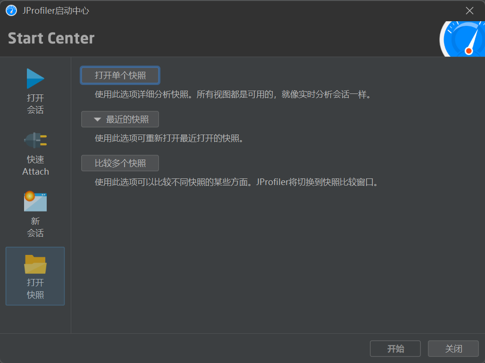
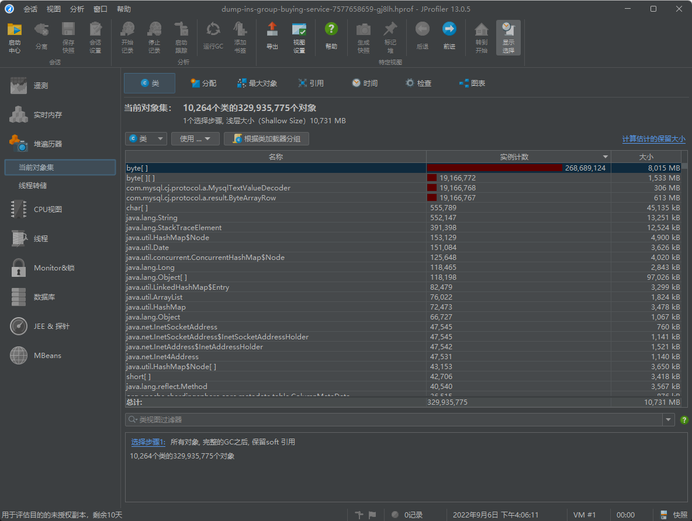
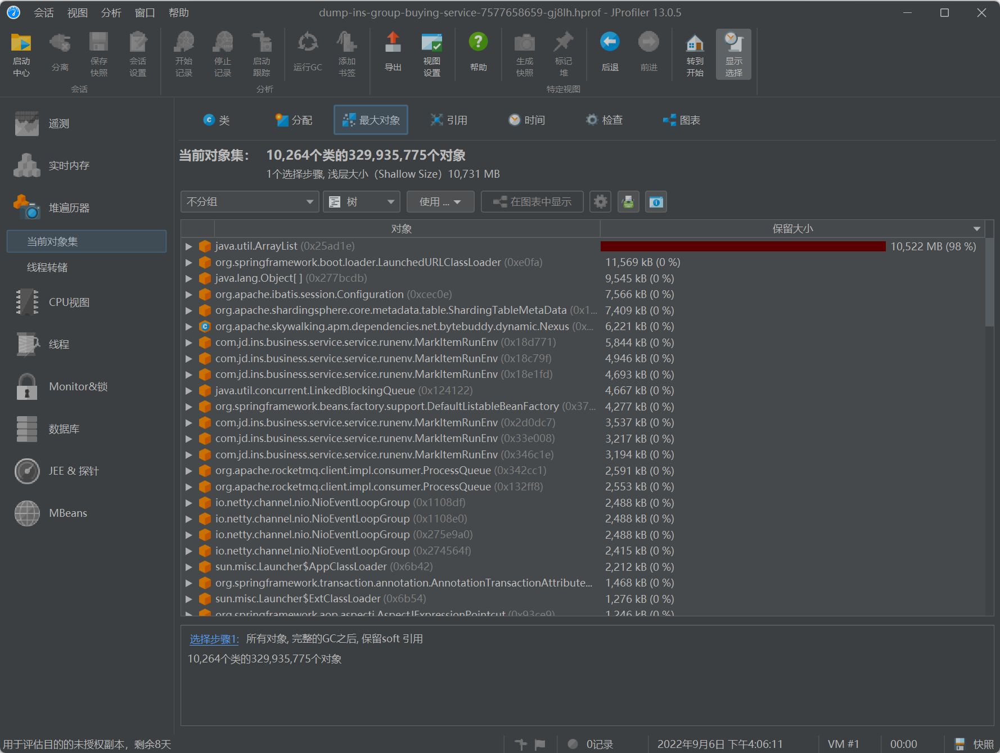
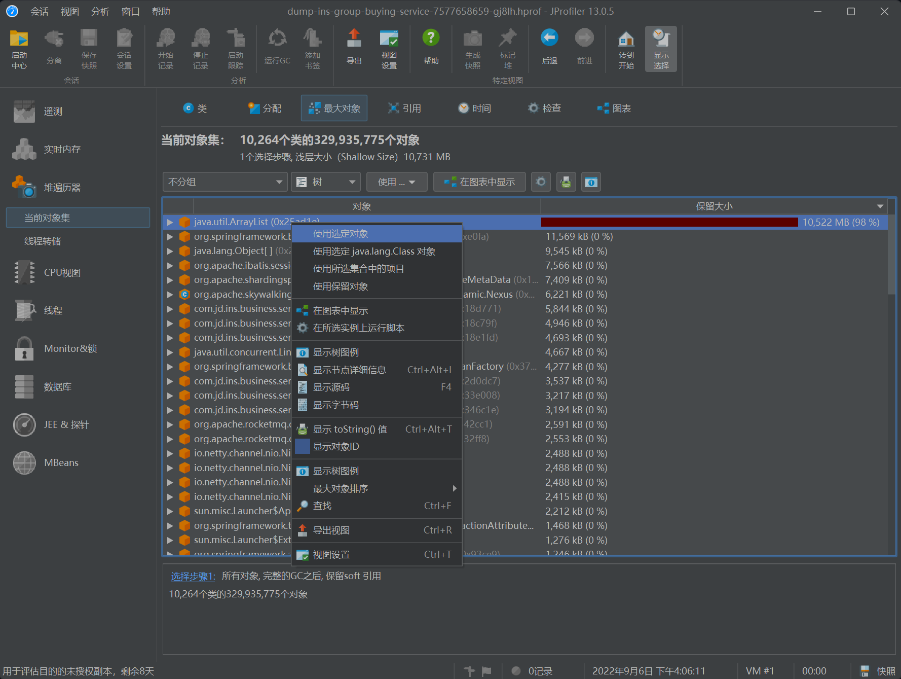
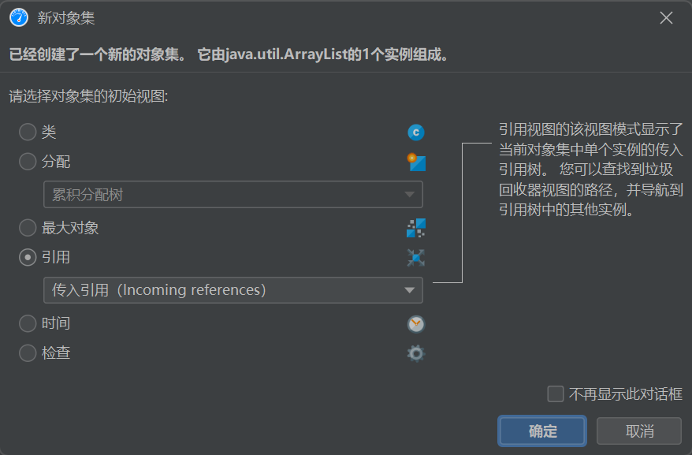
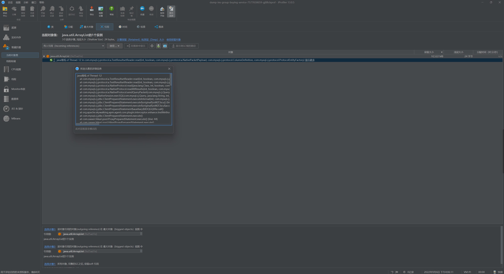
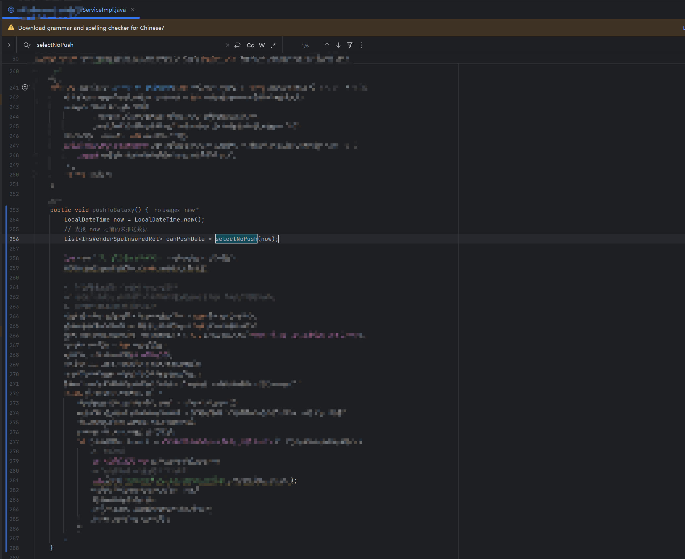

Out of Memory（OOM）内存不足，从字面意思我们可以看出该异常的出现的原因是因内存不足导致的。

今天分析的此案例是近日我们生产环境出现的真实案例，出现问题的主要原因是随着业务量的增长，业务数据日益增长，在推送任务SQL查询的时候没有限制查询条数导致的，下面我们从0开始做一下复盘。
<!-- more -->

通常由以下几个原因引起：

- 内存泄漏：内存泄漏是指应用程序中的对象持有了对内存的引用，但无法被垃圾回收器释放。这些未被释放的对象会导致内存消耗增加，最终耗尽可用内存。

- 过度使用内存：应用程序在执行过程中分配了大量的内存对象，并且这些对象长时间存在于内存中，超出了JVM的可用内存限制，导致OOM错误。

- 大数据集处理：当处理大量数据时，如读取大型文件、处理数据库查询结果集等，如果不适当地管理数据，可能会导致内存占用过高，最终导致OOM问题。

  

## 1、如何生成并导出hprof文件

生成Dump文件，需要在JVM启动时添加参数：

```sh
# 出现 OOME 时生成堆 dump:  
-XX:+HeapDumpOnOutOfMemoryError

# 指定生成堆文件地址：
-XX:HeapDumpPath=/xxx/DumpLogs/
```


## 2、分析hprof文件

分析hprof文件我们这里采用的工具是 JProfiler，首先我们把获取到的hprof文件在JProfiler中打开

1. 点击单个快照选取我们获取到的hprof文件



2. 等到文件加载完成进入该页面（Classes），在顶部选择进入最大对象页面（Biggest Objects）



3. 对该页面的数据按照保留大小倒序排序，可以看到占用最大的对象



4. 右击选择使用选定对象（Use Slected Objects）



5. 选择传入引用（Incoming references）显示这个对象被谁引用



6. 进入引用页面（References）展开引用树，点击显示更多，即可在堆栈日志中查看到项目中内存泄漏的位置



```
java堆栈 of Thread-12
    at com.mysql.cj.protocol.a.TextResultsetReader.read(int, boolean, com.mysql.cj.protocol.a.NativePacketPayload, com.mysql.cj.protocol.ColumnDefinition, com.mysql.cj.protocol.ProtocolEntityFactory) (line: 87)
    at com.mysql.cj.protocol.a.TextResultsetReader.read(int, boolean, com.mysql.cj.protocol.Message, com.mysql.cj.protocol.ColumnDefinition, com.mysql.cj.protocol.ProtocolEntityFactory) (line: 48)
    .....
    at com.***.service.service.impl.***ServiceImpl.selectNoPush(java.time.LocalDateTime) (line: 290)
    at com.***.service.service.impl.***ServiceImpl.pushToGalaxy() (line: 248)
    at com.***.service.worker.handler.***ServiceImpl.execute(java.lang.String) (line: 32)
    at com.xxl.job.core.thread.JobThread.run() (line: 152)
```


## 3、定位问题

上述已经找到项目中内存泄漏的位置，在项目中找到对应的位置



定位到这行发现是一条SQL如下：

```sql
SELECT
	* 
FROM
	push_table 
WHERE
	push_status = 0
	AND updated_time <![ CDATA [ >= ]]> #{startTime,jdbcType=TIMESTAMP}
```

乍一看该sql没什么问题，但是在生产中查询总数发现会因为数据突增查询出10W+的数据，一下导致内存不足，从而导致服务宕机


## 4、解决方案

最终我们的解决方案是在查询sql时，时间设置范围 + 查询条数限制，来保证查询数据数量不会过大，导致OOM

```sql
SELECT
	* 
FROM
	push_table 
WHERE
	push_status = 1
	AND updated_time <![ CDATA [ >= ]]> #{startTime,jdbcType=TIMESTAMP}
	AND updated_time <![ CDATA [ <= ]]> #{endTime,jdbcType=TIMESTAMP}
	LIMIT 2000
```

