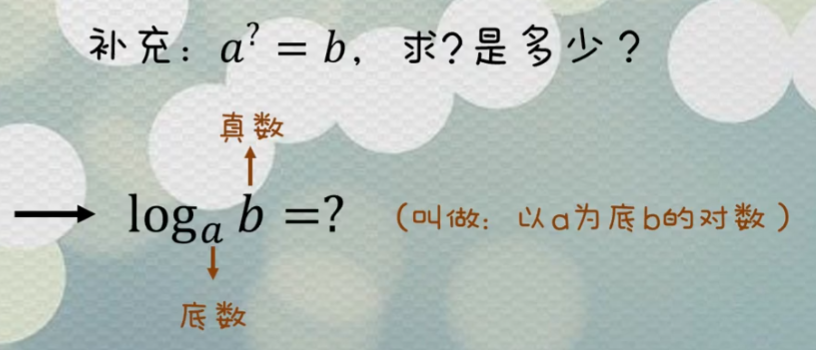
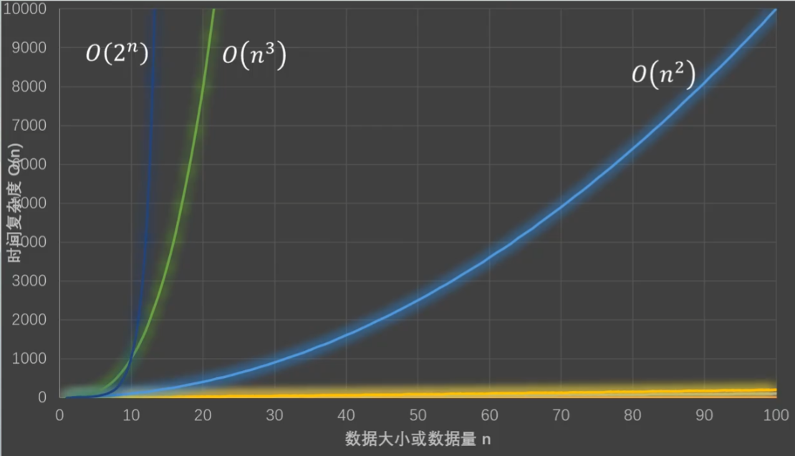

想要了解算法我们得先了解算法中最为重要的基本复杂度，这里我们先了解一下时间复杂度、空间复杂度这两个概念。
<!-- more -->


## 时间复杂度

### 计算方式

```java
/**
 * 衡量代码的执行速度：时间复杂度
 * T(n) = 常数  --->  时间复杂度就为 O(1)
 * T(n) = 常数1 * n + 常数2  --->  时间复杂度就为 O(n), 也就是说常数1可以当做1处理,常数2可以忽略不计,所以时间复杂度为 n
 * T(n) = 5n^3 + 66n^2 + 33  --->  时间复杂度就为 O(n^3), 也就是保留n的次方数最大的那一项, 因为随着n的增大,后面的项远远不及n的最高次项大,所以可以直接省略
 * 总结上面的规律我们得到,如何去判断时间复杂度：
 * T(n)是不是常数：
 * 是：时间复杂度为 O(1)
 * 否：时间复杂度为 O(保留T(n)的最高次项并且去掉最高次项的系数)
 * <p>
 * 例如:
 * 1.一段代码中没有循环语句,只有单独的几条语句时间复杂度就为 O(1)
 */
public class TimeComplexity {


    public static void main(String[] args) {
        print1();
        print2();
    }

    /**
     * 调用一次print1(),内部共执行2次语句
     * T(n) = 2  --->  时间复杂度就为 O(1)
     * <p>
     * 当输入为n时，某段代码的总执行次数
     * n为输入数据的大小
     * </p>
     */
    public static int print1() {
        // 执行1次
        System.out.println("print1");
        // 执行1次
        return 0;
    }

    /**
     * 调用一次print2(),内部共执行3n+3次语句
     * T(n) = 3n+3  --->  时间复杂度就为 O(n)
     * <p>
     * 当输入为n时，某段代码的总执行次数
     * n为输入数据的大小
     * </p>
     */
    public static int print2() {
        int n = 10;
        // i = 0 执行1次
        // i < n 执行n+1次
        // i++   执行n次
        for (int i = 0; i < n; i++) {
            // 执行n次
            System.out.println("print2:" + i);
        }
        // 执行1次
        return 0;
    }

    /**
     * 调用一次print3(),内部共执行 n*(1*n) 次语句
     * T(n) = n^2 + n  --->  时间复杂度就为 O(n^2)
     * 由此我们可以得出,如果有α重循环,时间复杂度就为O(n^α)
     */
    public static int print3() {
        int n = 10;
        // 执行n次
        for (int i = 0; i < n; i++) {
            // 执行 1 * n 次
            for (int j = 0; j < n; j++) {
                System.out.println("print3:" + i);
            }
        }
        // 执行1次
        return 0;
    }


    /**
     * 调用一次print3(),内部共执行 n^2+n 次语句
     * T(n) = n^2 + n  --->  时间复杂度就为 O(n^2)
     * 由此我们可以得出,如果有α重循环,时间复杂度就为O(n^α)
     */
    public static void print4() {
        int n = 10;
        // 执行n^2次
        for (int i = 0; i < n; i++) {
            for (int j = 0; j < n; j++) {
                System.out.println("print4:" + i);
            }
        }
        // 执行n次
        for (int i = 0; i < n; i++) {
            System.out.println("print4:" + i);
        }
    }


    /**
     * 调用一次print5(),内部调用选最长的链路作为时间复杂度的判断,那么时间复杂度就为 O(n^2)
     */
    public static void print5(int n) {
        if (n > 10) {
            // 执行n^2次
            for (int i = 0; i < n; i++) {
                for (int j = 0; j < n; j++) {
                    System.out.println("print4:" + i);
                }
            }
        } else {
            // 执行n次
            for (int i = 0; i < n; i++) {
                System.out.println("print4:" + i);
            }
        }
    }


    /**
     * 调用一次print6(),时间复杂度就为 O(n^2)
     * 像这样的外部循环一次内部循环就少一次的,只需要把n个里层循环执行的次数相加,就能得到总执行次数的不精确结果
     * 当 i = 0     1     2     3   ...  (n-2)    (n-1)
     * T(n) = n  (n-1) (n-2) (n-3)  ...   2        1
     *      = n*(n-1)
     *      = n^2-1
     *      = O(n^2)
     */
    public static void print6(int n) {
        for (int i = 0; i < n; i++) {
            for (int j = i; j < n; j++) {
                System.out.println("print6:" + i);
            }
        }
    }

    /**
     * 当n为8的时候,输出语句执行3次,i *= 2执行3次, i < n执行(3+1)次,i = 0执行一次
     *  3+3+(3+1)+1
     * =3*3+2
     * T(8) = 3 ----> 2^3 = 8
     *          ----> 2^T(8) = 8
     *
     *
     *
     * 当n为16的时候,输出语句执行4次,i *= 2执行4次, i < n执行(4+1)次,i = 0执行一次
     * 4+4+(4+1)+1
     * =3*4+2
     * T(16) = 4 ----> 2^4 = 16
     *           ----> 2^T(16) = 16
     *
     *
     * 2^T(n) = n
     * T(n) 就等于 log₂n
     *
     * 那么print7的时间复杂度就为 T(n) = 3log₂n + 2 = O(log₂n)
     */
    public static void print7(int n) {
        for (int i = 0; i < n; i *= 2) {
            System.out.println("print6:" + i);
        }
    }
}
```




### 时间复杂度对比



| 名称         | 时间复杂度 |
| ------------ | ---------- |
| 常数时间     | O(1)       |
| 对数时间     | O(log n)   |
| 线性时间     | O(n)       |
| 线性对数时间 | O(n log n) |
| 二次时间     | O(n²)      |
| 三次时间     | O(n³)      |
| 指数时间     | O(2ⁿ)      |

由快到慢O(1)	O(log n)	O(n)	O(n log n)	O(n²)	O(n³)	O(2ⁿ)


### 举个栗子

n为整数，T(n) = T(n-1) + n ，T(0) = 1求这个算法的时间复杂度？

T(n) = T(n-1) + n

​		= T(n-2) + (n-1) + n

​		= T(n-3) + (n-2) + (n-1) + n

​				·········

​		= T(2) + 3 + ··· + (n-2) + (n-1) + n

​		= T(1) + 2 + 3 + ··· + (n-2) + (n-1) + n

​		= T(0) + 1 + 2 + 3 + ··· + (n-2) + (n-1) + n

​		= n² + n + 1

​		= O(n²)


## 空间复杂度

既然时间复杂度不是用来计算程序具体耗时的，那么我也应该明白，空间复杂度也不是用来计算程序实际占用的空间的。

空间复杂度是对一个算法在运行过程中临时占用存储空间大小的一个量度，同样反映的是一个趋势，我们用 S(n) 来定义。

空间复杂度比较常用的有：O(1)、O(n)、O(n²)，我们下面来看看：

###  **空间复杂度 O(1)**

如果算法执行所需要的临时空间不随着某个变量n的大小而变化，即此算法空间复杂度为一个常量，可表示为 O(1)，举例：

```text
int i = 1;
int j = 2;
++i;
j++;
int m = i + j;
```

代码中的 i、j、m 所分配的空间都不随着处理数据量变化，因此它的空间复杂度 S(n) = O(1)

###  **空间复杂度 O(n)**

我们先看一个代码：

```text
int[] m = new int[n]
for(i=1; i<=n; ++i)
{
   j = i;
   j++;
}
```

这段代码中，第一行new了一个数组出来，这个数据占用的大小为n，这段代码的2-6行，虽然有循环，但没有再分配新的空间，因此，这段代码的空间复杂度主要看第一行即可，即 S(n) = O(n)