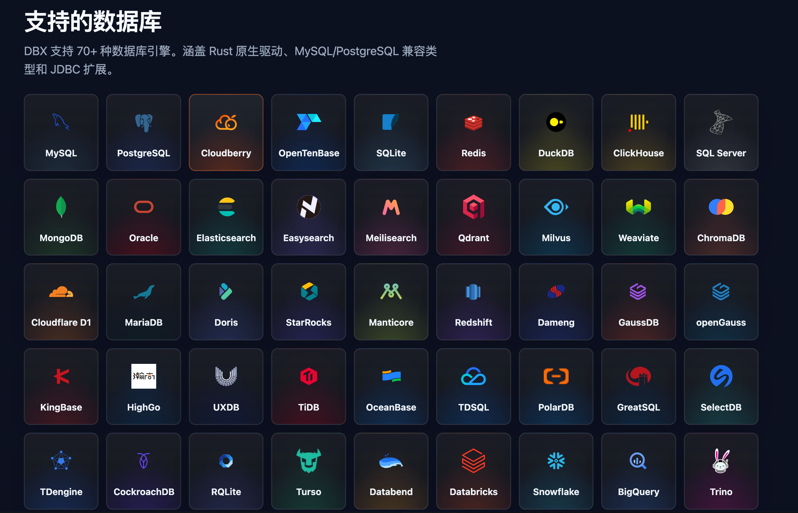
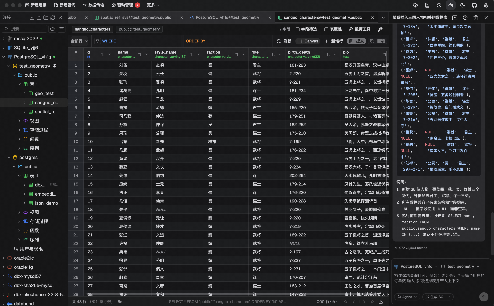
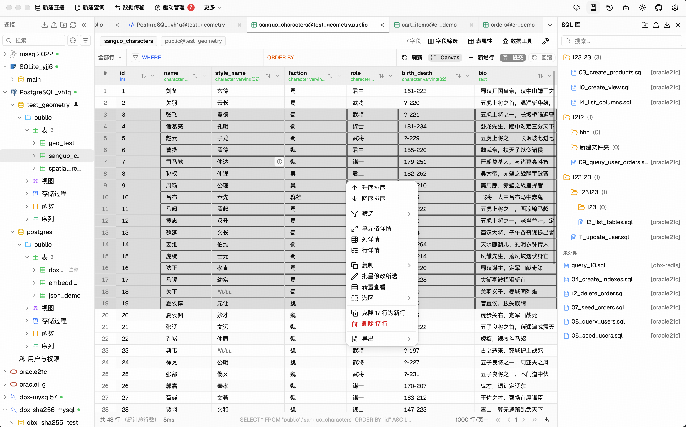

# DBX

## 核心优势速览

| 重点 | DBX 带来的价值 |
| --- | --- |
| **数据库覆盖广** | 官网展示 **70+ 数据库引擎**，从 MySQL、PostgreSQL 到 Redis、MongoDB、ClickHouse 和向量数据库，都可以先用同一个入口连接。 |
| **轻量易部署** | 桌面安装包约 **20MB**，同时支持桌面端和 Docker，适合快速打开、快速排查和团队评估。 |
| **开源可控** | 源码公开，能够查看版本进展、评估长期可用性，并减少对单一商业授权体系的绑定。 |
| **减少工具切换** | 连接、SQL、表格浏览和结果确认集中在一个工作台，减少多客户端、多窗口之间的来回切换。 |
| **AI 融入数据库工作流** | AI 结合数据库和表结构上下文生成 SQL，降低从自然语言需求到可执行查询的转换成本。 |
| **关注生产安全** | 官方单独提供生产安全文档，提醒生产连接隔离、高风险 SQL 复核和 AI 结果人工确认。 |

> **一句话推荐：** 如果你希望用一个轻量、开源的工具连接尽可能多的数据库，同时减少客户端切换，并让 AI 参与 SQL 和数据库自动化，DBX 值得优先试用。

## DBX 的核心优势

### 1. 支持的数据库种类多

DBX 官网将“连接更多数据库”作为产品的核心卖点，展示覆盖 **70+ 数据库引擎**。支持范围横跨关系型数据库、文档数据库、搜索引擎、分析型数据库和向量数据库，包括 MySQL、PostgreSQL、SQLite、Redis、MongoDB、ClickHouse、SQL Server 等常见类型。

它还同时提供 Rust 原生驱动、MySQL/PostgreSQL 兼容类型和 JDBC 扩展。对需要在一个项目中同时接触业务库、缓存、分析库或向量库的开发者来说，最大的价值是：不必为不同数据库分别安装和维护一套客户端。

> 实际可用的数据库类型、版本兼容性、认证方式和高级特性仍应以当前版本文档为准。

### 2. 轻量，启动和部署成本低

官网宣传 DBX 桌面安装包约 **20MB**，并同时提供桌面端与 Docker 使用方式。它的轻量并不只是安装包体积小，更体现在使用路径短：打开工具、建立连接、执行查询、查看数据，不需要先搭建复杂的服务或引入大型套件。

- 个人开发者可以直接使用桌面端处理日常数据库任务。
- 团队可以用 Docker 评估自托管和统一使用方式。
- 在电脑上同时保留多个数据库连接时，工具本身的负担更低。

轻量适合“随时打开、快速处理、用完即走”的开发排查场景；如果团队需要完整的企业级审计、权限编排和厂商 SLA，则应另外评估商业产品。

### 3. 开源，可查看、评估和参与

DBX 源码公开在 GitHub。开源带来的优势不是简单的“免费”，而是团队可以直接查看项目进展、了解工具边界，并根据自身情况评估是否适合长期使用。

- 可以先按真实数据库和工作流验证，而不是先购买完整商业授权。
- 可以查看 Issue、版本更新和驱动支持变化。
- 对有自托管、内部工具或二次集成需求的团队，源码可见性更有价值。

开源也意味着版本成熟度和社区支持需要自己判断。生产环境使用前，建议锁定版本、验证备份与权限策略，并确认团队能够接受社区支持模式。

### 4. 一个工作台，减少工具切换

DBX 把数据库连接、查询、表格浏览、筛选排序和结果确认放在同一个工作区。开发者可以在同一窗口内完成“找到目标数据库 → 编写 SQL → 查看结果 → 对照表结构 → 继续调整”的连续动作。

这对于需要同时维护多种数据库的团队尤其重要：减少在多个客户端之间复制连接信息、来回切换窗口和重复确认环境的成本，也降低了误连数据库的概率。它更像一个统一入口，而不是只解决某一种数据库的专用客户端。

### 5. AI 与自动化，把数据库工作从“手写”推进到“协作”

[官方文档](https://dbxio.com/cn/docs/what-is-dbx#%E6%8E%A5%E5%85%A5-ai-%E4%B8%8E%E8%87%AA%E5%8A%A8%E5%8C%96)将 AI 与自动化列为 DBX 的重要方向。AI 助手可以结合当前数据库、表结构和查询上下文，帮助用户把自然语言需求转换为可执行的 SQL，再回到工作台中检查和调整。

它的重点不是单独提供一个聊天窗口，而是把 AI 放进数据库工作流：

- 用自然语言描述筛选、聚合或排查目标，快速生成 SQL 初稿。
- 根据当前表结构理解字段关系，减少手动查找字段和拼接 JOIN 的时间。
- 在同一界面中查看 SQL、执行结果和上下文，减少复制粘贴与窗口切换。
- 将重复查询和数据库操作整理为可复用的流程，为后续自动化留出空间。

AI 生成的 SQL 必须经过人工复核。涉及写入、删除、权限或生产数据时，应先确认连接环境、影响范围和执行计划，再执行变更。

### 6. 面向生产环境的安全意识

DBX 官方单独提供了[生产安全文档](https://dbxio.com/cn/docs/production-safety)，说明数据库客户端不能只追求“连得上、改得快”，还要把生产环境保护放在工作流里。对 DBX 的安全价值，可以重点从以下四个方面理解：

- **生产环境隔离：** 连接管理时明确区分开发、测试和生产，生产连接使用独立命名、最小权限账号和只读账号，降低误连、误改的风险。
- **高风险操作复核：** 对 UPDATE、DELETE、DROP 等可能影响大量数据的语句，先检查目标连接、影响范围和执行结果，再进行提交；不要把客户端的便捷操作当成绕过审批的理由。
- **变更可控：** 重要变更应先在测试库或事务中验证，并保留可追溯的 SQL、备份和回滚方案。DBX 适合帮助开发者快速确认问题，但不能替代团队的发布和变更流程。
- **AI 结果人工确认：** AI 生成的 SQL 仍然需要开发者复核，尤其要检查表名、条件、JOIN 关系和写入范围，避免把自然语言误解直接带到生产库。

这一点也是 DBX 与“只看功能数量”的数据库客户端的区别：它把生产安全作为独立主题提醒用户。具体的保护机制、提示方式和版本支持范围，请以[官方生产安全文档](https://dbxio.com/cn/docs/production-safety)为准。

## 怎么判断 DBX 是否适合你

- **数据库种类多：** 需要同时连接 MySQL、PostgreSQL、Redis、MongoDB、ClickHouse 或其他数据库，优先验证 DBX 的统一连接体验。
- **追求轻量：** 不想为临时排查安装大型套件，或希望在 Docker 中快速评估，DBX 的安装和部署成本更合适。
- **重视开源：** 希望查看源码、跟踪版本、减少商业授权绑定，或需要评估自托管可能性，可以从 DBX 开始。
- **想减少切换：** 日常工作包含连接、SQL、表格浏览和结果确认，统一工作台能直接减少窗口和工具切换。
- **希望 AI 参与数据库工作：** 想让自然语言、表结构上下文和 SQL 生成出现在同一条工作流中，可以重点体验 DBX 的 AI 助手。
- **重视生产安全：** 希望在选择数据库客户端时同时关注生产连接隔离、高风险 SQL 复核和 AI 结果确认，可以将 DBX 的生产安全文档纳入评估清单。

如果团队最看重成熟的企业支持、审计体系、复杂数据建模或明确 SLA，应把 DBX 与 Navicat Premium、DataGrip 等商业产品并行验证，而不是只看价格。

## 相关链接

- [DBX 官方网站](https://dbxio.com/cn)
- [官方文档：什么是 DBX](https://dbxio.com/cn/docs/what-is-dbx)
- [官方文档：接入 AI 与自动化](https://dbxio.com/cn/docs/what-is-dbx#%E6%8E%A5%E5%85%A5-ai-%E4%B8%8E%E8%87%AA%E5%8A%A8%E5%8C%96)
- [官方文档：生产安全](https://dbxio.com/cn/docs/production-safety)
- [DBX 项目源码](https://github.com/t8y2/dbx)
