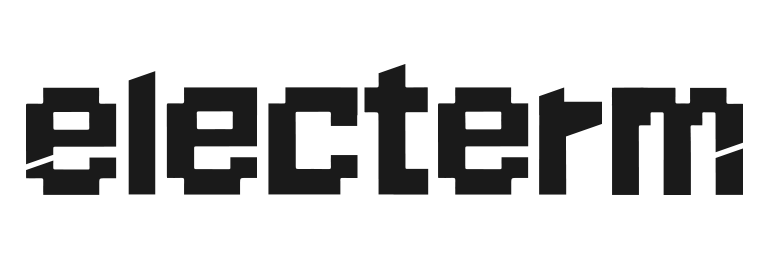

# Electerm

  

> **一句话推荐：** Electerm 适合需要在 Windows、macOS 和 Linux 上，用一个开源工具完成本地终端、SSH 远程连接和 SFTP 文件传输的开发者与运维人员。

## 核心优势

- **终端、SSH、SFTP 一体化：** 一个应用同时覆盖本地命令行、远程服务器登录和文件传输，减少工具切换。
- **跨平台一致体验：** Windows、macOS 和 Linux 均可使用，适合个人多设备和跨平台团队。
- **远程运维效率高：** 多标签会话配合终端和文件操作，适合日志查看、配置检查、发布辅助和故障排查。
- **开源且可持续关注：** 可以查看源码、跟踪版本变化并参与社区，不被单一商业客户端锁定。
- **从轻量任务开始使用：** 无需先配置复杂的企业管理体系，就能满足日常服务器连接和文件处理需求。

## 项目简介

Electerm 是一款跨平台开源终端及 SSH/SFTP 客户端，可在 Windows、macOS 和 Linux 上使用。它将本地命令行、远程服务器连接与文件传输整合在同一应用中，适合开发和运维人员进行日常远程操作。

对于需要同时维护多台服务器、频繁执行命令并传输配置或日志文件的用户，Electerm 可以减少终端和独立文件传输工具之间的切换。它的开源属性也便于用户查看项目进展、参与贡献和持续评估版本变化。

## 本地终端

- 在本地直接运行常用命令行工具，适合执行 Git、构建、日志查看和脚本任务。
- 将本地终端与远程会话放在统一界面中，降低开发、测试和运维任务之间的切换成本。
- 本地命令仍然会影响当前电脑和工作目录，执行删除、发布或批量修改命令前应先确认终端和路径。

## SSH 远程连接

- 通过 SSH 登录 Linux 或其他支持 SSH 的远程主机。
- 适合进行服务查看、日志排查、配置检查、进程管理和日常运维操作。
- 建议为不同环境使用清晰的会话名称，并结合密钥认证、最小权限账号和堡垒机策略使用。
- 生产服务器操作应保留必要的审计记录，不要把密码、私钥或敏感配置写入普通笔记或共享脚本。

## SFTP 文件传输

- 在远程终端会话之外，通过 SFTP 浏览远程目录和传输文件。
- 适合上传构建产物、下载日志、同步配置模板和处理小型运维文件。
- 上传前确认目标主机、目标目录和文件版本；涉及生产文件时，建议先备份并通过发布流程完成变更。

## 多会话与跨平台使用

- 通过多标签页同时处理多个终端或远程会话。
- 支持 Windows、macOS 和 Linux，适合个人在不同电脑之间保持相近的使用习惯。
- 可以按环境、项目或用途整理会话，减少误连错误服务器的风险。

## 推荐理由与适用边界

### 适合选择 Electerm 的情况

- 希望使用一个开源工具同时处理本地终端、SSH 和 SFTP。
- 需要跨 Windows、macOS 和 Linux 使用同一类远程连接工具。
- 偏好可查看源码、可参与社区并且不依赖单一商业服务的工具。

### 需要谨慎评估的情况

- 团队强依赖集中式账号同步、企业策略、审计报表或厂商 SLA 时，应先验证 Electerm 是否覆盖组织要求。
- 大规模团队协作、复杂跳板机链路或严格合规场景，需要结合现有堡垒机和身份管理系统评估。
- 对终端协议、脚本自动化和会话管理有非常专业的要求时，商业终端软件可能提供更成熟的支持体系。

## 与商业终端工具对比

| 产品 | 产品定位 | 主要优势 | 适合人群 | 授权模式与注意事项 |
| --- | --- | --- | --- | --- |
| Electerm | 开源跨平台终端、SSH 和 SFTP 客户端 | **终端、SSH、SFTP 一体化，跨平台且开源**，适合日常远程开发和运维 | 个人开发者、运维人员、希望使用开源跨平台工具的团队 | 开源项目；具体协议支持、版本稳定性和社区支持范围以项目当前文档为准 |
| Termius | 商业化跨平台 SSH 客户端 | 多平台体验、会话组织和同步类能力，适合个人设备之间切换 | 需要跨设备管理 SSH 会话并重视统一体验的用户 | 商业服务和授权分层可能随版本变化；以 [官方页面](https://termius.com/) 为准 |
| SecureCRT | 商业终端与 SSH 客户端 | 会话管理、脚本自动化和成熟的企业级终端使用体验 | 需要稳定终端能力、自动化和长期商业支持的团队 | 商业授权；版本、试用和价格以 [官方页面](https://www.vandyke.com/products/securecrt/) 为准 |
| Xshell | 商业 Windows 终端与 SSH 客户端 | Windows 环境下的远程连接、会话管理和终端操作体验 | 主要使用 Windows、偏好成熟商业客户端的开发和运维人员 | 商业授权，部分个人或教育使用政策需以 [官方页面](https://www.netsarang.com/en/xshell/) 为准 |

## 如何选择

- 需要开源、跨平台，并且希望把终端、SSH 和 SFTP 放在一起，可以优先试用 Electerm。
- 需要跨设备同步 SSH 会话、重视统一账号体验时，可以评估 Termius 的授权方案。
- 需要脚本自动化、成熟会话管理和厂商支持时，SecureCRT 更值得重点比较。
- 团队主要使用 Windows，且希望采用传统成熟的商业终端工具时，可以评估 Xshell。

## 相关链接

- [官方网站](https://electerm.org/)
- [项目源码](https://github.com/electerm/electerm)
