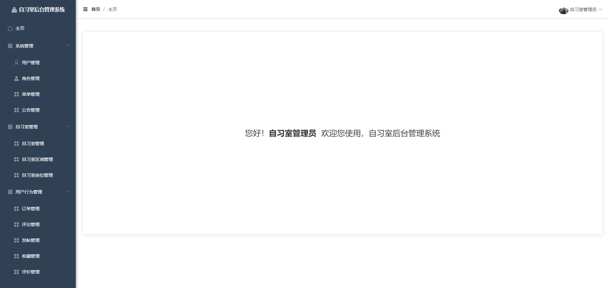
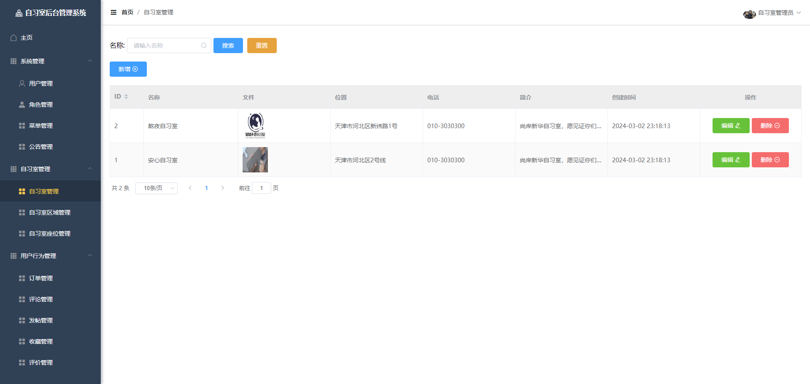
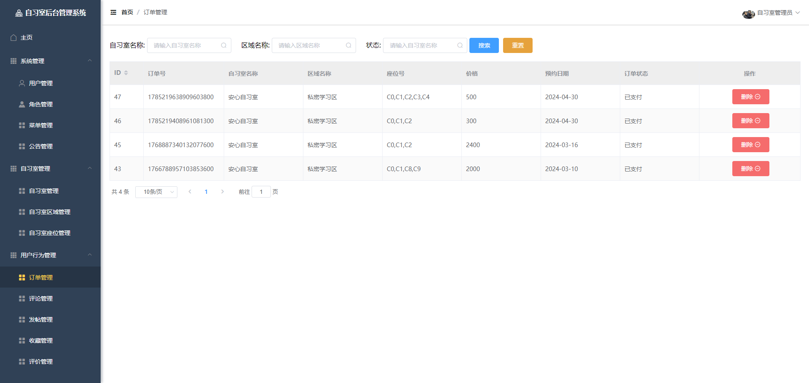
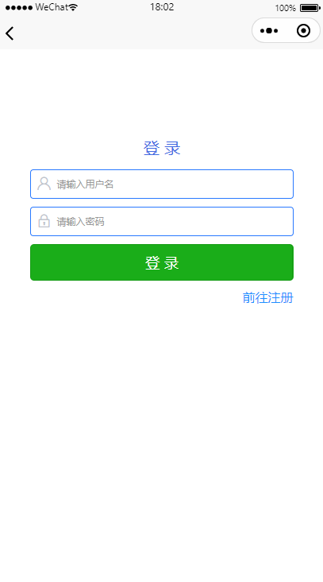
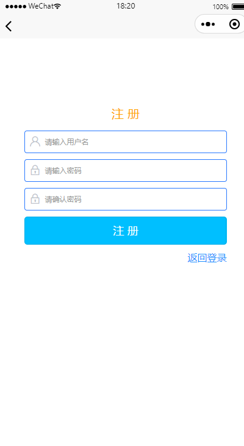
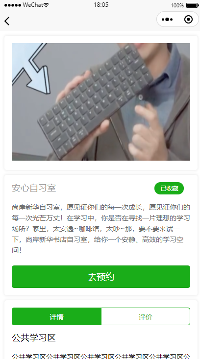
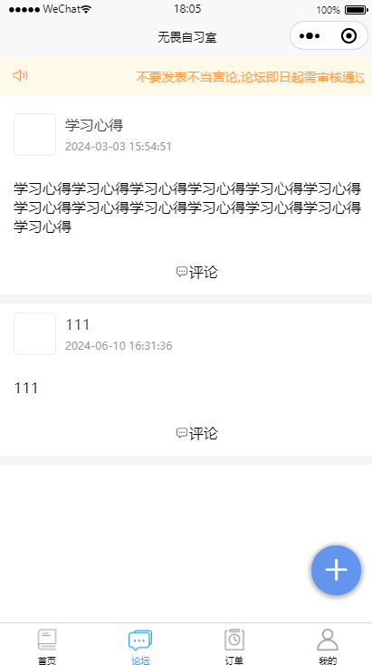
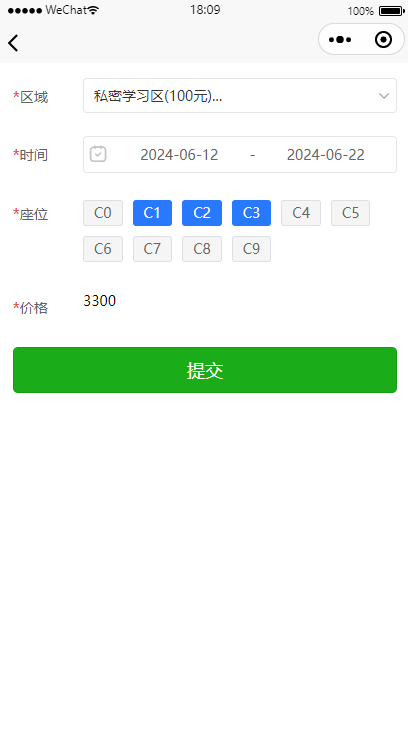
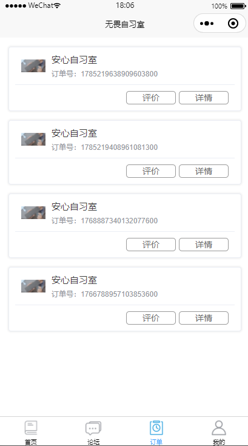
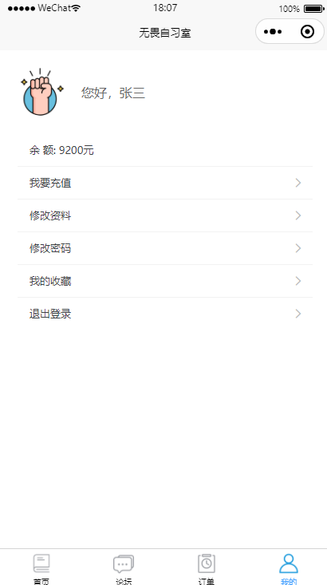

## 1. 技术栈

&ensp;&ensp;&ensp;
&ensp;&ensp;&ensp;
&ensp;&ensp;

## 2. 项目简介

这是一套围绕“自习室预约 + 自习室运营管理”设计的实战项目，适合用于校园场景、培训机构、自习空间、共享学习空间等业务。

项目包含管理端与用户端两部分：

- 管理端负责自习室、座位、订单、评论、帖子、收藏、优惠等运营配置
- 用户端负责浏览自习室、预约座位、支付下单、发布评论、参与论坛互动

系统采用前后端分离思路，兼顾页面展示、业务流程和后台管理，适合作为毕设、课程设计或实战练习项目。

## 3. 功能模块

### 3.1 管理员端

- 登录与系统管理
- 自习室管理
- 自习室区域管理
- 自习室座位管理
- 订单管理
- 评论管理
- 帖子管理
- 收藏管理
- 评价管理
- 个人中心
- 修改密码

### 3.2 用户端

- 注册与登录
- 首页浏览自习室、通知、推荐内容
- 查看自习室详情与评分
- 收藏自习室
- 查看评论与发布评论
- 论坛发帖与互动
- 预约自习室与选择座位
- 查看订单、评价订单
- 个人资料维护与退出登录

## 4. 项目亮点

- 支持自习室按区域、座位维度进行精细化管理
- 预约流程清晰，适合模拟真实业务场景
- 前台展示与后台运营分离，结构完整
- 集成论坛、收藏、评价等互动功能
- 页面和业务都比较适合做实战演示与答辩展示

## 5. 项目获取方式

可通过微信搜索相关教程或项目资料获取完整源码与演示内容。

